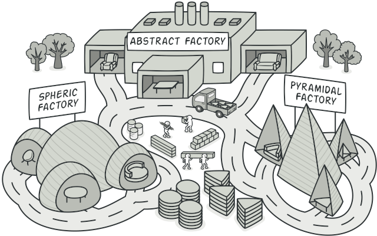
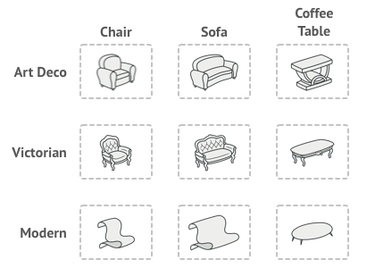
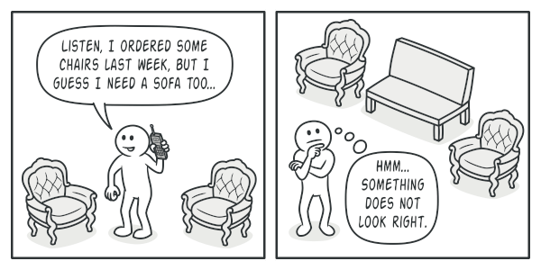
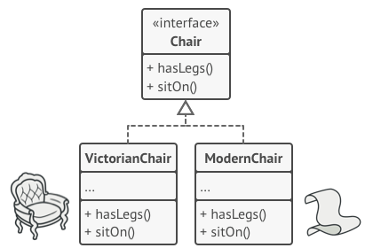
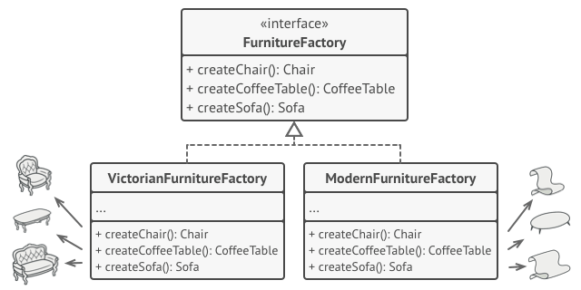
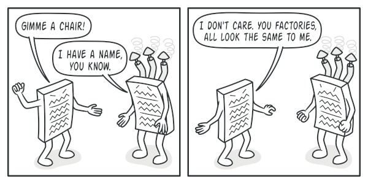
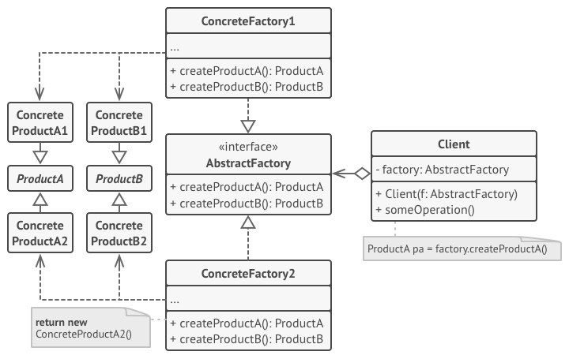
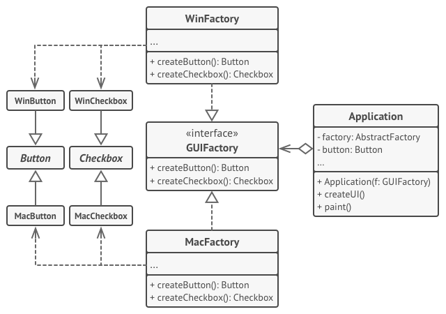

# Abstract Factory
Provide an interface for creating families of related or dependent objects without specifying their concrete classes.

## 🎯 เป้าหมายของ pattern นี้
**Abstract Factory** สร้างกลุ่มของ object ที่มีความเกี่ยวข้องกัน โดยไม่ต้องกำหนดว่าตัว class ที่นำมาสร้างจริงๆคืออะไร

## ✌ หลักการแบบสั้นๆ
1. **Abstract Factory** จะกำหนด interface ที่ใช้ในการสร้าง product แต่ละประเภท และมี abstract method ที่ใช้ในการสร้าง product ต่างๆ
1. Subclass เป็นคนกำหนดเองว่า product ที่จะสร้างแต่ละตัว จะถูกสร้างจาก class ตัวไหน ซึ่งจะต้องเป็น class ที่อยู่ในกลุ่มเดียวกัน
1. เมื่อ client ต้องการ product ก็จะมาเรียก Subclass ให้ไปสร้าง product ต่างๆให้

## 😢 ปัญหา
สมมุติว่าเรามีโปรแกรมจำลองร้านขายเฟอร์นิเจอร์อยู่ตัวนึง ซึ่งมีเงื่อนไขอยู่ว่า

1. ตอนที่ลูกค้ามาดูเฟอร์นิเจอร์ โปรแกรมจะต้องแสดง `เก้าอี้`, `โซฟา`, `โต๊ะกาแฟ` ให้เขาดู
1. พวก `เก้าอี้`, `โซฟา`, `โต๊ะกาแฟ` เวลาเอาโชว์จะต้องเป็นสไตล์เดียวกัน เช่น `Modern`, `ArtDeco`, `Victorian`  
> **Note**  
**Modern** สินค้าจะเป็นสไตล์บ้านๆทั่วไป  
**ArtDeco** สินค้าจะเป็นสไตล์อาร์ตสวยงาม  
**Victorian** สินค้าจะเป็นสไตล์หรูหราไฮโซ



ดังนั้นเวลาเอาสินค้ามาแสดง โปรแกรมจะต้องสร้างเฟอร์นิเจอร์ object ที่ตรงกับสไตล์ที่เขาเลือก

ลองจินตนาการดูถ้าเราสร้าง object ที่ไม่ใช้กลุ่มของมันไปโชว์ให้ลูกค้าดู ลูกค้าจะกริ้วขนาดไหนกันนะ



จากภาพจะเห็นได้ว่าโซฟาของ Modern ไม่เข้ากับเก้าอี้สไตล์ Victorian เลย รวมทั้งลูกค้าก็ไม่แฮปปี้

ดังนั้นสิ่งที่นักพัฒนาโปรแกรมอย่างเราทำก็คือต้องไม่เขียน code ให้แสดงผลผิดพลาด ถ้าเขาเลือกสไตล์ไหนมา เราก็ต้องเอาเฉพาะสินค้าสไตล์นั้นไปแสดง

แต่เราขี้เกียจที่จะแก้โค้ดเราทุกครั้งเมื่อมีสินค้าใหม่เข้ามา หรือ มีสไตล์อื่นๆเข้ามาแน่นอน แล้วเราจะทำยังไงดีละ?

## 😄 วิธีแก้ไข

อย่างแรกเลย เราต้องจัดกลุ่มประเภทสินค้าของเราให้ได้ก่อน ซึ่งโจทย์ของเราตอนนี้ก็จะแบ่งเป็น `เก้าอี้`, `โซฟา`, `โต๊ะกาแฟ`

แล้วหลังจากนั้นเราก็จะเริ่มสร้าง interface ให้กับพวกมันตามแต่ละกลุ่มกัน เช่น
* กลุ่มของเก้าอี้ ก็จะต้องไป implement `Chair interface` (ตามรูปด้านล่าง)
* กลุ่มของโซฟา ก็จะต้องไป implement `Sofa interface`
* กลุ่มของโต๊ะกาแฟ ก็จะต้องไป implement `CoffeeTable interface`



หลังจากที่จัดกลุ่มสินค้าเสร็จ ถัดไปเราก็จะสร้าง interface สำหรับสไตล์ขึ้นมาโดยมี method ที่ใช้ในการสร้าง object ที่เกี่ยวข้องกับมันรวมอยู่ด้วย (สร้างเก้าอี้, สร้างโซฟา และ สร้างโต๊ะกาแฟ)

โดยที่ method เหล่านั้นจะ return `abstract object` ของสินค้ากลับออกมา ตามรูป



ซึ่งจากภาพ จะทำให้เราจัดการกับความหลากหลายของสินค้ากับสไตล์ได้แล้ว โดยการแยกออกเป็น class หลายๆตัว (class แต่ละตัวเรียกว่า `factory`)

ซึ่งเจ้า factory class จะเป็นตัวกำหนดว่าเฟอร์นิเจอร์ที่มันจะเอามาโชว์เป็นสไตล์ไหน เช่น `ModernFurnitureFactory` ก็จะสร้างเฟอร์นิเจอร์ object ที่เป็นสไตล์บ้านๆออกมาเท่านั้น

ซึ่งตัวเฟอร์นิเจอร์สไตล์บ้านๆก็จะต้อง implement interface แบบบ้านๆด้วย เช่น เก้าอี้สไตล์ modern ก็จะต้อง implement `IModernChair` เท่านั้น หรือ เก้าโซฟาสไตล์ modern ก็ต้อง implement `IModernSofa` เท่านั้น และต้องไม่สามารถไปสร้าง object จาก `IVictorianSofa` ได้

เมื่อเป็นแบบนี้มันจะทำให้เราสามารถรองรับ factory แบบอื่นๆได้ เช่น เมื่อมีสไตล์กรีกเข้ามาใหม่ เราก็แค่ `Greek factory` เข้าไป โปรแกรมก็จะสามารถทำงานได้ โดยที่ไม่ต้องแก้ไขโค้ดเดิมเลย



ดังนั้นเมื่อ client ได้ factory ที่ต้องการแล้ว มันก็ไม่ต้องสนใจเลยว่า object เก้าอี้ ที่จะได้รับจะถูกสร้างจาก class ไหน

เพราะมันกลายเป็น abstract `Chair interface` ไปเรียบร้อยแล้ว ดังนั้น client ก็มีหน้าที่แค่เรียกใช้งาน `sitOn()` ก็พอ

## 📌 โครงสร้างของ pattern นี้

> **อธิบาย**  
**Abstract Products** - (ProductA, ProductB) กลุ่มของ interface เพื่อใช้จำแนกกลุ่มของ `Product` (เช่น IChair, ISofa และ CoffeeTable)  
**Concrete Products** - (ConcreteProduct A1, A2, B1, B2) เป็น class ที่จะนำมาใช้สร้างเป็น `Product`ที่แท้จริง (เช่น ModernChair, VictorianChair)  
**Abstract Factory** - interface factory ต้นแบบ ซึ่งจะมีกลุ่มของ method ที่เอาไว้สร้าง product ต่างๆ  
**Concrete Factories** - (ConcreteFactory 1 & 2) เป็น class ที่ implement abstract factory เพื่อกำหนดว่าตอน product ต่างๆจะใช้ class ไหนเป็นตัวสร้าง และจะต้องเป็นกลุ่มเดียวกันด้วย (family)

## 🛠 ตัวอย่างการนำไปใช้งาน
ตัวอย่างนี้เป็นการจำลองใช้ **Abstract Factory** ไปสร้างของต่างๆ (ปุ่ม และ checkbox) ที่สามารถทำงานได้ทั้งบน Windows และ MacOS โดยที่ไม่ทำให้ client ต้องไปยึดติด (coupling) กับ UI class และของที่สร้างออกมาก็จะเป็นกลุ่มเดียวกันเสมอ (ถ้าเป็น Windows เมื่อสร้าง ปุ่ม หรือ checkbox จะได้ object ที่เป็น windows เท่านั้น ไม่มีทางที่จะได้ MacOS object กลับมาเด็ดขาด)



1. จากภาพจะเห็นว่าเมื่อ client ต้องการจะสร้างปุ่มขึ้นมาซักปุ่ม ก็เพียงแค่เลือกว่าจะทำงานกับ `WinFactory` หรือ `MacFactory` เท่านั้น
1. เมื่อ client ต้องการปุ่ม ก็เพียงเรียกใช้ `createButton` เราก็จะได้ Button object ที่เหมาะสมกับ environment ของเราไปใช้งานต่อได้เลย

## 👍 ข้อดี
* product ที่ได้กลับมาเป็นกลุ่มเดียวกันกับ factory ที่เลือก
* ลดการเกิด `tight coupling` ระหว่างการสร้าง **product** กับ **client**
* ถูกหลัก `Single Responsibility Principle`
* ถูกหลัก `Open/Closed Principle`

## 👎 ข้อเสีย
* เพิ่มความซับซ้อนให้กับโค้ด เพราะต้องไปสร้าง class และ interface มากมาย

## 📝 Code ตัวอย่าง
```
using System;

// Factories
interface IFurnitureFactory
{
    IChair CreateChair();
    ICoffeeTable CreateCoffeeTable();
}
class VictorianFurnitureFactory : IFurnitureFactory
{
    public IChair CreateChair()
        => new VictorianChair();

    public ICoffeeTable CreateCoffeeTable()
        => new VictorianCoffeeTable();
}
class ModernFurnitureFactory : IFurnitureFactory
{
    public IChair CreateChair()
        => new ModernChair();

    public ICoffeeTable CreateCoffeeTable()
        => new ModernCoffeeTable();
}

// Products
interface IChair
{
    string SitOn();
}
class VictorianChair : IChair
{
    public string SitOn()
        => "Sitting on victorian chair";
}
class ModernChair : IChair
{
    public string SitOn()
        => "Sitting on modern chair";
}

interface ICoffeeTable
{
    string SomeUsefulFunction();
}
class VictorianCoffeeTable : ICoffeeTable
{
    public string SomeUsefulFunction()
        => "Do something on victorian coffee table";
}
class ModernCoffeeTable : ICoffeeTable
{
    public string SomeUsefulFunction()
        => "Do something on modern coffee table";
}

// Client
class Program
{
    static void Main(string[] args)
    {
        Console.WriteLine("1.Testing client code with the first factory type...");
        ClientMethod(new VictorianFurnitureFactory());

        Console.WriteLine("2.Testing the same client code with the second factory type...");
        ClientMethod(new ModernFurnitureFactory());
    }

    static void ClientMethod(IFurnitureFactory factory)
    {
        var chairProduct = factory.CreateChair();
        Console.WriteLine(chairProduct.SitOn());

        var tableProduct = factory.CreateCoffeeTable();
        Console.WriteLine(tableProduct.SomeUsefulFunction());
    }
}
```

**Output**
```
1.Testing client code with the first factory type...
Sitting on victorian chair
Do something on victorian coffee table
2.Testing the same client code with the second factory type...
Sitting on modern chair
Do something on modern coffee table
```

# Credit
https://refactoring.guru  
You can buy his book by click the image below.  
[](https://refactoring.guru/design-patterns/book#buy-now)  