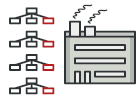

# Abstract Factory

Provide an interface for creating families of related or dependent objects without specifying their concrete classes.

## 🏳️ เป้าหมายของ pattern นี้
**Abstract Factory** สร้างกลุ่มของ object ที่มีความเกี่ยวข้องกัน โดยไม่ต้องกำหนดว่าตัว class ที่นำมาสร้างจริงๆคืออะไร

## หลักการแบบสั้นๆ
xxx

## ☹ ปัญหา

สมมุติว่าเรามีโปรแกรมจำลองร้านขายเฟอร์นิเจอร์อยู่ตัวนึง ซึ่งมีเงื่อนไขอยู่ว่า

1. ตอนที่ลูกค้ามาดูเฟอร์นิเจอร์ โปรแกรมจะต้องแสดง `เก้าอี้`, `โซฟา`, `โต๊ะกาแฟ` ให้เขาดู
1. พวก `เก้าอี้`, `โซฟา`, `โต๊ะกาแฟ` เวลาเอาโชว์จะต้องเป็นสไตล์เดียวกัน เช่น `Modern`, `ArtDeco`, `Victorian`  
> Note  
Modern สินค้าจะเป็นสไตล์บ้านๆทั่วไป  
ArtDeco สินค้าจะเป็นสไตล์อาร์ตสวยงาม  
Victorian สินค้าจะเป็นสไตล์หรูหราไฮโซ

ดังนั้นเวลาเอาสินค้ามาแสดง โปรแกรมจะต้องสร้างเฟอร์นิเจอร์ object ที่ตรงกับสไตล์ที่เขาเลือก

ลองจินตนาการดูถ้าเราสร้าง object ที่ไม่ใช้กลุ่มของมันไปโชว์ให้ลูกค้าดู ลูกค้าจะกริ้วขนาดไหนกันนะ

จากภาพจะเห็นได้ว่าโซฟาของ Modern ไม่เข้ากับเก้าอี้สไตล์ Victorian เลย รวมทั้งลูกค้าก็ไม่แฮปปี้

ดังนั้นสิ่งที่นักพัฒนาโปรแกรมอย่างเราทำก็คือต้องไม่เขียน code ให้แสดงผลผิดพลาด ถ้าเขาเลือกสไตล์ไหนมา เราก็ต้องเอาเฉพาะสินค้าสไตล์นั้นไปแสดง

แต่เราขี้เกียจที่จะแก้โค้ดเราทุกครั้งเมื่อมีสินค้าใหม่เข้ามา หรือ มีสไตล์อื่นๆเข้ามาแน่นอน แล้วเราจะทำยังไงดีละ?

## ㋡ วิธีแก้ไข

อย่างแรกเลย เราต้องจัดกลุ่มประเภทสินค้าของเราให้ได้ก่อน ซึ่งโจทย์ของเราตอนนี้ก็จะแบ่งเป็น `เก้าอี้`, `โซฟา`, `โต๊ะกาแฟ`

แล้วหลังจากนั้นเราก็จะเริ่มสร้าง interface ให้กับพวกมันตามแต่ละกลุ่มกัน เช่น
* กลุ่มของเก้าอี้ ก็จะต้องไป implement `Chair interface` (ตามรูปด้านล่าง)
* กลุ่มของโซฟา ก็จะต้องไป implement `Sofa interface`
* กลุ่มของโต๊ะกาแฟ ก็จะต้องไป implement `CoffeeTable interface`

หลังจากที่จัดกลุ่มสินค้าเสร็จ ถัดไปเราก็จะสร้าง interface สำหรับสไตล์ขึ้นมาโดยมี method ที่ใช้ในการสร้าง object ที่เกี่ยวข้องกับมันรวมอยู่ด้วย (สร้างเก้าอี้, สร้างโซฟา และ สร้างโต๊ะกาแฟ)

โดยที่ method เหล่านั้นจะ return `abstract object` ของสินค้ากลับออกมา ตามรูป

ซึ่งจากภาพ จะทำให้เราจัดการกับความหลากหลายของสินค้ากับสไตล์ได้แล้ว โดยการแยกออกเป็น class หลายๆตัว (class แต่ละตัวเรียกว่า `factory`)

ซึ่งเจ้า factory class จะเป็นตัวกำหนดว่าเฟอร์นิเจอร์ที่มันจะเอามาโชว์เป็นสไตล์ไหน เช่น `ModernFurnitureFactory` ก็จะสร้างเฟอร์นิเจอร์ object ที่เป็นสไตล์บ้านๆออกมาเท่านั้น

ซึ่งตัวเฟอร์นิเจอร์สไตล์บ้านๆก็จะต้อง implement interface แบบบ้านๆด้วย เช่น เก้าอี้สไตล์ modern ก็จะต้อง implement IModernChain เท่านั้น

เมื่อเป็นแบบนี้มันจะทำให้เราสามารถรองรับ factory แบบอื่นๆได้ เช่น เมื่อมีสไตล์กรีกเข้ามาใหม่ เราก็แค่ Greek factory เข้าไป โปรแกรมก็จะสามารถทำงานได้โดยที่ไม่ต้องแก้ไขโค้ดเดิมเลย

Incomplete ...