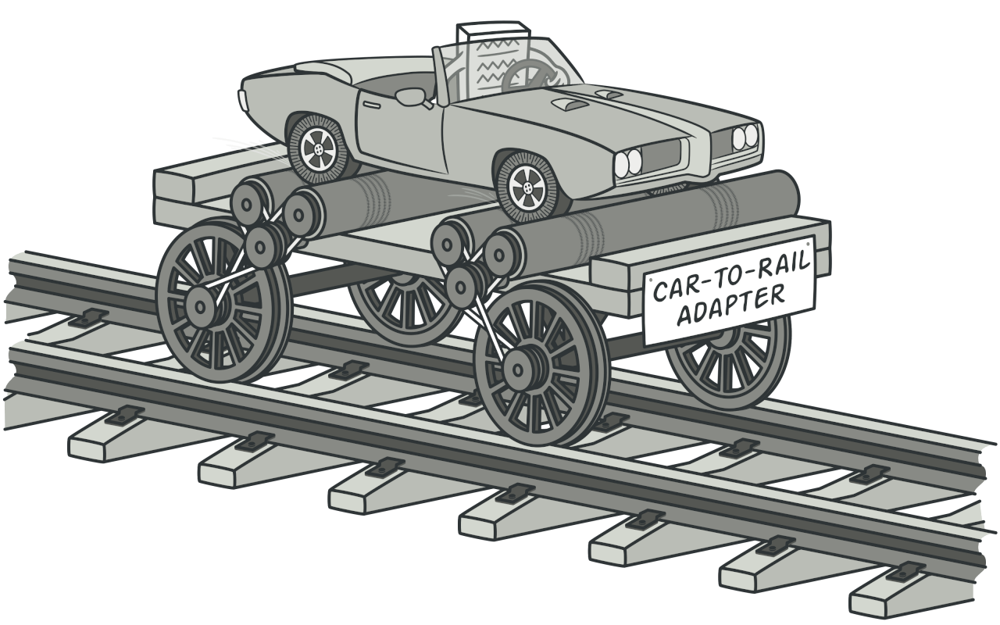
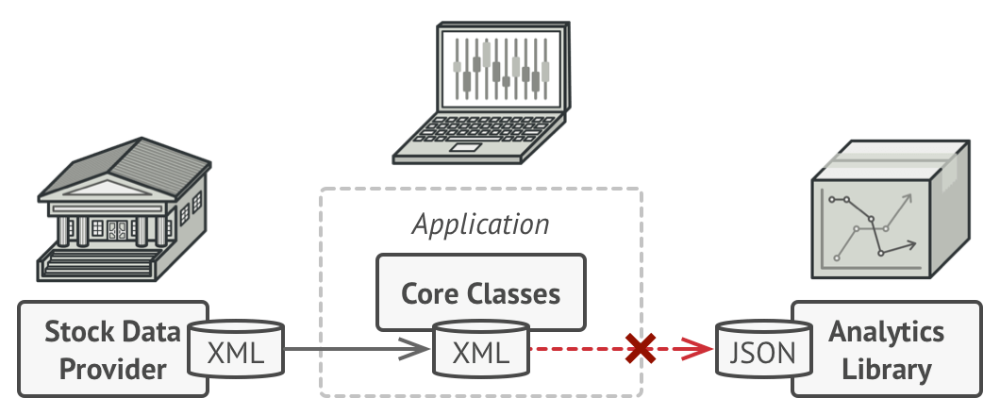
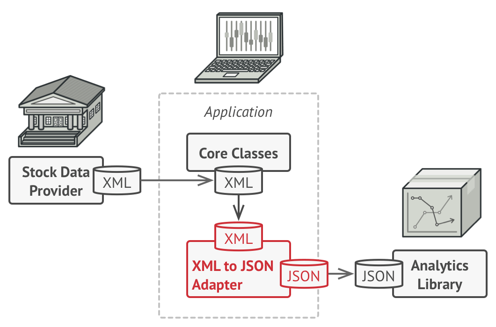
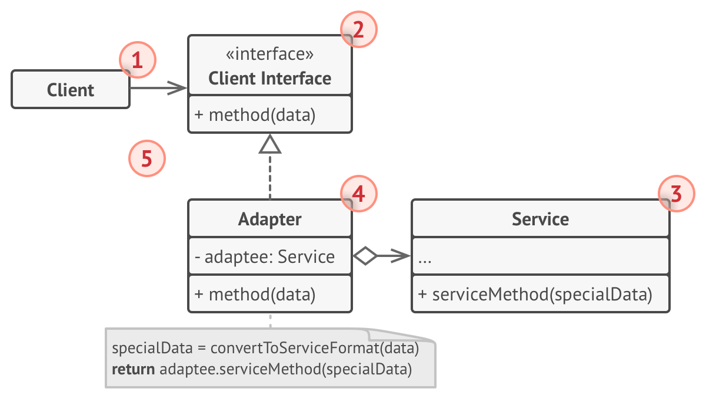

# Adapter
Convert the interface of a class into another interface clients expect. Adapter lets classes work together that couldn't otherwise because of incompatible interfaces.

## 🎯 เป้าหมายของ pattern นี้
ทำให้ของ 2 อย่างทำงานร่วมกันได้ แม้ว่ามันไม่ได้ถูกออกแบบให้ทำงานร่วมกันแต่แรก โดยไม่แตะต้องโค้ดเดิมที่ถูกเขียนไว้เลย

## ✌ หลักการแบบสั้นๆ
1. สร้าง interface ที่เราอยากจะทำงานด้วยขึ้นมา แล้วทำงานกับ interface นั้นแทน
1. นำ interface ที่เราสร้างขึ้นมาไปทำงานร่วมกัน class ที่ต้องการทำงานด้วย

## 😢 ปัญหา
กาละครั้งหนึ่ง เง็กเซียนฮ่องเต้ได้ทำแอพซื้อขายหุ้น ซึ่งตัวแอพสามารถดูราคาหุ้นในตลาดได้ตลอด 24 ชม ซึ่งการทำงานของแอพนี้ จริงๆแล้วมันก็แค่ไปดึงข้อมูลหุ้นที่เป็นไฟล์ XML จากหลายๆที่มากองๆไว้ด้วยกัน แล้วพล๊อตกราฟเท่ๆออกมาให้ดู และเง็กเซียนก็พอพระทัยในแอพนั้นเป็นอันมาก

จนมาถึงวันหนึ่ง เง็กเซียนได้ข่าวมาว่า มีบริษัทหนึ่งขาย library สำหรับวิเคราะห์หุ้นขั้นเทพ ที่ให้ผลแม่นดุจตาเห็น!! ดังนั้นเง็กเซียนเลยตัดสินใจซื้อ library ที่ว่านั้นมา

แต่เง็กเซียนแทบหงายเงิบ เพราะ library ที่ซื้อมามันดันทำงานกับ JSON format ได้เท่านั้น!!



จากรูปเลยข้อมูลหุ้นวิ่งเข้าแอพของเง็กเซียนทำงานได้ตามปรกติ แต่มันเอาเข้าไปทำงานกับ library ที่ซื้อมาไม่ได้

เง็กเซียนจะทำเช่นไรกับปัญหาที่เจอมานี้ดี เงินก็เสียไปแล้ว โปรแกรมเขาก็ไม่ได้พังอะไร จะไปแก้ให้มันทำงานกับไฟล์ XML ก็ได้ แต่นั่นหมายความว่าเง็กเซียนต้องไปแก้โค้ดที่มันมีอยู่แล้ว

และหลังจากไตร่ตรองอยู่นั่นเอง เง็กเซียนก็ตระหนักได้ว่า โค้ดนั่นมันเป็นของบริษัทอื่นนิหว่า มันแก้เองไม่ได้โว้ยยยย!! (นึกถึงหน้าจตุรเทพในเรื่องคุโรมาตี้ขึ้นมาเลย)

แล้วเง็กเซียนจะแก้ปัญหานี้อย่างไรดี . . .

## 😄 วิธีแก้ไข
เง็กเซียนก็โทรไปเพื่อซื้อบริษัทนั้นมา แล้วสั่งให้มันเขียนรองรับ XML จบข่าวววว (ฮา)

วิธีการแก้ไขปัญหาก็แสนจะง่าย ให้จินตนาการง่ายๆว่า สาย power โน๊ตบุ๊คเรามันมี 3 ขาใช่ปะ แต่เต้าเสียบไฟแบบทั่วๆไปมันจะมีรูให้เสียบแค่ 2 รู แล้วเราจะทำยังไงให้มันเสียบได้?? ... เราก็แค่ไปซื้อตัวแปลงจาก 3 ขาเป็น 2 ขามาใช้ไงละ!! (เคยมีครั้งนึงผมต้องหักสายกราวทิ้ง เพื่อให้มันมี 2 ขา จริงจังนะนิ -_-'')

ก่อนที่จะเมากาวไปมากกว่านี้ สิ่งที่เง็กเซียนต้องทำก็คือ สร้างสิ่งที่เรียกว่า `Adapter` ขึ้นมา

ซึ่งสิ่งที่เรียกว่า `Adapter` มันจะมีหน้าที่ห่อหุ้ม object ที่เราไม่สามารถทำงานร่วมกับมันเอาไว้ แล้วเปลี่ยนมันให้กลายเป็นของที่เราสามารถทำงานร่วมกับมันได้ รวมถึงจัดการความซับซ้อนของ object นั้นทั้งหมดอีกด้วย (ในตัวอย่าง adapter ก็คือตัวแปลงจาก 3 ขาเป็น 2 ขา)

และในบางครั้ง เราอาจจะต้องทำ Adapter ที่เป็น 2 ทาง (two-way adapter) คือ `แปลงให้ฝั่ง A ใช้ฝั่ง B ได้` และยังต้อง `แปลงให้ฝั่ง B ก็ใช้ฝั่ง A ได้` ด้วยช่วยกัน



จากภาพ เง็กเซียนก็จะสร้าง Adapter ขึ้นมาตัวนึงนั่นคือ `XMLToJSONAdapter` เอาไว้แปลงข้อมูล XML ไปเป็น JSON เพื่อส่งข้อมูลไปให้กับ library ที่ซื้อมานั่นเอง

## 📌 โครงสร้างของ pattern นี้

> **อธิบาย**  
1. **Client** - คือคลาสที่ทำงานร่วมกับ interface ที่เป็นต้นแบบของ Adapter  
1. **Client Interface** - เป็นมาตรฐานในการสร้าง Adapter เพื่อให้ Client สามารถทำงานร่วมกับ class ที่ได้ตามที่ client คาดหวังไว้  
1. **Service** - class ที่แท้จริงที่ client ต้องทำงานร่วมด้วย ซึ่งปรกติ client จะไม่สามารถทำงานร่วมกับมันตรงๆได้
1. **Adapter** - ตัวที่ทำหน้าที่จัดการให้ client ทำงานร่วมกับ class ที่แท้จริงที่ต้องทำงานร่วมกัน  
1. Client ทำงานร่วมกับ interface เท่านั้น ไม่ได้ทำงานร่วมกับ class ที่แท้จริง ทำให้เราสามารถเขียน Adapter แบบอื่นๆให้ client ทำงานรวมได้โดยที่ไม่ต้องเปลี่ยนโค้ดใดๆเราเลย


## 🛠 ตัวอย่างการนำไปใช้งาน
เราต้องการเขียนโปรแกรมไปดึงข้อมูลจาก Youtube ซึ่งโปรแกรมเราทำงานกับ class A แต่ เจ้าตัว Youtube API นั้นทำงานกับ class B เลยทำให้เราไม่สามารถคุยกับ Youtube API ได้ตรงๆ หรือถ้าเราไปใช้ class B ตาม Youtube แล้วเกิดวันหนึ่ง Youtube API เปลี่ยนไปใช้ class C ละ? โค้ดเราก็จะต้องคอยตามแก้ทุกครั้งที่ API เขาเปลี่ยนด้วยเหรอ?

ดังนั้นเราก็จะสร้าง Adapter ขึ้น เพื่อใช้เป็นตัวแทนคุยกับ Youtube API อีกที (ดูใน Code ตัวอย่างเลย)

## 👍 ข้อดี
* สามารถเปลี่ยน Adapter เมื่อไหร่ก็ได้ นั่นหมายความว่าเราสามารถเปลี่ยน library ของ 3rd party เป็นตัวอื่นได้เรื่อยๆ โดยไม่ต้องกลับไปแก้ไขโค้ดเก่าของเราเลย
* ถูกหลัก `Single Responsibility Principle`
* ถูกหลัก `Open/Closed Principle`

## 👎 ข้อเสีย
* เพิ่มความซับซ้อนให้กับโค้ด เพราะต้องไปสร้าง class และ interface มากมาย

## ‍‍📝 Code ตัวอย่าง
```
// Youtube API & Models
public class YoutubeProfile
{
    public string Username { get; set; }
    public string DisplayName { get; set; }
    public DateTime BirthDate { get; set; }
}
public class YoutubeAPI
{
    public YoutubeProfile GetProfile()
    {
        return new YoutubeProfile
        {
            Username = "saladpuk",
            DisplayName = "Mr.SaladPuk",
            BirthDate = new DateTime(2000, 1, 1),
        };
    }
}

// Adapter & Models
public class AccountInfo
{
    public string Id { get; set; }
    public string Name { get; set; }
    public int Age { get; set; }
}
public interface IAccountAdapter
{
    AccountInfo GetAccountInfo();
}
public class YoutubeAdapter : IAccountAdapter
{
    private YoutubeAPI adaptee = new YoutubeAPI();

    public AccountInfo GetAccountInfo()
    {
        var profile = adaptee.GetProfile();
        var age = new DateTime() + (DateTime.Now - profile.BirthDate);
        return new AccountInfo
        {
            Id = profile.Username,
            Name = profile.DisplayName,
            Age = age.Year,
        };
    }
}

// Client
class Program
{
    static void Main(string[] args)
    {
        var adapter = new YoutubeAdapter();
        var acc = adapter.GetAccountInfo();
        Console.WriteLine($"Id: {acc.Id}, Name: {acc.Name}, Age: {acc.Age}");
    }
}
```

**Output**
```
Id: saladpuk, Name: Mr.SaladPuk, Age: 20
```

# Credit
https://refactoring.guru  
You can buy his book by click the image below.  
[](https://refactoring.guru/design-patterns/book#buy-now)  