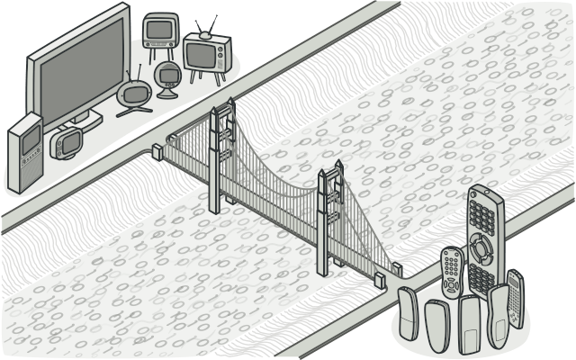
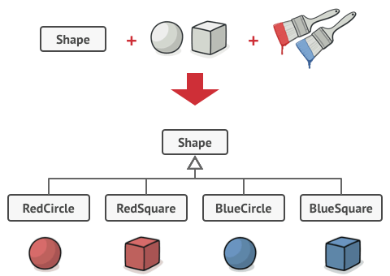
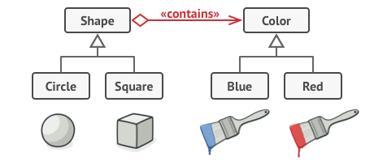
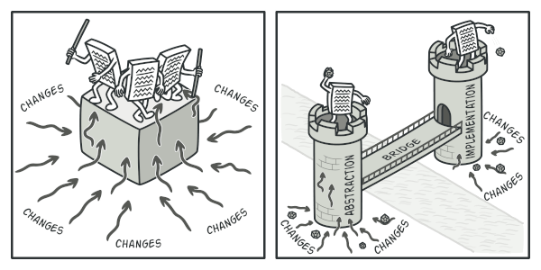
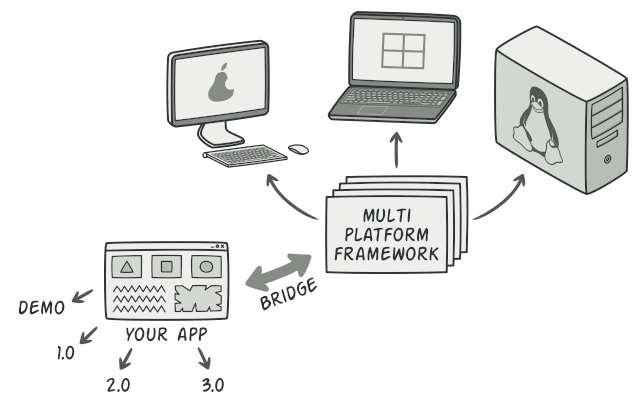
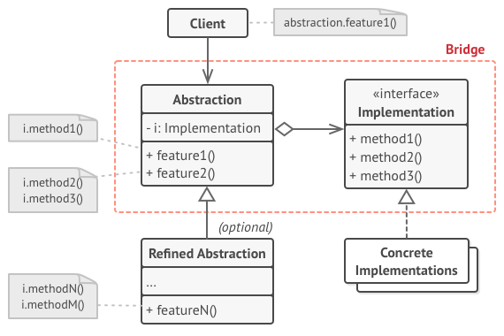
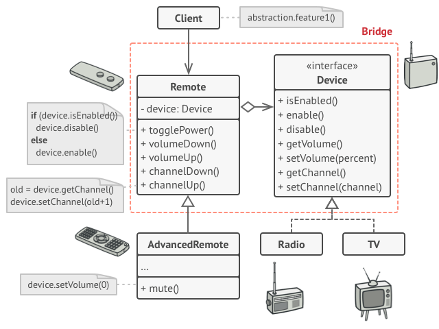

# Bridge
Decouple an abstraction from its implementation so that the two can vary independently.

## 🎯 เป้าหมายของ pattern นี้
แยกรูปแบบการทำงาน (abstraction) ออกจากการทำงานจริงๆของมัน เพื่อให้สามารถจัดการแยกกันได้
> **Note**  
abstraction ในที่นี้ไม่ใช่ abstract class ของโปรแกรมมิ่งเรานะ ในที่นี้มันจะเป็นคล้ายๆรูปแบบการทำงานมากกว่า เช่น หน้าตา (GUI) ของโปรแกรมเครื่องคิดเลข abstraction ของมันคือมีปุ่มกดที่เป็นตัวเลข กับปุ่มบวกลบไรพวกนี้  
ส่วนเมื่อกดแล้วมันจะต้องไปทำงานอะไร เป็นเรื่องของการทำงานจริงๆของมัน

## ✌ หลักการแบบสั้นๆ
1. เปลี่ยน inheritance เป็น composition

## 😢 ปัญหา
สมมุติว่าเรามี class `รูปทรง` ที่มี subclass อยู่ 2 แบบคือ `วงลม` กับ `สี่เหลี่ยม` แล้วเราอยากให้มันทำงานร่วมกับเรื่อง`สี` ได้ ดังนั้นเราก็เลยสร้าง subclass เพื่อมาทำงานกับ `สีแดง` และ `สีน้ำเงิน`

จากในตอนแรกที่มีแค่ 2 subclass พอเราทำเรื่องสีเข้ามารวมด้วย มันเลยทำให้เราต้องแก้ subclass กลายเป็น 4 subclass (วงลมสีแดง, วงกลมสีน้ำเงิน, สี่เหลี่ยมสีแดง, สี่เหลี่ยมสีน้ำเงิน) ตามรูป



(เพื่อให้เข้าใจไอเดีย จะขอสมมุติว่าเรื่องสี มันไม่ได้ง่ายแค่ไปกำหนดเป็น field ใน class รูปทรง ได้ก็แล้วกัน)

จากภาพจะเห็นว่าถ้าเราเพิ่ม รูปทรงใหม่ๆเข้าไป 1 อัน เราจะต้องสร้าง subclass ใหม่ 2 ตัว สำหรับสีแดง และ สีน้ำเงิน

และในทางกลับกัน ถ้าเราเพิ่มสีใหม่เข้าไป 1 สี เราก็ต้องเพิ่ม subclass ใหม่ให้กับทุกรูปทรงเช่นกัน

แล้วเราจะแก้ปัญหาแบบนี้ยังไงดี ยิ่งเพิ่มยิ่งเยอะ ยิ่งเยอะยิ่งเลอะ ... ปวดตับเลย เพราะอ่านไม่ให้ลิ้นพันกันเนี่ยแหละ


## 😄 วิธีแก้ไข
ปัญหาที่มันเกิดขึ้นจริงๆมันเกิดจาก การที่เราเอาของ 2 อย่างที่ไม่เกี่ยวข้องอะไรกันเลยมาร่วมกัน ซึ่งเจ้านี่แหละคือปัญหาที่เกิดขึ้นบ่อยๆในการทำ inheritance

ซึ่ง Bridge pattern บอกว่า `อย่าไปทำ inheritance ถ้าของ 2 อย่างไม่เกี่ยวข้องกัน` ให้ใช้ `composition` แทน ซึ่งมันจะช่วยให้เราแยกเรื่องที่ไม่เกี่ยวข้องกันออกจากกันได้ ตามรูปเลย



จากวิธีนี้ ของ 2 อย่างก็ไม่ได้ผูกไปด้วยกันแล้ว เพราะของรูปทรงกับสีมันเชื่อมกันแค่ `ลิงค์ของ object` เท่านั้น ทำให้การเพิ่มรูปทรงเข้าไปใหม่ ก็ไม่เกี่ยวอะไรกับสี และการเพิ่มสีก็ไม่เกี่ยวกับรูปทรงละ 

ซึ่งเจ้า `ลิงค์ของ object` นี่แหละมันทำงานคล้ายกับ `สะพาน` ที่เชื่อมระหว่าง รูปทรง กับ สี และการทำแบบนี้มันทำให้เราสามารถแยกของ 2 อย่าง ออกจากกันได้

ยกตัวอย่างเช่น แยกหน้าตาโปรแกรม (GUI) ออกเป็นหลายๆตัว สำหรับผู้ดูแลระบบ, สำหรับผู้ใช้ทั่วไป 
ออกจาก โค้ดที่ใช้ทำงานจริงๆของมัน



จากรูป ถ้าเราไม่แยกเรื่องออกจากกัน นั่นหมายความว่าโค้ดที่ดูแลรับผิดชอบเรื่องนั้นๆย่อมใหญ่ตาม เวลาที่มี requirement เข้ามาก็จะแก้ยาก แต่ในทางกลับกันถ้าเราแยกเรื่องออกจากกัน โค้ดที่ดูแลรับผิดชอบก็จะถูกแบ่งเป็นเรื่องๆไป เวลามี requirement เข้ามาก็จะแก้ไปเรื่องๆไปเช่นกัน

ตัวอย่างที่ชัดเจนของเรื่องนี้คือ เราต้องเขียนแอพเพื่อไปให้มันใช้งานได้ทั้งบน Windows, Linux และ MacOS สิ่งที่เราควรทำคือ

แยกหน้าตา (abstraction) ออกมาเป็นเรื่องหนึ่ง และแยก การทำงานจริงๆออกเป็นอีกเรื่อง



ซึ่งเราจะให้หน้าตา (abstraction) คอยดูแลว่ามันต้องแสดงอะไรบนแอพเมื่อไปทำงานในแต่ละระบบ แล้ว `เชื่อม` เข้ากับการทำงานจริงๆของมัน

ดังนั้นปุ่มเซฟที่แสดงอยู่บนหน้าจอ Windows กับ Linux เมื่อผู้ใช้กดปุ่มนั้นลงไป มันก็จะไปเรียก ตัวที่ทำงานจริงๆของแต่ละระบบขึ้นมาทำงาน Windows ก็ไปเรียก windows command ส่วน Linux ก็ไปเรียก linux command

ส่วนการแสดงผลปุ่มเซฟบน Windows กับ Linux ก็จะเป็นเรื่องของหน้าตา (abstraction) ว่าจะโชว์ icon แบบไหนมาแสดง ต้องโค้งต้องเหลี่ยมยังไง ก็ขึ้นกับระบบปฏิบัติการของมัน

## 📌 โครงสร้างของ pattern นี้


> **อธิบาย**  
**Abstraction** - คอยให้ client ใช้ในระบะ high-level ซึ่งภายในตัวมันจะเชื่อมไปยังตัวทำงานที่แท้จริง (low-level work)  
**Implementation** - จัดเตรียม interface ให้กับตัวทำงานที่แท้จริง โดยที่ **Abstraction** จะเรียกใช้ผ่าน interface พวกนี้เท่านั้น  
**Concrete Implementations** - โค้ทที่ทำงานจริงๆ  
**Refined Abstractions** - คอยจัดการเรื่องที่นอกเหนือจากที่ **Abstraction** ธรรมดามี ซึ่งคลาสนี้จะมีหรือไม่มีก็ได้

## 🛠 ตัวอย่างการนำไปใช้งาน
เราอยากจะสร้างรีโมทอเนกประสงค์เอาไว้ควบคุมของต่างๆ เช่นวิทยุ ทีวี หลอดไฟ บลาๆ ซึ่งถ้าเราออกแบบโดยใช้ inheritance เราก็จะมี class ออกมาเต็มไปหมดเลย เช่น TvRemoteController, RadioRemoteController ไรงี้ ซึ่งถ้าเพิ่มรีโมทหรืออุปกรณ์เข้ามาก็จะยิ่งทำให้ class แตกหน่อออกมากขึ้น เหมือนกับ รูปทรงกับสี

ดังนั้นแทนที่จะใช้ inheritance เราก็จะไปใช้ composition แทน โดยแบ่งออกเป็น 2 เรื่องคือ ตัวควบคุม(รีโมท) และ การทำงาน(อุปกรณ์) ตามรูป



ถ้าเราอยากมีรีโมทที่ทำได้มากกว่ารีโมทธรรมดาก็ได้ โดยสร้าง Refined Abstract class ขึ้นมา ในรูปคือ `AdvancedRemote` เพื่อเอาไว้ปิดเสียง

## 👍 ข้อดี
* แยกงานของแต่ละ platform ออกจากกันได้

## 👎 ข้อเสีย
* เพิ่มความซับซ้อนให้กับโค้ด เพราะต้องไปสร้าง class และ interface มากมาย

## ‍‍📝 Code ตัวอย่าง
```
using System;

// Abstracts
class Remote
{
    private IDevice device;

    public Remote(IDevice device)
    {
        this.device = device;
    }

    public void TogglePower()
    {
        if(device.IsEnabled)
        {
            device.Disable();
        }
        else
        {
            device.Enable();
        }
    }
}
class AdvancedRemote : Remote
{
    public AdvancedRemote(IDevice device) 
        : base(device) {}

    public void Mute()
        => Console.WriteLine("Mute!!");
}

// Implementations
interface IDevice
{
    bool IsEnabled { get; }
    void Enable();
    void Disable();
}
class Radio : IDevice
{
    public bool IsEnabled { get; private set; }
    public void Enable()
    {
        IsEnabled = true;
        Console.WriteLine("Radio is turned on");
    }
    public void Disable()
    {
        IsEnabled = false;
        Console.WriteLine("Radio is turned off");
    }
}
class Tv : IDevice
{
    public bool IsEnabled { get; private set; }
    public void Enable()
    {
        IsEnabled = true;
        Console.WriteLine("Tv is turned on");
    }
    public void Disable()
    {
        IsEnabled = false;
        Console.WriteLine("Tv is turned off");
    }
}

// Client
class Program
{
    static void Main(string[] args)
    {
        var radioRemote = new Remote(new Radio());
        radioRemote.TogglePower();
        radioRemote.TogglePower();

        var tvRemote = new AdvancedRemote(new Tv());
        tvRemote.TogglePower();
        tvRemote.TogglePower();
        tvRemote.Mute();
    }
}
```

**Output**
```
Radio is turned on
Radio is turned off
Tv is turned on
Tv is turned off
Mute!!
```

# Credit
https://refactoring.guru  
You can buy his book by click the image below.  
[](https://refactoring.guru/design-patterns/book#buy-now)  