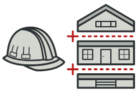
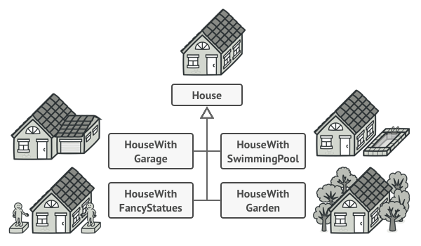
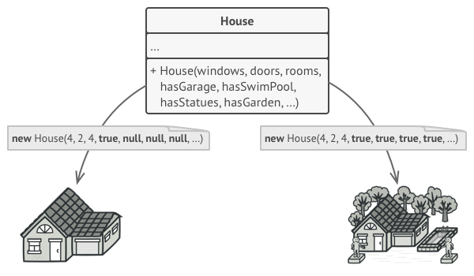
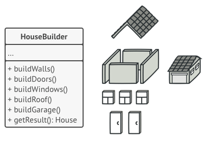
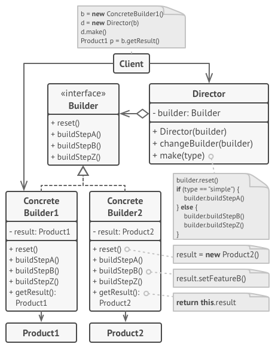
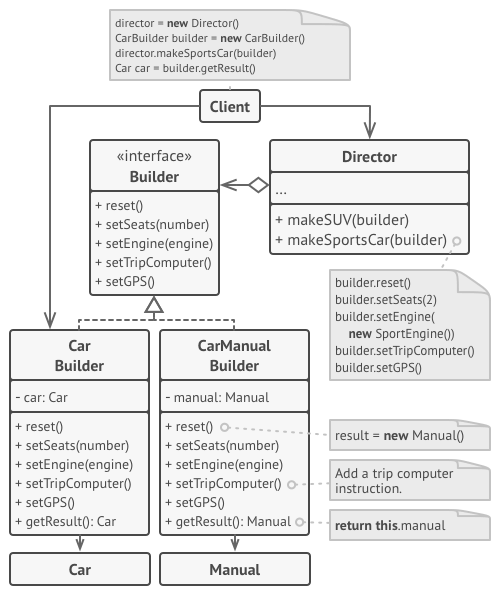

# Factory Method
The intent of the Builder design pattern is to separate the construction of a complex object from its representation. By doing so the same construction process can create different representations.

## 🎯 เป้าหมายของ pattern นี้
แยกการสร้าง object ที่ต้องอาศัยขั้นตอนการสร้างที่ซับซ้อนออก และช่วยให้เราสามารถสร้าง object ประเภทอื่นๆที่มีขั้นตอนการสร้างแบบเดียวกันได้

## ✌ หลักการแบบสั้นๆ
1. แยกขั้นตอนการสร้าง object ออกไปให้ `Builder` รับผิดชอบ (อาจจะมี builder เพื่อใช้สร้าง object หลายๆแบบก็ได้)
1. แยกลำดับขั้นตอนการประกอบ object ออกไปให้ `Director` รับผิดชอบ (ภายใน director จะมีวิธีการประกอบ object หลายๆแบบก็ได้)
1. Client เมื่อต้องการสร้าง object ก็จะส่ง Builder ไปให้ Director เพื่อให้สร้างของที่ตัวเองต้องการออกมา

## 😢 ปัญหา


สมมุติว่าเรามี class ตัวหนึ่ง ที่มีขั้นตอนในการสร้างค่อนข้างยุ่งยากหลายขั้นตอน เช่น ต้องสร้างของหลายๆอย่างให้กับ constructor แถมยังต้องไปกำหนดค่าให้กับ field & property ต่างๆ หรืออาจจะรวมถึงต้องไปเรียกใช้ initialization method อีกด้วย

ลองคิดดูสิถ้าเราต้องสร้าง object จาก class ที่ว่านี้ขึ้นมา มันจะทำให้ client code ของเราวุ่นวายขนาดไหน

แล้วถ้าเรามี class ลักษณะนี้อีกหลายๆตัวละ!! client code ของเราน่าจะกลายเป็นสปาเก็ตตี้แน่นอน (เละ)

เพื่อให้เห็นภาพมากขึ้นเรามาลองสมมุติว่า

ถ้าเราอยากจะเขียนโค้ด เพื่อสร้างบ้านแบบเรียบง่ายซักหลัง สิ่งแรกที่เราต้องทำก็คือไปสร้าง `House` object ใช้ปะ

แต่แค่ new House() ขึ้นมา มันยังไม่จบเท่านั้นละ เช่น เราต้องไปคอยกำหนดอีกว่า บ้านจะมีกำแพงกี่อัน, มี่กี่ชั้น, ประตูหน้าต่างทำจากอะไร แถมต้องไปสร้างหลังคาให้มันด้วย (จากที่ว่ามาเนี่ยแหละ complex object)

แต่ปัญหาของมันไม่ได้มีอยู่แค่นี้ เพราะถ้าโปรแกรมของเราเริ่มต้องการบ้านแบบอื่นๆบ้างละ เช่น บ้านไซต์ใหญ่กว่าปรกติ, มีสนามหญ้าด้วย, มีโรงรถ, มีสระว่ายน้ำ, มีรูปปั้นสวยๆประดับบ้าน แค่คิดก็ปวดหัวละ ถ้าต้องไปสร้าง object บ้านพวกนั้น

ซึ่งจากที่ว่ามาเราก็อาจจะไปสร้าง subclass เพื่อทำหน้าที่จัดการบ้านแต่ละประเภทที่ยกต้วอย่างไปก็ได้นิน่า ตามรูปด้านล่าง



แต่การทำแบบนี้กำยังมีปัญหาอยู่ดี เช่นอยู่มาวันหนึ่งบ้านจะต้องมีระเบียงด้วย มันก็จะทำให้เราก็ต้องไปแก้ไข subclass พวกนั้นให้รองรับเรื่องระเบียงด้วย

ซึ่งจากภาพ แค่เพิ่มเรื่องระเบียงเข้าไป 1 เรื่อง เรากลับต้องไปแก้ 4 subclass เลยนะ!! แล้วถ้าเรามี subclass เยอะๆละ ... แค่คิดก็ปวดตับละ

งั้นมาลองวิธีที่ไม่ต้องไปวุ่นว่ายกับ subclass ดูบ้างซิ คือลองทำให้ `House class` รองรับบ้านทุกรูปแบบเลย โดยแค่ส่ง parameter ต่างๆที่ใช้กำหนดข้อมูลของบ้าน เช่น จำนวนกำแพง, จำนวนชั้น, ประตูหน้าต่าง ฯลฯ เข้ามาก็น่าจะได้นิน่า ตามรูปด้านล่าง



วิธีนี้ใครเคยทำบ้างยกมือโหน่ย XD

ซึ่งข้อเสียของวิธีนี้คือ มันมี parameter มากเกินความจำเป็น ซึ่งบ้านบางประเภทก็ไม่ได้ต้องการ parameter บางตัวเลย ทำให้ parameter ส่วนใหญ่ที่ส่งเข้ามาไม่มีประโยชน์ที่จะเอาไปใช้ **แต่มันบังคับให้เราต้องส่งไปด้วย**

แล้วเราจะแก้ไขปัญหาพวกนี้ยังไงดีหว่า ??

## 😄 วิธีแก้ไข
หลักการของ **Builder pattern** นั้นแนะนำให้เราแยกขั้นตอนการสร้าง object ที่ซับซ้อนออกมาจาก class ของมัน ไปไว้ใน class ที่เรียกว่า `Builder`



จากรูปจะเห็นว่าขั้นตอนการสร้าง object เช่น สร้างกำแพง, สร้างประตู, สร้างหน้าต่าง ... ถูกย้ายออกไปอยู่ใน `HouseBuilder` แล้ว 

และ `HouseBuilder` จะเป็นคนดูแลวิธีการในการสร้าง house object ทั้งหมดให้เราเอง เช่น WoodenHouseBuilder สำหรับสร้างบ้านไม้

เดี๋ยวซิ บ้านของเรามันไม่ได้มีแค่บ้านไม้นะ บางหลังก็ทำจากอิฐ บางหลังทำจากเพชรนะ (บ้านบ้าพระทำจากเพชร)

สำหรับกรณีนี้เราก็แค่สร้าง `Builder` ออกมาหลายๆแบบซิ ซึ่ง builder แต่ละตัวก็จะมีขั้นตอนการ implement method ในการสร้างบ้านไม่เหมือนกัน เช่น
* **WoodenyHouseBuilder** - ภายใน method ของมันก็จะเขียนให้สร้างบ้านขึ้นมาจากไม้
* **BrickHouseBuilder** - ภายใน method ของมันก็จะเขียนให้สร้างบ้านขึ้นมาจากอิฐ
* **DiamonHouseBuilder** - ภายใน method ของมันก็จะเขียนให้สร้างบ้านขึ้นมาจากเพชร

ตามรูปด้านล่าง


จากรูปจะเห็นว่า Builder แต่ละประเภทจะสร้างบ้านออกมาตามลักษณะงานของมันเอง

แต่การมีแค่ Builder แค่นี้มันยังไม่จบนะ เพราะ builder ก็เปรียบเสมือนชนชั้นแรงงานที่คอยสร้างของต่างๆให้เรา 

หรือจินตนาการง่ายว่า ถ้าเรามีแค่ Builder มันก็เหมือนกับเราไปสั่งคนงานให้สร้าง กำแพง, ประตู, หน้าต่าง เอาไว้ ส่วนมันจะเอามาประกอบกันยังไง เราก็ต้องทำเองหมดเลยอะดิ 

ซึ่งถ้าเป็นแบบนั้นมันหมายความว่า client code จะต้องเรียก method ของ builder แต่ละตัวเอง เพื่อนำมาประกอบเป็นบ้าน (`Product`) มันหมายความว่าโค้ดเราก็จะวุ่นวายอยู่ดี

จากที่โม้มาด้านบน เราเลยต้องมี class อีกกลุ่มหนึ่งที่คอยควบคุมคนงานเหล่านั้นอีกที ซึ่งเราเรียกมันว่า `Director`

`Director`

จะมีหน้าที่ในการเรียกใช้งาน method ต่างๆที่อยู่ใน `Builder` เพื่อสร้างบ้านในแบบที่เราอยากได้ขึ้นมา

(จินตนาการง่ายๆ คนคุมการสร้างบ้านรู้ว่าเราอยากได้บ้านแบบไหน แต่เขาสร้างของต่างๆไม่เป็น เลยทำให้ต้องไปเรียกใช้คนงานมาสร้างแบบต่างๆ ซึ่งคนงานจะรู้ว่าถ้าอยากได้บ้านไม้ต้องสร้างยังไง หรือ อยากได้ประตูอิฐจะต้องสร้างยังไง แล้ว Director ก็จะเอาของที่ได้มาไปประกอบกันอีกที)


จากที่ว่ามามันจะทำให้ client สามารถสร้าง object บ้านแบบที่อยากได้ เพียงแค่สั่ง director คนเดียวก็พอ แล้วที่เหลือ director ก็จะไปเรียกใช้ builder ให้มาสร้างของตามที่เราอยากได้มาให้เรานั่นเอง

หายปวดหัวแว๊ว XD

## 📌 โครงสร้างของ pattern นี้


> **อธิบาย**  
**Builder** - เป็น interface ที่รวมขั้นตอนในการสร้าง product มีอะไรบ้าง  
**Concrete Builders** - (ConcreteBuilder 1&2) เป็น class ที่ลงรายละเอียดจริงๆว่าขั้นตอนแต่ละขั้นตอนต้องทำยังไง  
**Products** - (Product 1&2) คือของที่จะได้จากที่ builder สร้าง (builder แต่ละตัว อาจจะได้ product เดียวกันหรือต่างกันก็ได้)  
**Director** - เป็น class ที่คอยกำหนดว่าจะเรียกใช้ method อะไรของ Builder บ้าง รวมถึงลำดับก่อนหลังในการเรียกด้วย เพื่อใช้ในการสร้าง product ให้ client  
**Client** - ทำงานกับ director โดยแค่ส่ง builder ต่างๆไปให้ director เท่านั้นแล้วก็รอรับ product ไปใช้งาน

## 🛠 ตัวอย่างการนำไปใช้งาน
ตัวอย่างนี้เป็นการจำลองใช้ **Builder** ไปสร้างรถเกียร์ออโต กับเกียร์ธรรมดา



1. จากภาพจะเห็นว่าเมื่อ client ต้องการรถแบบไหนก็เพียงแค่ส่ง Builder ไปให้กับ Director ก็พอ
1. Director ก็จะไปเรียกใช้ method ต่างๆของ builder เพื่อสร้างรถออกมา
1. Method ของ Builder แต่ละแบบก็จะทำงานไม่เหมือนกัน เช่น รถเกียร์ธรรมดาก็ใช้ Manual object

## 👍 ข้อดี
* สามารถสร้าง object ที่มีขั้นตอนการสร้างอันซับซ้อนได้เรื่อยๆ
* รองรับ product แบบอื่นๆที่มีขั้นตอนในการสร้างเหมือนกันได้
* ถูกหลัก `Single Responsibility Principle`

## 👎 ข้อเสีย
* เพิ่มความซับซ้อนให้กับโค้ด เพราะต้องไปสร้าง class มากมาย

## ‍‍📝 Code ตัวอย่าง
```
using System;
using System.Collections.Generic;

// Products
public interface IProduct
{
    IList<string> Parts { get; set; }
    void DescribeYourself();
}
public class House : IProduct
{
    public IList<string> Parts { get; set; }

    public void DescribeYourself()
    {
        foreach (var item in Parts)
        {
            Console.WriteLine(item);
        }
    }
}

// Builders
public interface IHouseBuilder
{
    void BuildWalls();
    void BuildDoors();
    void BuildSwimmingPool();
    IProduct GetHouse();
}
public class WoodenHouseBuilder : IHouseBuilder
{
    private House house = new House{ Parts = new List<string>() };

    public void BuildWalls()
        => house.Parts.Add("Created wooden walls");
    public void BuildDoors()
        => house.Parts.Add("Created wooden doors");
    public void BuildSwimmingPool()
        => house.Parts.Add("Created wooden swimming pool");
    public IProduct GetHouse()
        => house;
}
public class BrickHouseBuilder : IHouseBuilder
{
    private House house = new House{ Parts = new List<string>() };

    public void BuildWalls()
        => house.Parts.Add("Created brick walls");
    public void BuildDoors()
        => house.Parts.Add("Created brick doors");
    public void BuildSwimmingPool()
        => house.Parts.Add("Created brick swimming pool");
    public IProduct GetHouse()
        => house;
}

// Directors
public class HouseDirector
{
    private IHouseBuilder builder;

    public HouseDirector(IHouseBuilder builder)
        => this.builder = builder;

    public void BuildHouse()
    {
        builder.BuildWalls();
        builder.BuildDoors();
    }
    
    public void BuildHouseWithSwimmingPool()
    {
        builder.BuildWalls();
        builder.BuildDoors();
        builder.BuildSwimmingPool();
    }
}

// Client
class Program
{
    static void Main(string[] args)
    {
        Console.WriteLine("1.Build a wooden house");
        var woodenHouseBuilder = new WoodenHouseBuilder();
        var director1 = new HouseDirector(woodenHouseBuilder);
        director1.BuildHouse();
        woodenHouseBuilder.GetHouse().DescribeYourself();

        Console.WriteLine("2.Build a brick house with swimming pool");
        var brickHouseBuilder = new BrickHouseBuilder();
        var director2 = new HouseDirector(brickHouseBuilder);
        director2.BuildHouseWithSwimmingPool();
        brickHouseBuilder.GetHouse().DescribeYourself();
    }
}
```

**Output**
```
1.Build a wooden house
Created wooden walls
Created wooden doors
2.Build a brick house with swimming pool
Created brick walls
Created brick doors
Created brick swimming pool
```

# Credit
https://refactoring.guru  
You can buy his book by click the image below.  
[](https://refactoring.guru/design-patterns/book#buy-now)  