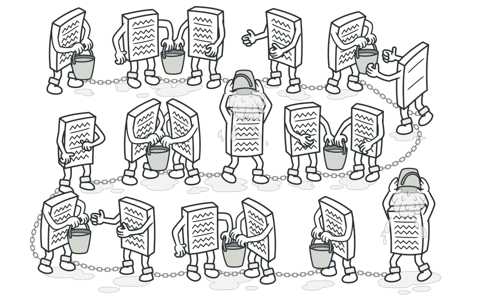
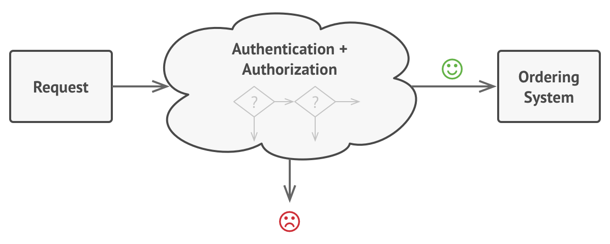
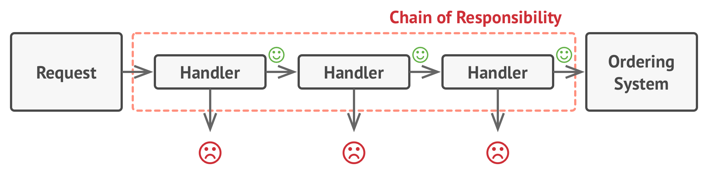
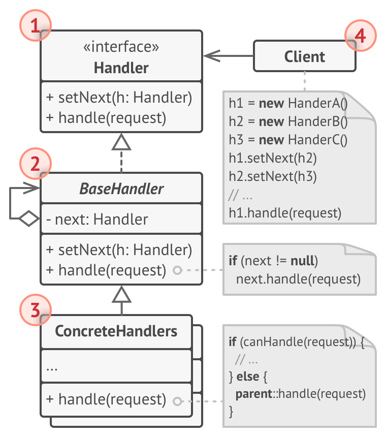

# Chain of Responsibility
Avoid coupling the sender of a request to its receiver by giving more than one object a chance to handle the request. Chain the receiving objects and pass the request along the chain until an object handles it.

## 🎯 เป้าหมายของ pattern นี้
ป้องกันการเกิด coupling จากตัวส่ง request กับ ตัวจัดการ request

## ✌ หลักการแบบสั้นๆ
1. แตกตัวจัดการ request ออกเป็น class หลายๆตัว (handler)
1. นำตัวจัดการที่แตกออกมาแล้ว มาเรียกต่อกันเป็นทอดๆตามลำดับ (chain) 
1. request จะถูกส่งให้กับ handler ตัวแรก แล้วไปยัง handler ตัวถัดไปเรื่อยๆ ตราบใดที่ยังไม่มี handler ไหนมาจัดการมันได้

## 😢 ปัญหา
วันนี้เรามาทำงานกับลาซาด้า เว็บขายของ online ของประเทศอุกันด้า ซึ่งใครที่จะสั่งซื้อสินค้าได้จะต้องผ่านการ login ให้เรียบร้อยเสียก่อน (authentication) และ ต้องมีสิทธิ์ (authorization) ในการสั่งซื้อด้วย ซึ่งถ้ามีอย่างใดอย่างหนึ่งไม่ถูก ก็จะไม่สามารถสั่งซื้อได้เลย ตามรูป



หลังจากผ่านไปเดือนกว่าๆ เราก็ได้เพิ่มความสามารถอื่นๆเข้าไปในระบบตามนี้

* เมื่อส่งคำสั่งซื้อมันจะต้องไม่ส่ง raw data ไปให้กับเซิฟเวอร์ เนื่องจากมันไม่ปลอดภัย ดังนั้นเลยให้จุดนี้ต้องเพิ่มขั้นตอนในการตรวจสอบคำสั่งซื้อเพิ่มขึ้น
* เพื่อป้องกันการทำ brute force password ทำให้เราต้องเพิ่มการตรวจสอบ IP ที่ login ล้มเหลวหลายๆครั้งด้วย
* เพื่อความรวดเร็ว บางทีเราก็จะส่ง cach data กลับไป (สำหรับบาง request ก็ไม่สามารถใช้ cach ได้อยู่ดีนะจ๊ะ)

> **Brute force** - คือการที่ hacker ใช้ในการสุ่มรหัสผ่านของเราแบบง่ายที่สุด คือสุ่มแบบไล่ทุกอย่างไปเรื่อยๆเลย เช่น PIN 4 หลัก เขาก็จะไล่ใส่ตั้งแต่ 0000 ไปจนถึง 9999 ทำให้สุดท้ายเขาก็จะรู้รหัส PIN เรา ดังนั้นโดยระบบปรกติเขาเลยจะ lock บัญชีที่ใส่หรัสผ่านผิดบ่อยๆ

> **Cach data** - คือข้อมูลที่เก็บไว้ชั่วคราว โดยปรกติจะเป็นข้อมูลที่ไม่มีการเปลี่ยนแปลง (static) เนื่องจากเป็นข้อมูลที่ระบบมันจำไว้ เลยไม่ต้องผ่านการคำนวณอะไรมากมาย ดังนั้นเวลาทำงานกับข้อมูลพวกนี้จะเร็วม๊วก ทำให้วิธีนี้เป็นที่นิยมใช้บ่อยๆ เช่น หน้าเว็บไหนที่มีคนเข้าบ่อยๆ และหน้านั้นไม่ค่อยเปลี่ยน คนทำเว็บเขาก็จะเก็บหน้านี้เป็น cach ไว้ แล้วพอมีคนมาเปิดหน้าเว็บนั้นๆ ระบบก็จะส่งหน้าเว็บนั้นไปให้ได้เลย ทำให้เว็บค่อนข้างเร็ว

จากที่เราเพิ่มความสามารถตามที่ไล่มา ทำให้ขั้นตอนในการตรวจสอบการสั่งซื้อเพิ่มขึ้น ตามรูป


โค้ดในการตรวจสอบเริ่มดูยุ่งเหยิง ทำให้ทุกๆครั้งที่มีการเพิ่มความสามารถใหม่ๆเข้าไปในระบบ มันก็จะยิ่งยุ่งมากขึ้นกว่าเดิม และอาจจะไปกระทบกับระบบส่วนอื่นๆด้วย ที่เป็นบาปไปกว่านั้นคือ ทุกครั้งที่เพิ่มความสามารถเข้าไป มันอาจจะเกิดโค้ดที่ซ้ำกันเกิดขึ้นก็ได้ ทำให้เราต้องเสียแรงไปเช็คการทำงานพวกนั้นเพิ่มอีกด้วย

และอีกจุดที่อาจจะมองตกไปคือ ทุกเงื่อนไขที่เพิ่มเข้าไป มันจะยิ่งเพิ่มการผูกติดกัน (coupling) เข้าไปเรื่อยๆอีกด้วย

จากที่นั่งเมากาวมาจะเห็นว่า ทุกๆครั้งที่เพิ่มอะไรลงไปมันก็จะทำให้ระบบยากต่อการทำความเข้าใจ และการบำรุงรักษาก็จะยากตามไปด้วย (ยิ่งถ้าไม่ทำ **Refactor code** นะ ยิ่งเป็นบาปหนักกว่าเดิม)

จากปัญหาที่ว่ามา เราจะจัดการยังไงดี เพื่อไม่ให้มันเป็นสปาเก็ตตี้แบบนี้ดี??

## 😄 วิธีแก้ไข
ขณะที่กำลังปวดหัวอยู่นั้นเอง ก็ได้เดินไปเจอกับ**เทะสึไบซัง**ที่กำลังเดินบิณฑบาตอยู่แถวนั้นอยู่พอดี เขาก็เลยบอกว่า ใช้ **Chain of responsibility** สิโยม!!

ขณะที่เรายืน งงๆ แล้วสูดหายใจเอาฝุ่น 2.5 เข้าปอดอยู่ เทะสึไปซังก็พูดต่อว่า

แทนที่โยมจะมีตัวจัดการทุกอย่างอยู่แค่ที่เดียว โยมก็แตกมันออกเป็นตัวจัดการหลายๆตัวดิโยม ซึ่งอาตามาขอเรียกตัวจัดการแต่ละตัวว่า `Handler` นะ ซึ่งจากปัญหาของโยมเนี่ย แทนที่การตรวจสอบต่างๆ เวลาที่มีคำสั่งซื้อเข้ามาจะอยู่แค่ใน method ตัวเดียว โยมก็แตกมันออกเป็นหลายๆตัวดิ (เอ็งไปรู้ปัญหาตรูตอนไหนฟระ!!)

ยังไม่หมดเท่านั้นนะโยม หลังจากที่โยมแตกเป็น Handler เป็นหลายๆตัวละ ก็ให้เอา handler พวกนั้นมาเรียกใช้งานต่อๆกันเป็นทอดๆนะ `(Chain)` โดยที่เจ้า handler แต่ละตัวจะต้องรู้ด้วยว่า handler ตัวที่ต่อจากมันคือตัวไหน

ซึ่งพอโยมทำแบบนี้เวลาที่มีคำสั่งซื้อเข้ามา คำสั่งซื้อก็จะถูกโยนไปหา handler ที่มันต่อๆกันอยู่ แล้วมันก็จะถูกประมวลผลโดย handler แต่ละตัวไงละโยม

และที่เจ๋งไปกว่านั้นคือ handler แต่ละตัวมันมีสิทธิ์ที่จะส่งคำสั่งซื้อไปยัง handler ตัวถัดไป หรือจะหยุดส่งไปเลยก็ได้ เช่นกรณีส่งคำสั่งซื้อที่ไม่มีสิทธิ์สั่งซื้อ พอเจอเจ้า handler ที่ตรวจสอบสิทธิ์ มันก็จะปัดคำสั่งซื้อนั้นทิ้งเลยละโยม ใจร้ายไหม?

เดี๋ยวอาตามาจะเขียนภาพให้ดูนะ เห็นโยมยืนสูดฝุ่น 2.5 ไปเยอะจนน่าจะมึนละ ... ได้ภาพประมาณนี้เลยโยม



ฟังอาตามาอธิบายดีๆนะโยมนะ (เริ่มรู้สึกหงุดหงิดเจ้าพระรูปนี้แล้วแฮะ)

ถ้าคำสั่งซื้อเข้ามาปุ๊ป มันก็จะถูกโยนไปหา handler ตัวแรกสุด ซึ่งถ้าตัวแรกตรวจดูแล้วพบว่า คำสั่งซื้อไม่มีปัญหา มันก็จะส่งต่อไปหา handler ตัวถัดไปเรื่อยๆ ตราบใดที่ไม่มีปัญหาคำสั่งซื้อนั้นก็จะถูกสั่งซื้อได้ถูกต้อง แต่ถ้ามีข้อมูลบางอย่างไม่ถูกเงื่อนไข handler ตัวที่รับผิดชอบเงื่อนไขนั้นๆก็จะหยุดไม่ส่งคำสั่งซื้อนั้น ให้กับ handler ตัวถัดไปไงละโยม

แต่ไหนๆก็ไหนๆแล้วนะโยม อาตตามาจะบอกความลับให้ฟัง โดยทั่วไปแล้วเวลาเขาเอา chain of responsibility pattern นี้ไปใช้นะ เขาจะทำกลับด้านกันนิดหน่อยคือ `ถ้ามี request เข้า มาแล้ว handler นั้นๆสามารถทำงานกับ request นั้นได้จนจบแล้วละก็ มันจะไม่ส่ง request ไปให้กับ handler ตัวถัดไปเลย` นะจุ๊

สุดท้ายอาตตามาจะบอกให้เอาบุญ โดยปรกติแล้ว handler ทั้งหลาย ควรจะต้องมาจาก interface เดียวกันนะจุ๊ ส่วน concrete handler ก็ดูแลแค่ method `execute` ของตัวเองก็พอ มันจะได้ไม่เกิด coupling ขึ้นยังไงละ

## 📌 โครงสร้างของ pattern นี้


> **อธิบาย**  
**1.Handler** - interface กลางของ handler ตัวมันจะมี method สำหรับจัดการ request  
**2.Base Handler** - (มีหรือไม่มีตัวนี้ก็ได้) base class ของ handler โดยจะมีโค้ดที่ใช้บ่อยๆอยู่ในนี้  
**3.Concrete Handlers** - ตัว handler สำหรับทำงานที่แท้จริง เมื่อมันได้รับ request โดยตัวมันสามารถเลือกได้ต่อว่าจะส่งต่อ หรือ หยุดส่ง request ให้ handler ที่ต่อจากมัน และโดยปรกติข้อมูลที่จำเป็นในการทำงานของมันจะถูกส่งเข้ามาผ่าน constructor  
**4.Client** - สร้าง chain ของ handler ทั้งหลาย หรือเรียกใช้ chain ที่มีอยู่แล้ว  

## 🛠 ตัวอย่างการนำไปใช้งาน
สมมุติว่าเราต้องการเขียน lib ตัวนึงที่เอาไว้เขียน log ไฟล์ โดยมี log ทั้งหมด 3 แบบคือ Info, Debug และ Error

โดยรอบนี้เราจะใช้ Chain of responsibility มาช่วย แต่จะใช้ในรูปแบบที่ หากมี handler ไหนจัดการไปแล้ว มันจะไม่ส่งต่อให้ handler ตัวถัดไปนะ ไปลองดูโค้ดตัวอย่างกันเบย

## 👍 ข้อดี
* สามารถจัดการ request โดยเป็นลำดับๆได้
* สามารถเพิ่มขั้นตอนใหม่ๆเข้าไปโดยไม่มีผลกระทบกับระบบ

## 👎 ข้อเสีย
* บาง request อาจจะไม่ถูก handler ตัวไหนเอาไปทำงานเลย ถ้าเราไม่เขียนการจัดการส่วนนี้ดีๆ

## ‍‍📝 Code ตัวอย่าง
```
using System;

// Request Models
class LogInfo
{
    public int Level { get; set; }
    public string Message { get; set; }

    public LogInfo(int level, string message)
    {
        Level = level;
        Message = message;
    }
}

// Handler Interface
interface ILogger
{
    ILogger HigherLogger { get; }
    void SetNextLogger(ILogger logger);
    void WriteLog(LogInfo log);
}

// Base Handler
abstract class LoggerBase : ILogger
{
    private int logLevel;

    public ILogger HigherLogger { get; protected set; }

    public LoggerBase(int logLevel)
        => this.logLevel = logLevel;

    public void SetNextLogger(ILogger logger)
        => HigherLogger = logger;

    public void WriteLog(LogInfo log)
    {
        if(logLevel >= log.Level)
            WriteMessage(log.Message);
        else
            HigherLogger?.WriteLog(log);
    }

    protected abstract void WriteMessage(string msg);
}

// Concrete Handlers
class InfoLogger : LoggerBase
{
    public InfoLogger(int logLevel)
        : base(logLevel){ }

    protected override void WriteMessage(string msg)
        => Console.WriteLine($"[INFO] {msg}");
}
class DebugLogger : LoggerBase
{
    public DebugLogger(int logLevel)
        : base(logLevel){ }

    protected override void WriteMessage(string msg)
        => Console.WriteLine($"[DEBUG] {msg}");
}
class ErrorLogger : LoggerBase
{
    public ErrorLogger(int logLevel)
        : base(logLevel){ }

    protected override void WriteMessage(string msg)
        => Console.WriteLine($"[ERROR] {msg}");
}

// Client
class Program
{
    static void Main(string[] args)
    {
        const int INFO = 1;
        var infoLogger = new InfoLogger(INFO);

        const int DEBUG = 2;
        var debugLogger = new DebugLogger(DEBUG);

        const int ERROR = 3;
        var errorLogger = new ErrorLogger(ERROR);

        infoLogger.SetNextLogger(debugLogger);
        debugLogger.SetNextLogger(errorLogger);

        var chainedLogger = infoLogger;
        chainedLogger.WriteLog(new LogInfo(INFO,"Hello world XD"));
        chainedLogger.WriteLog(new LogInfo(DEBUG, "Houston we have a problem."));
        chainedLogger.WriteLog(new LogInfo(ERROR, "Who the cat is Huston?"));
    }
}
```

**Output**
```
[INFO] Hello world XD
[DEBUG] Houston we have a problem.
[ERROR] Who the cat is Huston?
```

# Credit
https://refactoring.guru  
You can buy his book by click the image below.  
[](https://refactoring.guru/design-patterns/book#buy-now)  