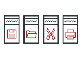
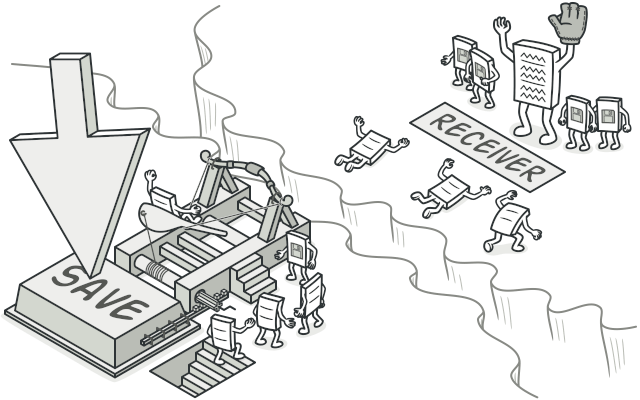
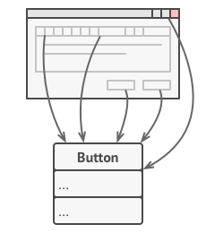
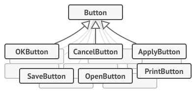
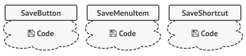
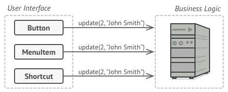
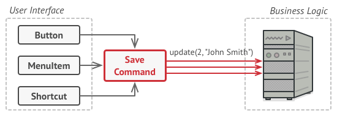
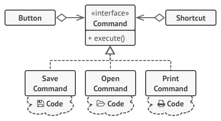
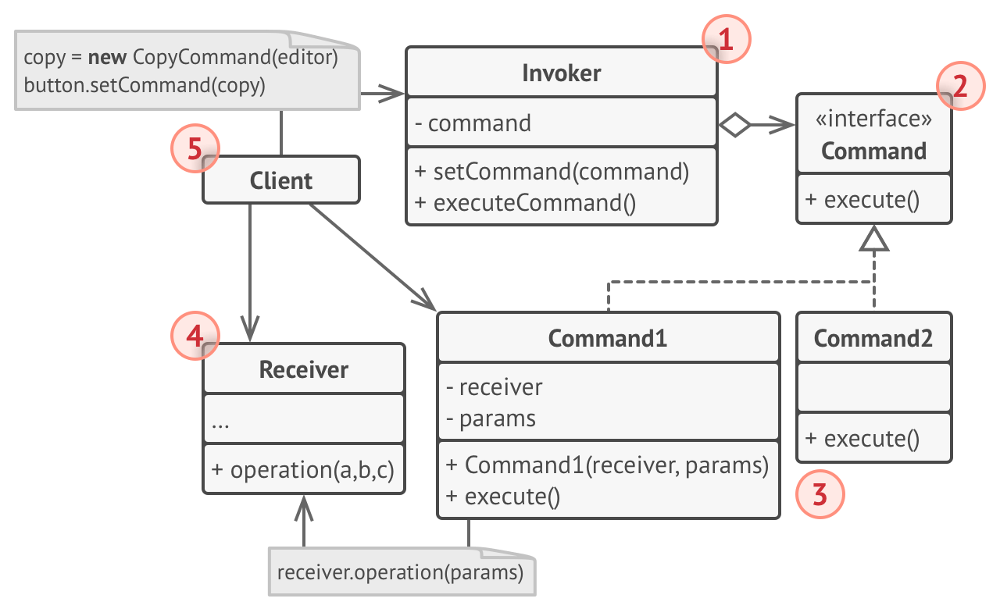

# Command
Encapsulate a request as an object, thereby letting you parameterize clients with different requests, queue or log requests, and support undoable operations.

## 🎯 เป้าหมายของ pattern นี้
เปลี่ยน Action ต่างๆให้กลายเป็น object ทำให้โปรแกรมจัดการ action ที่เข้ามาได้หลายรูปแบบ เช่น ทำเป็นลำดับๆ หรือ ยกเลิกคำสั่งที่พึ่งไป

## ✌ หลักการแบบสั้นๆ
1. xxx

## 😢 ปัญหา


วันนี้นึกสนุก เลยเขียนโปรแกรม Text editor ขึ้นเล่นๆตัวนึง ซึ่งภายในโปรแกรมนี้จะมี Toolbar อยู่ด้านบน ซึ่งภายในนั้นจะมีปุ่มต่างๆให้กดมากมาย ซึ่งปุ่มทุกปุ่มเราสร้างมาจาก `Button` class ตามรูป



เนื่องจากปุ่มที่อยู่บน toolbar นั้น มันมีการทำงานแบบซึ่งไม่เหมือนกันเลย เลยทำให้เราต้องสร้าง subclass ของมันออกมา เพื่อให้มันทำงานในรูปแบบต่างๆกันได้ เช่น `ปุ่มตกลง`, `ปุ่มยกเลิก`, `ปุ่มบันทึก` บลาๆ ตามรูปด้านล่าง



เมื่อเขียนเสร็จ เราก็พึ่งเอะใจว่า นั่นมันโค้ดบ้าอะไรกันฟระเนี่ยน subclass ยั้วเยี้ยเต็มไปหมด หยั่งกะแมลงสาบ!! ยิ่งมีปุ่มบน toolbar เพิ่มขึ้นมาเท่าไหร่ subclass ก็จะยิ่งมากขึ้นเท่านั้น

ยังมีเรื่องน่าเกลียดอีกเรื่อง เมื่อเรามองปุ่มต่างๆในโปรแกรมเราแล้วจะเห็นว่า **ปุ่มบันทึก** ที่อยู่บน toolbar, **ปุ่มบันทึก** ที่อยู่บนเมนู หรือแม้กระทั่ง **ปุ่มบันทึก** ที่อยู่ในเมนูลัด ทั้งหมดจริงๆมันก็คือโค้ดตัวเดียวกันนิหว่า!! เราแค่ไปสร้าง subclass ใหม่ แล้ว copy โค้ดเดิมไปวางใน subclass พวกนั้น ตามรูปเลย



มันผิดกลับที่ตั้งใจไว้ในตอนแรก เพราะในตอนแรก ปุ่มบันทึกมันมีแค่ toolbar เท่านั้น แต่พอทำไปๆซักพัก มันก็เริ่มมีปุ่มบันทึกตรงนั้น ตรงนู้น ตรงนี้ เพิ่มเข้ามาเรื่อยๆ มันเลยทำให้โค้ดเรา `มีกลิ่นไม่ดี` ยิ่งขึ้นไปเรื่อยๆ

> โดเรม่อนวันนี้เสนอตอน **โค้ดมีกลิ่นไม่ดี** (เคยดมมั่นปะ?)  
เรื่องของการที่โค้ดมีกลิ่นไม่ดีนั้น เป็นคำที่เอาไว้พูดถึงโค้ดที่มีแนวโน้มว่าจะมีปัญหาในอนาคตสูง เช่น โค้ดเดียวกันถูกเขียนซ้ำๆหลายๆที่, ออกแบบแล้วคลาสใหญ่ม๊วกกกก บลาๆ ปัญหาพวกนี้เรามีเทคนิกที่ช่วยตรวจในเบื้องต้นที่เรียกกันว่า `Code smell` นั่นเอง

แล้วเราจะแก้ปัญหากลิ่นคาวปลานี้ยังไงดีละ? (แหวะ)

## 😄 วิธีแก้ไข
ก่อนที่จะไปต่อขออธิบายหลักปฎิบัติที่ชื่อว่า Separation of concerns (SoC) นิ๊สนุง

> **Separation of concerns**  
คือหนึ่งใน design principle ซึ่งหลักการมีอยู่ว่า เราควรจะแยกงานออกเป็นส่วนๆ ตามหน้าที่การรับผิดชอบของมัน (จบเท่านี้ละกันเดี๋ยวจะยาว ไปหาอ่านต่อเองนะจุ๊)

ดังนั้น ถ้าเรามองกลับไปว่ามันเกิดอะไรขึ้นกับโค้ดเรา เราก็จะพบว่า `เมื่อผู้ใช้กดปุ่มเซฟที่หน้า UI สิ่งที่มันเกิดขึ้นคือ มันจะไปเรียกใช้ method บันทึกโดยตรงได้เลย` นั่นหมายความว่ามันขัดกับหลักการของ Separation of concerns เลยนิ ยังไงหว่า?

งั้นอธิบายต่ออีกนิสกะด๊าย
> มันขัดหลักการยังไง? (ฟระ)  
โดยปรกติการแสดงผลต่างๆของโปรแกรม เช่นหน้าตา ความสวยงาม เราจะแยกมันออกเป็น concern ในด้าน UI layer (เพราะงานมันคือต้องดูแลความสวยงามอย่างเดียว) ซึ่งมันผิดหลักการเพราะ เมื่อปุ่มถูกกดปุ๊ปมันจะไปเรียกโค้ดในการบันทึกตรงๆเลย ซึ่งจริงๆเรื่องการบันทึกเป็นงานฝั่ง Business logic layer ต่างหาก

จากที่ UI layer ไปเรียก Business logic layer ตรงๆ พอผู้ใช้กดปุ่มบันทึกมันเลยทำให้โค้ดเรามันออกมาเป็นภาพนี้



ซึ่งแนวคิดของ `Command Pattern` เสนอว่า ให้เปลี่ยนของที่ผู้ใช้กระทำ `(Action)` มาเป็น object ซะ และถ้ามันต้องมีข้อมูลพิเศษต่างๆก็ให้ยัดเข้ามาใน object นั้นด้วยเลย ซึ่ง object พวกนั้นเราเรียกมันว่า `Command` นั่นเอง

เมื่อปุ่มถูกกด มันจะไปสร้าง command object ขึ้นมา ซึ่งเจ้าตัว command object นี้แหละจะเป็นเสมือนตัวเชื่อมระหว่าง UI layer กับ Business logic layer

เมื่อเป็นแบบนี้จะทำให้ UI layer แยกจาก Business logic layer อีกต่อไป (แยกขาดกันได้) ตามภาพเลย



ตัว Command ทุกตัวจะ implement `Interface` เดียวกัน ซึ่งเจ้า interface นั้นจะมีแค่ `Execute()` method เท่านั้น ทำให้คนที่ส่ง/รับ command ไม่ต้องผูกติด (coupling) กับ concrete command ใดๆ

แล้วข้อมูลต่างๆที่จะส่งไปกับ command ละ? เช่นกดเปลี่ยนเป็นสีเหลือง หรือเปลี่ยนเป็นสีแดง มันจะต้องส่ง `สี` เป็น parameter ไปด้วยนิน่า

คำตอบคือ เจ้าตัว command เองนั่นแหละที่มีข้อมูลเหล่านั้นอยู่ด้วย ตามภาพเลย



สรุปสั้นๆก่อน ในตอนนี้เวลาที่เราจะสั่งให้มันทำอะไร เราก็จะเปลี่ยนคำสั่งให้อยู่ในรูปของ `Command object`

ถัดมาเมื่อตัวที่สั่งให้ Command ทำงาน เราเรียกตัวนั้นว่า `Invoker` 

และสุดท้ายเมื่อ invoker สั่งให้ command ทำงาน ซึ่งเจ้าตัว command มีหน้าที่แค่เก็บมูลที่เกี่ยวข้องกับงานที่ต้องทำเท่านั้น  ส่วนตัวที่จะรับงานนั้นไปทำจริงๆเราเรียกมันว่า `Receiver`

## 📌 โครงสร้างของ pattern นี้


> **อธิบาย**  
**Invoker** - เก็นคนที่เก็บ command ต่างๆที่มี ไว้ให้ client เรียกใช้เมื่อต้องการ แล้วเมื่อ client สั่งงานเข้ามา เจ้า invoker จะทำการสั่งให้ command object ไปทำงาน  
**Command** - เป็น interface มาตรฐานให้กับ concreate command ปรกติจะมีแค่ Execute() method เดียว  
**Concrete Commands** - เป็นตัวเก็บข้อมูลที่เกี่ยวข้องกับรูปแบบคำสั่ง ซึ่งตัวมันเองจะไม่ทำงานเอง แต่จะทำหน้าที่ส่งต่อให้ Business logic object ไปทำงานต่อ  
**Receiver** - คือคนที่เอางานไปทำจริงๆ ดังนั้น Business logic จะอยู่ที่นี่  
**Client** - เป็นคนสร้าง concrete command object เพื่อส่งต่อไปให้กับ invoker ทำงาน

## 🛠 ตัวอย่างการนำไปใช้งาน
สมมุติว่าผมต้องการเขียนโปรแกรม เปิด/ปิด Tv ด้วยรีโมต โดยเจ้ารีโมตตัวนี้รองรับคำสั่ง Undo และ Redu อีกด้วย (เจ๋งปะละ?)

ปะไปดูโค้ดตัวอย่างกัน

## 👍 ข้อดี
* ทำให้โปรแกรมรองรับ Undo/Redo (CTRL+Z กับ CTRL+Y)
* สามารถสั่งงาน command เมื่อไหร่ก็ได้ ไม่จำเป็นต้องให้มันทำทันที

## 👎 ข้อเสีย
* เพิ่มความซับซ้อนให้กับโค้ด เพราะต้องไปสร้าง class มากมาย

## ‍‍📝 Code ตัวอย่าง
```
using System;
using System.Linq;
using System.Collections.Generic;

// Command Interface
interface ICommand
{
    void Execute();
    void Undo();
    void Redu();
}

// Concrete Commands
class TurnOnTelevisionCommand : ICommand
{
    private Television tv;

    public TurnOnTelevisionCommand(Television tv)
        => this.tv = tv;

    public void Execute()
        => tv.TurnOn();

    public void Undo()
        => tv.TurnOff();

    public void Redu()
        => tv.TurnOn();
}
class TurnOffTelevisionCommand : ICommand
{
    private Television tv;

    public TurnOffTelevisionCommand(Television tv)
        => this.tv = tv;

    public void Execute()
        => tv.TurnOff();

    public void Undo()
        => tv.TurnOn();

    public void Redu()
        => tv.TurnOff();
}
class ChangeChannelCommand : ICommand
{
    private Television tv;
    private int channel;
    private int previousChannel;

    public ChangeChannelCommand(Television tv, int channel)
    { 
        this.tv = tv;
        this.channel = channel;
    }

    public void Execute()
    {
        previousChannel = tv.CurrentChannel;
        tv.ChangeChannel(channel);
    }

    public void Undo()
        => tv.ChangeChannel(previousChannel);

    public void Redu()
        => tv.ChangeChannel(channel);
}

// Receiver
class Television
{
    public int CurrentChannel { get; private set; }

    public void TurnOff()
        => Console.WriteLine("Tv ปิด");

    public void TurnOn()
        => Console.WriteLine("Tv เปิด");
    
    public void ChangeChannel(int channel)
    {
        CurrentChannel = channel;
        Console.WriteLine($"เปลี่ยนช่อง Tv เป็นช่อง {channel}");
    }
}

// Invoker
class TelevisionRemoteInvoker
{
    private IList<ICommand> undoStack;
    private IList<ICommand> redoStack;

    public TelevisionRemoteInvoker()
    {
        undoStack = new List<ICommand>();
        redoStack = new List<ICommand>();
    }

    public void Execute(ICommand cmd)
    {
        cmd.Execute();
        undoStack.Add(cmd);
    }

    public void Undo()
    {
        if(!undoStack.Any())
            return;
        
        var previousCmd = undoStack.Last();
        previousCmd.Undo();
        undoStack.Remove(previousCmd);
        redoStack.Add(previousCmd);
    }

    public void Redu()
    {
        if(!redoStack.Any())
            return;
        
        var previousCmd = redoStack.Last();
        previousCmd.Redu();
        redoStack.Remove(previousCmd);
        undoStack.Add(previousCmd);
    }
}

// Client
class Program
{
    static void Main(string[] args)
    {
        var tv = new Television();
        var remote = new TelevisionRemoteInvoker();
        Console.Write("สั่งเปิด, ");
        remote.Execute(new TurnOnTelevisionCommand(tv));

        Console.Write("สั่งปิด, ");
        remote.Execute(new TurnOffTelevisionCommand(tv));

        Console.Write("ยกเลิกที่สั่งไปเมื้อกี้ (CTRL+Z), ");
        remote.Undo();

        Console.Write("สั่งเปลี่ยนช่อง, ");
        remote.Execute(new ChangeChannelCommand(tv, 72));

        Console.Write("สั่งเปลี่ยนช่อง, ");
        remote.Execute(new ChangeChannelCommand(tv, 55));

        Console.Write("ยกเลิกที่สั่งไปเมื้อกี้ (CTRL+Z), ");
        remote.Undo();
        
        Console.Write("ทำซ้ำ (CTRL+Y), ");
        remote.Redu();
    }
}
```

**Output**
```
สั่งเปิด, Tv เปิด
สั่งปิด, Tv ปิด
ยกเลิกที่สั่งไปเมื้อกี้ (CTRL+Z), Tv เปิด
สั่งเปลี่ยนช่อง, เปลี่ยนช่อง Tv เป็นช่อง 72
สั่งเปลี่ยนช่อง, เปลี่ยนช่อง Tv เป็นช่อง 55
ยกเลิกที่สั่งไปเมื้อกี้ (CTRL+Z), เปลี่ยนช่อง Tv เป็นช่อง 72
ทำซ้ำ (CTRL+Y), เปลี่ยนช่อง Tv เป็นช่อง 55
```

# Credit
https://refactoring.guru  
You can buy his book by click the image below.  
[](https://refactoring.guru/design-patterns/book#buy-now)  