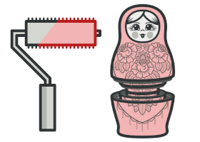
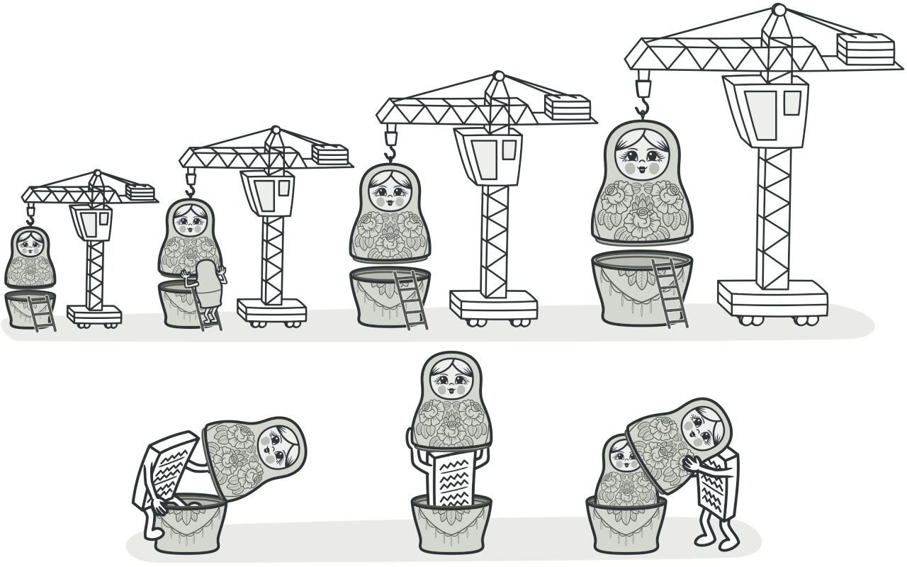
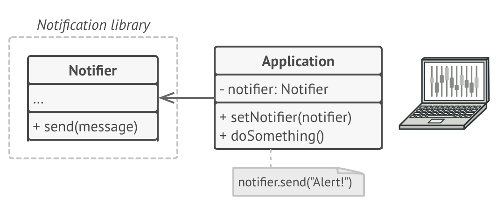
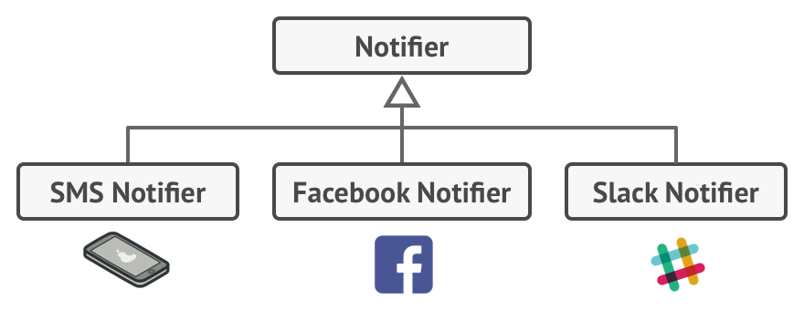
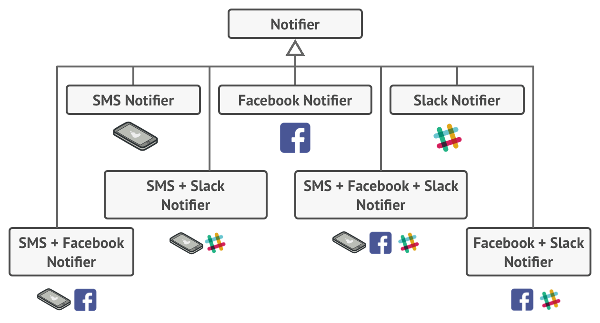
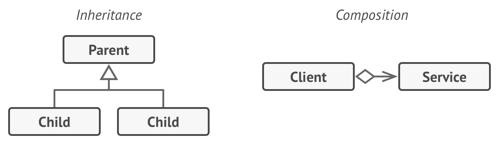
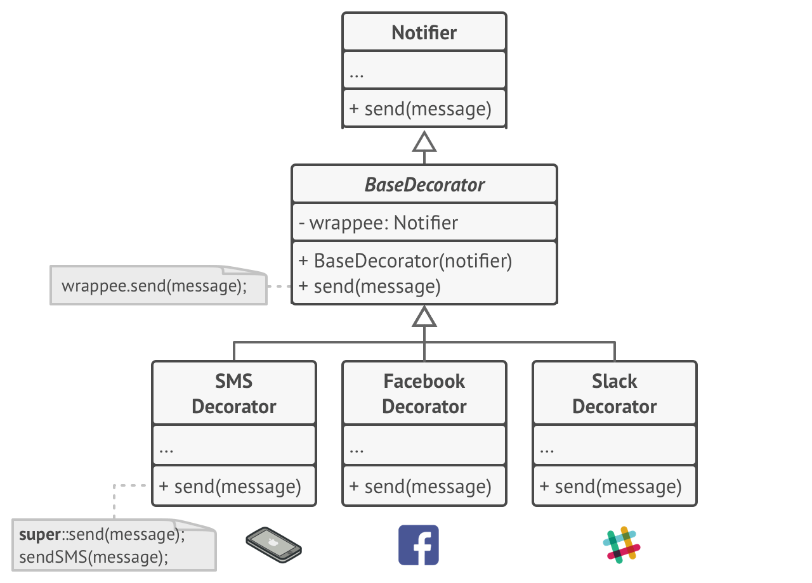
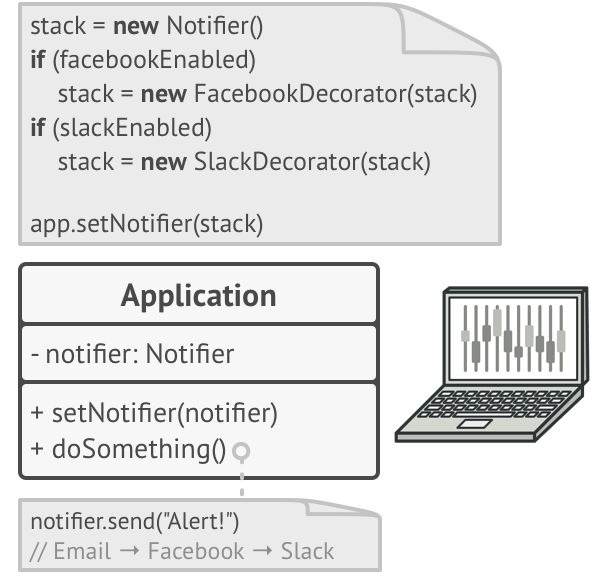
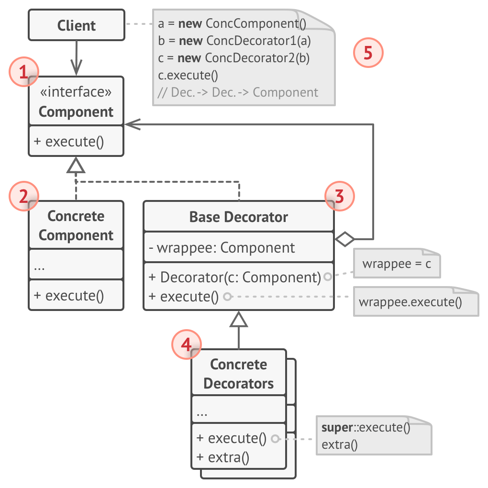

# Decorator
Attach additional responsibilities to an object dynamically. Decorators provide a flexible alternative to subclassing for extending functionality.

## 🎯 เป้าหมายของ pattern นี้
เพิ่ม/ลด ความสามารถให้กับ object ขณะ runtime

## ✌ หลักการแบบสั้นๆ
1. สร้าง wrapper class ที่สามารถเพิ่มความสามารถเข้าไปได้เรื่อยๆ
1. นำ wrapper class มา wrap ตัว wrapper class ที่เราต้องการความสามารถนั้นๆ

## 😢 ปัญหา


สมมุติว่าเรากำลังพัฒนา library ที่ใช้ส่งข้อความออกไปตัวหนึ่ง และมันก็เป็นที่นิยมมาก ทำให้มีบริษัทมากมายมาใช้ library ของเรา เพื่อส่งข้อความเหตุการณ์สำคัญต่างๆให้กับลูกค้าของพวกเขา

ในเวอร์ชั่นแรก library ของเรามี class แค่ `Notifier` เท่านั้น ซึ่งมันมี 1 method นั่นคือ `Send` เอาไว้ใช้ส่งข้อความออกไป และมันทำงานได้แค่ส่งข้อความทาง `อีเมล์` เท่านั้น ตามภาพ



จากภาพ เมื่อบริษัทไหนต้องการส่งข้อความออกไป เขาก็จะเรียกใช้ Send method เพื่อส่งอีเมล์ออกไปให้กับลูกค้าของเขา

หลังจากพัฒนาไปซักพัก เราก็ค้นพบว่าบริษัทที่มาใช้ library ของเราบางแห่งเริ่มอยากส่งข้อความออกไปทางอื่นที่ไม่ใช่อีเมล์บ้าง เช่น SMS, Facebook หรือ Slack 

หลังจากที่ไตร่ตรองอยู่นาน สุดท้ายเราก็ค้นพบว่า เราก็แค่แยก subclass ออกมาทำงานแต่ละเรื่องดิ ดังนั้นเราเลยเขียน subclass ออกมา 3 ตัว เพื่อส่งข้อความออกเป็น 3 รูปแบบตามรูป



หลังจากที่อัพเดท library ใหม่ตามรูปไปไม่นาน ก็มีบริษัทบางรายบ่นอุบอิบมาว่า ทำไมมันใช้งานยากจัง จะส่ง SMS ก็ต้องไป new object ใหม่ จะส่ง noti ให้ facebook ก็ต้องไป new ใหม่ จะส่ง slack ก็ต้องไป new ใหม่ อะไรก็ new new new ทำไมไม่ทำให้มันใช้งานง่ายๆละ

หลังจากที่ทนฟังบริษัทพวกนั้นบ่นจนเราทนไม่ได้ เราก็เลยมาเพิ่ม subclass ใหม่เพื่อให้มันส่งข้อความได้หลายๆอย่าง พวกเอ็งอยากส่งข้อความแบบไหนก็จงไปเลือกเอาเองไป๊!!



จากภาพไม่บอกก็คงรู้ว่า class บานเบอะ ไม่เพียงแค่เยอะใน library ของเราเท่านั้น ฝั่งที่เอา lib เราไปใช้ก็ปวดตับเช่นกัน

ในตอนนี้เราก็ได้แต่สวดมนต์หวังว่า พวกมันจะไม่อยากได้ช่องทางส่งข้อความแบบอื่นอีก ไม่งั้น library เราอาจจะได้ลงกินเนสบุ๊คก็เป็นได้

## 😄 วิธีแก้ไข
สาเหตุที่ lib เรามันบวมเรื่อยๆก็เพราะเราแก้ไขปัญหาผิด (ก็แหงดิ!!) ดังนั้นก่อนที่จะไปดูวิธีแก้ไข เรามาดูวิเคราะห์กันก่อนว่าเกิดอะไรขึ้นกับวิธีการนั้น

สิ่งที่เราอยากได้จริงๆคือ เราอยากให้ class ของเรามันมีความสามารถแบบใหม่ๆเพิ่มเข้าไปเรื่อยๆชิมิ? แต่การแก้ไขปัญหาโดยการใช้ inheritance มันก่อนให้เกิดปัญหาเพราะว่า
1. Inheritance มันไม่สามารถแก้ไขความสามารถของมันได้ ในขณะ runtime นั่นหมายความว่า เราเขียนให้มันทำงานยังไง มันก็จะทำงานอย่างนั้นตลอดไป วิธีเดียวที่จะให้มันทำงานต่างจากที่มันทำ คือการสร้าง object ใหม่จาก subclass อื่นมาแทนที่มัน
1. Subclass มี Baseclass ได้เพียงแค่ 1 ตัวเท่านั้น (ภาษาส่วนใหญ่จะเป็นแบบนั้น)

ดังนั้นจากที่ว่ามา ถ้าเราเขียน class ให้มันส่งอีเมล์ได้เท่านั้น ทำให้ตายยังไงมันก็ไม่มีทางส่งอย่างอื่นได้นอกจากอีเมล์ (หรือคุณเคยเขียนโค้ดส่งอีเมล์แล้วพอไปทำงานมันไปส่งพิซซ่าให่คุณปะ?)

ซึ่งวิธีการที่จะให้การทำงานของมันเปลี่ยนได้ตลอดเวลา นั่นคือการให้มัน `อ้างอิง` ไปหาตัวทำงานแทนต่างหาก หรือพูดง่ายๆคือให้ใช้ `Composition` นั่นเอง

จากที่ว่ามาแทนที่เราจะมี hardcode ว่ามันต้องทำงานยังไง เราก็แค่เปลี่ยนมาเก็บ reference object ที่เอาไว้ใช้ทำงานแทนก็พอ ถ้าเราอยากให้มันส่งอีเมล์ได้เราก็แค่เก็บ object ที่ใช้ส่งอีเมล์ ถ้าอยากให้มันส่ง SMS ก็เปลี่ยนไปเก็บ object ที่ส่ง SMS เพียงเท่านี้เราก็สามารถเปลี่ยนพฤติกรรมของมันขณะ runtime ได้แบ๊วววว~*



> **Composition** เป็นประเด็นสำคัญ ที่ใช้ใน design pattern อีกหลายๆตัวเลยนะ

ก่อนที่จะไปต่อ ขออธิบาย `Wrapper` นิสสสนึง (ขอเรียกมันว่า `เสื้อคลุม` ละกันนะ)

หลักการทำงานของเสื้อคลุมก็คือ ตัวมันจะมีหน้าที่เข้าไปเอา object ที่เป็นเป้าหมายของมันเข้ามาอยู่ภายในตัวมัน (มันถึงถูกเรียกว่าเสื้อคลุมไง) ซึ่งเจ้าเสื้อคลุมนี้มันจะมีของทุกอย่างเหมือนกับ object เป้าหมายของมันทุกประการเลย

คราวนี้เมื่อมี object ไหนมาสั่งให้เสื้อคลุมไปทำงาน เจ้าเสื้อคลุมมันก็จะสั่งให้ object ตัวที่มันคลุมอยู่ไปทำงาน  หรือมันจะทำงานก่อนแล้วค่อยไปเรียก object ที่มันคลุมทำงานตามก็ได้

ดังนั้น object ที่มาเรียกใช้เสื้อคลุมก็จะไม่เห็นความแตกต่างระหว่าง เจ้าเสื้อคลุม กับ object ที่อยู่ในเสื้อคลุมเลย

ซึ่งเสื้อคลุมแต่ละตัวก็จะมีความสามารถของมันอยู่แล้ว แล้วพอมันไปคลุม object อื่น มันก็จะได้ความสามารถของ object นั้นๆเข้ามาด้วย

และนอกจากนี้เจ้าเสื้อคลุม มันยังสามารถไปคลุม object เสื้อคลุมอันอื่นๆได้ด้วย (เหมือนคนใส่เสื้อหลายๆชั้น)

ดังนั้น พอมันไปคลุม object 1 ตัว มันก็จะมีความสามารถของตัวมันเอง + ความสามารถของ object นั้น แล้วยิ่งถ้ามันคลุมทับกันไปทับกันมา มันก็จะยิ่งมีความสามารถเพิ่มขึ้นเรื่อยๆ (โขมยเน็นได้ว่างั้น)

แล้วเจ้าเสื้อคลุมมันเกี่ยวอะไรกับ Decorator พระเอกของเราฟระ

ลองคิดง่ายๆว่าเอาแนวคิดของเสื้อคลุมมาแก้ปัญหานี้สิ

อย่างแรกคือให้มี class `Notifier` ไว้สำหรับส่งอีเมล์เหมือนเดิม

ถัดมาก็สร้าง class เสื้อคลุมที่ชื่อว่า `BaseDecorator` ไว้ โดยออกแบบให้มันไปคลุม `Notifier` ของเรา

ดังนั้น `BaseDecorator` เลยมี method ต่างๆเหมือนกับ `Notifier` ทุกประการ (นั่นคือ Send นั่นเอง) และแน่นอนมันต้องมี Composition กลับไปหาเจ้า object ตัวที่โดนคลุมด้วย

ถัดมา ความสามารถในการส่งข้อความทาง SMS, Facebook, Slack เราก็จะไปสร้างเป็น subclass ของเสื้อคลุม `BaseDecorator` อีกที ออกมาเป็นตามรูป



จากภาพ เมื่อ client อยากจะส่งอีเมล์ธรรมดาก็แค่เรียกใช้ Send จาก Notifier

แต่ถ้าเราอยากให้มันส่งอีเมล์ได้และส่ง Facebook ได้ด้วย เราก็จะเอาเสื้อคลุมที่ชื่อว่า `FacebookDecorator` ไปหุ้ม object ของ Notifier อีกทีหนึ่ง ทำให้มันมีความสามารถเพิ่มขึ้นเป็น ส่งได้ทั้งทาง Facebook และ อีเมล์ นั่นเอง

และถ้าอยากให้มันส่งไปยัง Slack ได้ด้วย เราก็จะเอา `SlackDecorator` ไปหุ้มต่ออีกชั้นนึง มันก็จะส่งทาง Facebook อีเมล์ และ Slack ได้ ทำให้มันมีความสามารถต่อยอดกันได้เรื่อยๆ ตามรูปเลย



เวลาที่เราเรียกให้เสื้อคลุมตัวนอกสุดทำงาน มันก็จะไปเรียก object ที่มันหุ้มอยู่ทำงานก่อนแล้วตัวเองค่อยทำงาน ซึ่ง object ที่มันหุ้มอยู่ก็จะไปเรียก object ที่มันหุ้มอยู่ชั้นถัดให้ไปทำงานให้เสร็จก่อนแล้วมันค่อยทำงาน วนแบบนี้ไปจนถึง object ชั้นในสุด ทำให้ความสามารถทุกอย่างที่มันหุ้มอยู่ ค่อยๆถูกเรียกใช้งานจากภายในออกมาภายนอกตามลำดับชั้นของมัน

จากเหตุนี้เอง เลยทำให้ Decorator pattern มีชื่อเรียกอีกอันนึงคือ `Wrapper` นั่นเอง

## 📌 โครงสร้างของ pattern นี้


> **อธิบาย**  
1.**Component** - เป็น interface ที่ใช้เป็นแบบอย่างของ object ที่จะถูกคลุม กับตัว Wrapper  
2.**Concrete Component** - คือ class ที่จะถูกคลุม ซึ่งตัวมันจะทำงานพื้นฐานที่สุดไว้ เช่น ส่งอีเมล์  
3.**Base Decorator** - เป็น baseclass ที่ใช้ในการคลุมของต่างๆจาก **Component**  
4.**Concrete Decorators** - เป็น subclass ของ **Base Decorator** ที่มีสามารถอื่นๆเข้ามา มีไว้ใช้เพิ่มความสามารถให้กับ decorator เวลามาคลุม ซึ่ง subclass จะทำการ override method จาก **Base Decorator** โดยสั่งให้ไปเรียก object ที่มันคลุมอยู่ไปทำงานก่อน หรือทำงานในส่วนของมันแล้วค่อยไปเรียก object ที่มันคลุมอยู่ไปทำงานต่อ

## 🛠 ตัวอย่างการนำไปใช้งาน
สมมุติว่าเราต้องเขียนโปรแกรมคิดเงินให้กับร้านขายน้ำปั่นซักร้าน ซึ่งร้านนี้มีความพิเศษคือ สามารให้ลูกค้าเพิ่มทอปปิ้งได้ไม่จำกัด (แต่คิดเงินเพิ่มนะ) และ ทอปปิ้งแต่ละตัวราคาก็ไม่เท่ากันด้วย ซึ่งพอลูกค้าสั่งเสร็จก็ต้องออกใบเสร็จให้ลูกค้าด้วยว่าเขาสั่งอะไรไป รวมเป็นเท่าไหร่

เช่น สั่งกาแฟ(35บ) เพิ่มนมข้นหวาน(10บ) เพิ่มวิปครีม(13บ) เพิ่มวิปครีม(13บ) เพิ่มคาราเมล(15บ) แล้วก็สั่ง ชานม(30บ) เพิ่มวิปครีม(13บ) เพิ่มไข่มุก(7บ)

จากโจทย์เราก็จะใช้ Decorator pattern มาช่วย ซึ่งเราก็จะแบ่งของออกเป็น 2 อย่างคือ
1. ประเภทน้ำปั่น มองว่าเป็น **Component**
1. ทอปปิ้งต่างๆ มองว่าเป็น **Decorator**

พอแยกของออกเป็น 2 อย่างแบบนี้ก็จะเห็นว่า ผมสามารถเพิ่มเมนูน้ำปั่นเข้าไปได้เรื่อยๆ โดยไม่มีผลกระทบกับ ทอปปิ้ง และเช่นกันผมก็เพิ่มทอปปิ้งได้เรื่อยๆไม่มีผลกับเมนูน้ำปั่น

แล้วถ้าอยากเพิ่มทอปปิ้งลงไปในน้ำอะไร เราก็แค่สร้าง decorator object ไปหุ้ม object ก่อนหน้าซะก็สิ้นเรื่อง

ปะไปดูตัวอย่างโค้ดดีกว่า อ่านอย่างเดียวปวดตับเปล่าๆ

## 👍 ข้อดี
* เพิ่มความสามารถให้กับ object โดยไม่ต้องสร้าง class ใหม่เรื่อยๆ
* เพิ่ม/ลด ความสามารถของ object ขณะ runtime ได้

## 👎 ข้อเสีย
* เมื่อต้องการลบความสามารถบางอย่างออกจาก wrapper จะลบค่อนข้างยาก (เพราะมันซ้อนๆกันอยู่)
* การทำงานต้องเป็นไปตามลำดับเท่านั้น ถ้าจะไม่ให้เรียงตามลำดับจะทำค่อนข้างยาก
* โค้ดตอนสร้างและเอาความสามารถมาเพิ่มๆให้กัน ค่อนข้างน่าเกลียด

## ‍‍📝 Code ตัวอย่าง
```
using System;

// Component
interface IBeverage
{
    string Description { get; }
    int GetCost();
}
// Concrete components
class Coffee : IBeverage
{
    public string Description => "กาแฟ";
    public int GetCost() => 35;
}
class MilkTea : IBeverage
{
    public string Description => "ชานม";
    public int GetCost() => 30;
}

// Decorator
abstract class ToppingDecorator : IBeverage
{
    private IBeverage wrappee;
    public ToppingDecorator(IBeverage beverage)
    {
        wrappee = beverage;
    }

    public virtual string Description => wrappee.Description;
    public virtual int GetCost() => wrappee.GetCost();
}
// Concrete decorators
class CondensedMilk : ToppingDecorator
{
    public override string Description => $"{base.Description} + ขมข้นหวาน";
    public override int GetCost() => base.GetCost() + 10;
    public CondensedMilk(IBeverage beverage) : base(beverage) { }
}
class WhipCream : ToppingDecorator
{
    public override string Description => $"{base.Description} + วิปครีม";
    public override int GetCost() => base.GetCost() + 13;
    public WhipCream(IBeverage beverage) : base(beverage) { }
}
class Caramel : ToppingDecorator
{
    public override string Description => $"{base.Description} + คาราเมล";
    public override int GetCost() => base.GetCost() + 15;
    public Caramel(IBeverage beverage) : base(beverage) { }
}
class Pearl : ToppingDecorator
{
    public override string Description => $"{base.Description} + ไข่มุก";
    public override int GetCost() => base.GetCost() + 7;
    public Pearl(IBeverage beverage) : base(beverage) { }
}

class Program
{
    static void Main(string[] args)
    {
        var coffee = new Coffee();
        Console.WriteLine("กาแฟธรรมดา");
        Console.WriteLine($"{coffee.Description}, ราคา: {coffee.GetCost()} {Environment.NewLine}");

        IBeverage extraCoffee = new CondensedMilk(coffee);
        extraCoffee = new WhipCream(extraCoffee);
        extraCoffee = new WhipCream(extraCoffee);
        extraCoffee = new Caramel(extraCoffee);
        Console.WriteLine("กาแฟพิเศษเพิ่มทอปปิ้ง");
        Console.WriteLine($"{extraCoffee.Description}, ราคา: {extraCoffee.GetCost()} {Environment.NewLine}");

        var milkTea = new MilkTea();
        IBeverage extraMilkTea = new WhipCream(milkTea);
        extraMilkTea = new Pearl(extraMilkTea);
        Console.WriteLine("ชานมพิเศษเพิ่มทอปปิ้ง");
        Console.WriteLine($"{extraMilkTea.Description}, ราคา: {extraMilkTea.GetCost()} {Environment.NewLine}");
    }
}
```

**Output**
```
กาแฟธรรมดา
กาแฟ, ราคา: 35 

กาแฟพิเศษเพิ่มทอปปิ้ง
กาแฟ + ขมข้นหวาน + วิปครีม + วิปครีม + คาราเมล, ราคา: 86 

ชานมพิเศษเพิ่มทอปปิ้ง
ชานม + วิปครีม + ไข่มุก, ราคา: 50 
```

# Credit
https://refactoring.guru  
You can buy his book by click the image below.  
[](https://refactoring.guru/design-patterns/book#buy-now)  