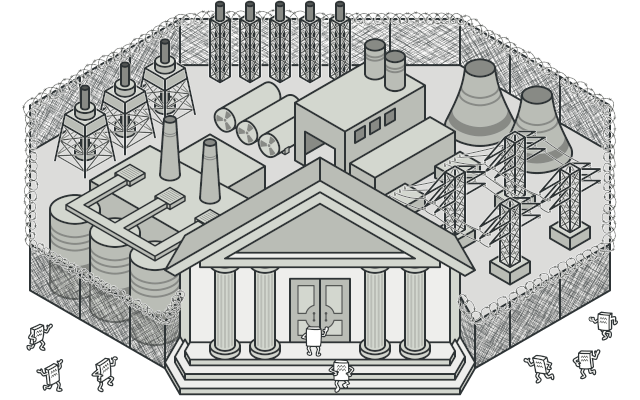
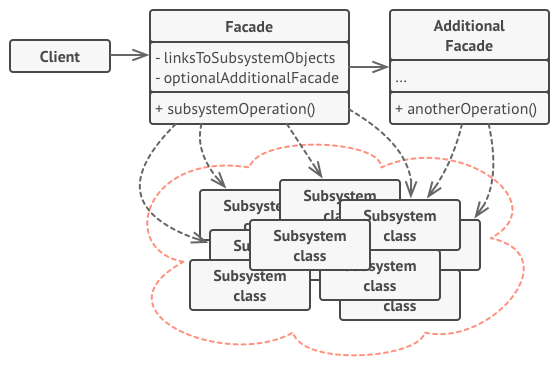

# Facade
Provide a unified interface to a set of interfaces in a subsystem. Façade defines a higher-level interface that makes the subsystem easier to use.

## 🎯 เป้าหมายของ pattern นี้
ทำให้ของที่ใช้งานยากๆซับซ้อนๆ สามารถใช้งานได้แบบง่ายๆ

## ✌ หลักการแบบสั้นๆ
1. สร้าง class ที่ทำงานกับ subsystem ที่วุ่นวายๆ แล้วจัดการเรื่องที่ client ต้องเรียกใช้ทั้งหมด
1. สร้างช่องทางให้ client เรียกใช้งานแบบง่ายๆ



## 😢 ปัญหา
สมมุติว่าเรากับอิคิวซังกำลังเขียนโค้ด เพื่อต่อกับ library ที่ใช้ในการควบคุมระบบไฟฟ้าพลังงานนิวเคลียอยู่ ซึ่งภายใน library นี้มีโครงสร้างที่ค่อนข้างซับซ้อน เช่น ระบบหล่อเย็น ระบบความดัน และระบบควบคุมอื่นๆอีกมากมายที่ทำงานร่วมกันอยู่ ซึ่งเจ้าระบบที่ว่ามานี้มีความละเอียดอ่อนสูงมาก ถ้าเราจะสั่งให้ระบบแต่ละตัวทำงาน ระบบนั้นๆจะต้องตรงเงื่อนไขของมันก่อนถึงจะสั่งให้มันทำงานได้ และการสั่งในแต่ละขั้นตอนต้องเป็นตามลำดับที่ถูกกำหนดไว้ ไม่สามารถข้ามขั้นตอนได้ เช่นก่อนจะสตาร์ตระบบความดัน ระบบหล่อเย็นจะต้องถูกสตาร์ตก่อน ไม่งั้นกาจเกิดความเสียหายต่อระบบนั้นๆได้

แค่ได้ยินก็ปวดหัวละ แต่การที่จะให้เณรน้อยไปออกแบบระบบไฟฟ้านิวเคลียนี่ปวดตับกว่า แต่งานก็คืองาน ดังนั้น อิคิวกับเราจะออกแบบโค้ทของเรายังไงกันดี เพื่อให้มันสามารถทำงานกับ library นั้นได้ โดยที่โค้ดของเราจะต้องไม่ไปผูกติด (coupling) อยู่กับ class ต่างๆของ library ที่ว่ามานี้ และเราก็ไม่อยากให้โค้ดเราซับซ้อบแบบระบบพวกนั้นด้วยเช่นกัน

## 😄 วิธีแก้ไข
นั่งสมาธิรอจนกว่าจะได้ยินเสียงปิ๊ง! มาม่าก็จะสุกพอดี แล้วอิคิวซังก็จะบอกกับเราว่า ใช้ `Facade` ดิ!! (ผมเริ่มสงสัยเบื้องหลังของวัดนี้แล้วละ)

ซึ่งอิคิวซังก็ได้อธิบายต่อว่า `Facade` คือ class ธรรมดา 1 ตัวนี้แหละ แต่มันจะช่วยไปจัดการเรื่องยากๆทั้งหมดให้เรา แล้วเมื่อไหร่ที่เราจะเรียกใช้งานเรื่องยากๆพวกนั้น มันก็จะมีช่องทางง่ายๆให้เราเรียกใช้

หลังจากที่อิคิวเห็นเราทำหน้า งงๆ เขาก็พล่ามต่อโดยไม่สนใจเราว่า การที่มี Facade มันจะช่วยให้เราทำงานง่ายขึ้น เมื่อเราต้องไปทำงานกับ library ที่ค่อนข้างซับซ้อน มี feature เยอะๆ แต่เราใช้งานแค่ไม่กี่ feature ของมันเท่านั้น

## 📌 โครงสร้างของ pattern นี้


> **อธิบาย**  
 **Facade** - ตัวที่ช่วยลดความซับซ้อนให้ client โดยเปิดค่อยช่องทางให้ client เรียกใช้งานง่ายๆเอาไว้ ส่วนการทำงานที่มันต้องไปเรียกอะไรต่อจะถูกจัดการไว้ที่นี่  
 **Additional Facade** - Facade อื่นๆที่คอยทำงานให้กับ subsystem อื่นๆ มีไว้เพื่อให้ Facade อื่นเรียกใช้ เพราะบางทีการเขียนทุกอย่างไว้ที่ facade ตัวเดียวอาจจะก่อให้เกิดปัญหาได้  
 **Complex Subsystem** - (ก้อนที่มันเขียนว่า Subsystem หลายๆอัน) คือกลุ่มของระบบที่มีอะไรเยอะแยะวุ่นวายๆอยู่ด้วยกัน เพื่อทำงานบางอย่าง ซึ่งเจ้าก้อนพวกนี้แหละที่ Facade จะมาทำงานด้วย ซึ่งเจ้าพวก subsystem ทั้งหมดนั้นจะไม่รู้ถึงการมีอยู่ของ facade เลย

## 🛠 ตัวอย่างการนำไปใช้งาน
สมมุติว่าเราต้องการอัพโหลดไฟล์ VDO ขึ้นไปบน PornHub (วีดีโอไรหว่า) ถ้าเรามานั่งคิดดูถึงขั้นตอนการอัพโหลดไฟล์ vdo เราก็จะพบว่ามันมีขันตอนค่อนข้างจุกจิกอยู่นะเช่น ปรับขนาดไฟล์ให้เหมาะสม, เข้ารหัสให้ถูกฟอร์แมตที่เว็บนั้นๆจะใช้, จัดการคุณภาพเสียง บลาๆ แล้วก็อัพโหลดขึ้นเซิฟเวอร์ (อิคิวซังแอบกระซิบมาว่า ระบบสมัยใหม่ขั้นตอนวุ่นวายๆพวกนี้จะอยู่ที่เซิฟเวอร์หมดแล้วนะครับ)

จากที่ว่ามาทั้งหมดนั่น ถามว่าจริงๆ client ต้องไปยุ่งกับเรื่องพวกนั้นไหม? ไม่ใช่เขาแค่ต้องการจะอัพโหลดไฟล์เหรอ?

ดังนั้นการที่เราเอา Facade เข้ามาช่วย เมื่อ client ต้องการจะอัพโหลดไฟล์ เขาก็แค่เรียกใช้ method ที่ชื่อว่า Upload ของ Facade ก็พอ สวนที่เหลือมันต้องเอา vdo ของเราไปทำอะไรต่อ ก็จะเป็นหน้าที่ของ facade ที่ไปจัดการต่อให้นั้นเอง นี้แหละคือประโยชน์ของ `Facade` ทำเรื่องยากๆให้เป็นเรื่องง่าย ปะไปดูโค้ดตัวอย่างกัน

## 👍 ข้อดี
* โค้ดของเราไม่ไปผูกติดกับ subsystem ที่วุ่นวาย

## 👎 ข้อเสีย
* เจ้าตัว Facade จะกลายเป็น God object และตัวมันจะผูกติดกับ subsystem ที่มันทำงานอยู่
> **God object** - คือของที่มันทำงานกับทุกสิ่งทุกอย่าง รู้ทุกเรื่อง เจือกได้ทุกอย่าง คิดง่ายๆคือคนที่เขียนโปรแกรมใหม่ๆยังแยก Module ไม่เป็น จะยัดทุกอย่างไว้ภายใน class เดียว และให้มันทำงานได้ครอบจักรวาล สิ่งนั้นแหละคือ God object

## ‍‍📝 Code ตัวอย่าง
```
using System;
using System.IO;

// Subsystem classes
class VideoCompressionCodec
{
    public Stream CompressFile(Stream file) {
        // Compress file
        return file;
    }
}
class AudioMixer
{
    public bool CanEnhancement(Stream file) {
        // Check the video
        return true;
    }
    public Stream EnhanceAudio(Stream file) {
        // Compress file
        return file;
    }
}
class FileUploader
{
    public string UploadVideo(Stream file) {
        // Upload it to the server
        return "UC6fBbrBB4dF7WznwLmfbOnQ";
    }

    public string GetVideoUrlById(string id) {
        // Search the video from its id
        return $"https://www.youtube.com/channel/{id}";
    }
}

// Facade
class VideoFacade
{
    public string UploadVideoAndGetUrl(Stream file)
    {
        var compressor = new VideoCompressionCodec();
        var compressedSteam = compressor.CompressFile(file);
        var audio = new AudioMixer();
        var canEnhance = audio.CanEnhancement(compressedSteam);
        if(canEnhance)
        {
            compressedSteam = audio.EnhanceAudio(compressedSteam);
        }
        var uploader = new FileUploader();
        var videoId = uploader.UploadVideo(compressedSteam);
        var url = uploader.GetVideoUrlById(videoId);
        return url;
    }
}

// Client
class Program
{
    static void Main(string[] args)
    {
        // Get file from somewhere
        Stream src = null;
        var facade = new VideoFacade();
        var url = facade.UploadVideoAndGetUrl(src);
        Console.WriteLine(url);
    }
}
```

**Output**
```
https://www.youtube.com/channel/UC6fBbrBB4dF7WznwLmfbOnQ
```

# Credit
https://refactoring.guru  
You can buy his book by click the image below.  
[](https://refactoring.guru/design-patterns/book#buy-now)  