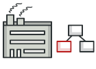
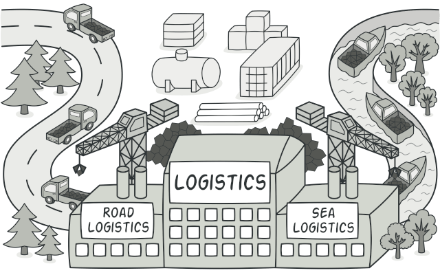
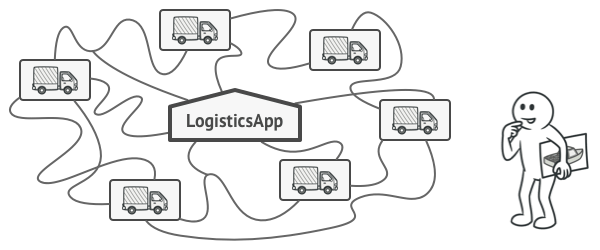
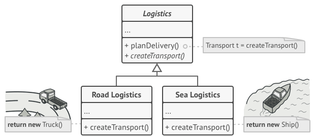
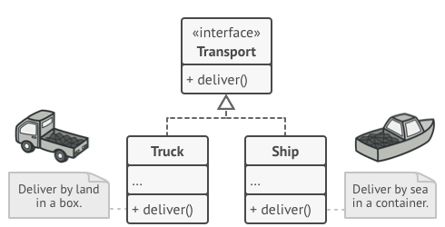
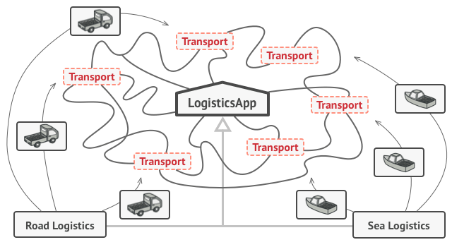
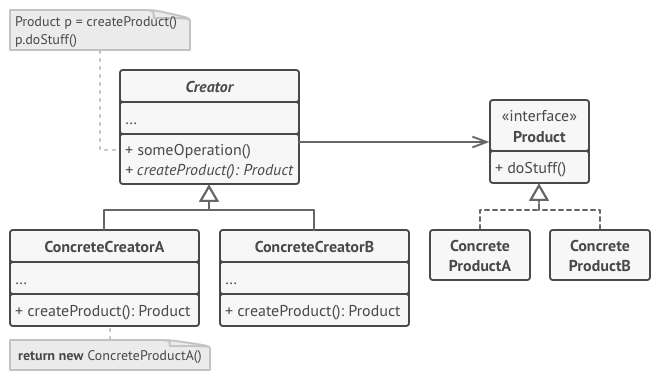
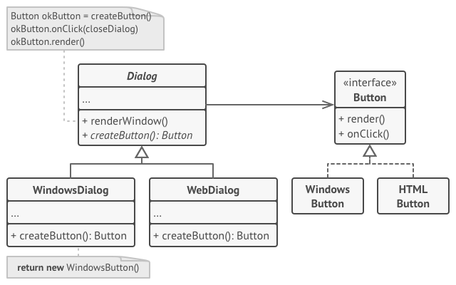

# Factory Method

```
Define an interface for creating an object, but let subclasses decide which class to instantiate. The Factory method lets a class defer instantiation it uses to subclasses.
- Gang Of Four
```

## เป้าหมายของ pattern นี้
**Factory method** ต้องการจะสร้าง object โดยไม่ต้องกำหนดว่าตัว class ที่นำมาสร้างจริงๆคืออะไร

## หลักการแบบสั้นๆ
1. **Factory Method** จะมี abstract method 1 ตัว เอาไว้สร้าง object
1. เมื่อ client ต้องการใช้ object ก็จะมาเรียก abstract method ตัวนั้น เพื่อเอา object ไปใช้
1. Subclass เป็นคนกำหนดเองว่าจะสร้าง object จาก class ตัวไหน

## ปัญหา


สมมุติว่าเรามีโปรแกรมที่ใช้ในการดูแลการขนส่งอยู่ตัวนึง ซึ่งโปรแกรมเราในตอนนี้ ดูแลได้เฉพาะการขนส่งทาง**รถบรรทุก**เท่านั้น เลยทำให้โค้ดทั้งหมดดูแลแค่ `Truck class` เท่านั้น

อยู่มาวันหนึ่งบริษัทขนส่งทางเรื่อเจ้าหนึ่งก็สนใจอยากใช้โปรแกรมเราขึ้นมา ทำให้เราต้องเขียนโปรแกรมให้รองรับการขนส่งทาง**เรือ**ด้วย



ในสถานะการณ์ปัจจุบัน การที่เราจะเพิ่ม class ใหม่เข้าไปไม่ใช่เรื่องง่ายเลย เพราะโค้ดทั้งหมดของเราทำงานแค่กับ Truck class เท่านั้น

อีกทั้งตอนที่สร้าง object ของ Truck class มันมีขั้นตอนในการสร้างที่วุ่นวายอีกด้วย

ซึ่งหมายความว่าถ้าเราเพิ่ม `Ship class` เข้าไป เราจะต้องทำการแก้โค้ดทั้งหมดให้รองรับ Ship class และขั้นตอนการสร้างที่วุ่นวายของมันด้วย!

ถ้าคิดต่อไปอีก ในอนาคตถ้ามีบริษัทขนส่งเจ้าอื่นๆเข้ามาใช้โปรแกรมเราอีกละ เช่นขนส่งทางเครื่องบิน, รถไฟ, เรือเหาะ, โจโกโบะ (มั่วละ) เข้ามาอีกละ ... นั่นมันหมายความว่าเราจะต้องแก้ไขโค้ดเราทุกครั้งเลยอะดิ!!

และทุกครั้งที่แก้ไขโค้ด เพื่อให้รองรับการขนส่งแบบต่างๆ โค้ดเราก็จะยิ่งยุ่งเหยิงมากขึ้นอีก อะป่าว? 

เราจะแก้ปัญหามันยังไงดี ?

## วิธีแก้ไข
ปัญหาที่แท้จริงของเราคือการสร้าง object ของ `Truck class` และ `Ship class` รวมถึงขึ้นตอนในการสร้าง object ที่วุ่นวายของมันด้วย

ซึ่งสิ่งที่เราสนใจจริงๆคือ object ของ Truck ไม่ก็ Ship เท่านั้น เราไม่ได้สนใจว่ามันจะสร้างออกมายังไง เราต้องการแค่เอา object นั้นไปใช้ต่อเท่านั้นเอง

ดังนั้นแทนที่จะให้ client ไป `new` object ที่ต้องการเอง เราก็โยนภาระนั้นให้กับ class อื่นซะสิ  ส่วนมันจะส่ง object กลับมาเป็น Truck หรือ Ship เราก็ไม่ได้สนใจ ขอแค่มันส่งมาถูกตัวก็พอแล้ว

จากที่โม้มา เราก็เลยสร้าง class ใหม่ขึ้นมาเพื่อรับภาระในการสร้าง object ของ Truck และ Ship ออกมาเป็นตามนี้



> **อธิบาย**  
**Logistics class** - เป็น abstract class ที่มี abstract method ชื่อ createTransport() เพื่อใช้สร้าง object ให้เรา (ตัวมันไม่ได้บอกว่าจะสร้าง object เป็น Truck หรือ Ship)  
**RoadLogistics class** - คือ subclass ที่ทำหน้าบอกว่าจะสร้าง object จริงๆออกมาเป็น `Truck class`  
**SeaLogistics class** -  คือ subclass ที่ทำหน้าบอกว่าจะสร้าง object จริงๆออกมาเป็น `Ship class`

เมื่อเป็นแบบนี้ พอมาคิดดูดีๆ Truck กับ Ship ก็เหมือนกับเป็น `Product` ที่ได้กลับมา เพื่อเอาไปใช้งานต่อดีๆนี่เอง

ดังนั้นเราก็เลยสร้าง interface ขึ้นมาเพื่อเป็นตัวแทนของ Truck class และ Ship class ประมาณนี้



เมื่อ Truck class และ Ship class ไป implement `Transport interface` เลยทำให้ object ที่ส่งกลับมาจาก `RoadLogistics` และ `SeaLogistics` สามารถทำได้ใน `Logistics class` แล้ว

ส่วนการทำงานจริงๆของ Truck class และ Ship class ก็ไปอยู่ใน method ที่ชื่อว่า deliver()  แล้วปล่อยให้ Truck class กับ Ship class เป็นคนลงรายละเอียดของมันเองก็พอ



คราวนี้ใครก็ตามที่ต้องการใช้ object (เราเรียกเจ้าหมอนี่ว่า client) ก็ไม่ต้องสนใจแล้วว่ามันได้ object เป็น Truck หรือ Ship กลับมา เนื่องจากมันไม่ต่างกันละ เพราะสิ่งที่ได้กลับมามัน abstract เป็น `Transport` object ไปหมดละ

## โครงสร้างของ pattern นี้



> **อธิบาย**  
**Product** - เป็นตัวแทนของ object ที่จะถูกสร้างจาก factory method เพื่อให้ client นำไปใช้งานต่อ  
**Concrete Products** - (ConcreteProductA และ ConcreteProductB) เป็น class ตัวจริงที่ถูกนำไปสร้างเป็น product object  
**Creator** - เป็น class ที่กำหนดว่า factory method จะสร้าง product อะไรกลับไปให้ client  
**Concrete Creators** - (ConcreteCreatorA และ ConcreteCreatorB) เป็น class ที่จะกำหนดว่าจะใช้ **Concrete Products** ตัวไหนไปสร้างเป็น product object (ไม่จำเป็นต้องสร้าง object ใหม่ทุกครั้ง เช่นอาจจะส่ง object จาก cache หรือ object pool กลับไปก็ได้)

## ตัวอย่างการนำไปใช้งาน
ตัวอย่างนี้เป็นการจำลองใช้ **Factory Method** ไปสร้างปุ่มที่สามารถทำงานได้ทั้งบน Windows และ WebSite โดยที่ไม่ทำให้ client ต้องไปยึดติด (coupling) กับ UI class



1. จากภาพจะเห็นว่าเมื่อ client ต้องการจะสร้างปุ่มขึ้นมาซักปุ่ม ก็เพียงแค่เลือกว่าจะทำงานกับ `WindowsDialog` หรือ `WebDialog` เท่านั้น
1. เมื่อ client ต้องการปุ่ม ก็เพียงเรียกใช้ `createButton` เราก็จะได้ Button object ที่เหมาะสมกับ environment ของเราไปใช้งานต่อได้เลย

## ข้อดี
* ลดการเกิด `tight coupling` ระหว่าง **creator** กับ **concrete products**
* ถูกหลัก `Single Responsibility Principle`
* ถูกหลัก `Open/Closed Principle`

## ข้อเสีย
* เพิ่มความซับซ้อนให้กับโค้ด เพราะต้องไปสร้าง class และ interface มากมาย

## Code ตัวอย่าง
```
using System;

interface ITransport
{
    string Deliver();
}

abstract class Logistics
{
    public string PlanDelivery()
    {
        var product = CreateTransport();
        return $"Logistics: The same creator's code has just worked with {product.Deliver()}";
    }
    
    public abstract ITransport CreateTransport();
}

class RoadLogistics : Logistics
{
    public override ITransport CreateTransport()
        => new Truck();
}

class SeaLogistics : Logistics
{
    public override ITransport CreateTransport()
        => new Ship();
}

class Truck : ITransport
{
    public string Deliver() 
        => "Trucks deliver cargo by land.";
}

class Ship : ITransport
{
    public string Deliver()
        => "Ships deliver cargo by sea.";
}

class Program
{
    static void Main(string[] args)
    {
        Console.WriteLine("App: Launched with the RoadLogistics.");
        ClientMethod(new RoadLogistics());

        Console.WriteLine("App: Launched with the SeaLogistics.");
        ClientMethod(new SeaLogistics());
    }

    static void ClientMethod(Logistics creator)
    {
        Console.WriteLine($"Client: I'm not aware of the creator's class, but it still works. {creator.PlanDelivery()}");
    }
}
```

**Output**
```
App: Launched with the RoadLogistics.
Client: I'm not aware of the creator's class, but it still works. Logistics: The same creator's code has just worked with Trucks deliver cargo by land
App: Launched with the SeaLogistics.
Client: I'm not aware of the creator's class, but it still works. Logistics: The same creator's code has just worked with Ships deliver cargo by sea
```

# Thank for your contents
https://refactoring.guru  
You can buy his book by click the book image below.  
[](https://refactoring.guru/design-patterns/book#buy-now)  