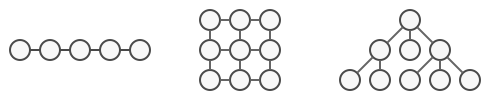
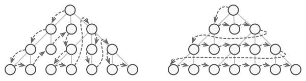
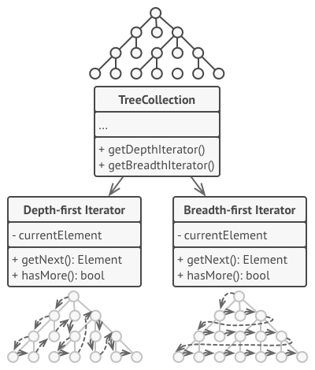
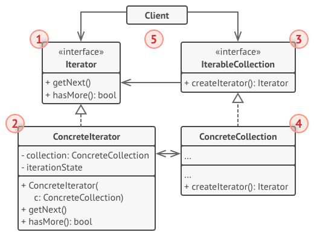

# Iterator
Provide a way to access the elements of an aggregate object sequentially without exposing its underlying representation.

## 🎯 เป้าหมายของ pattern นี้
ช่วยให้เราเข้าไปทำงานกับข้อมูลที่เป็น collection ได้ทุกรูปแบบ

## ✌ หลักการแบบสั้นๆ
1. แยกงานที่ใช้ในการท่องไปใน collection ออกมาให้ class อื่นทำงาน (เราเรียก class ใหม่นี้ว่า `Iterator`)
1. ให้ collection class สามารถสร้าง Iterator object ได้
1. ใครที่ต้องการเข้าถึงข้อมูลของ collection ให้ใช้งานผ่าน iterator object ที่ collection class สร้างให้แทน

## 😢 ปัญหา
วันหนึ่งนั่งดูดเนื้ออยู่ชิวๆก็คิดถึงวันวานที่นั่งเรียนวิชา Algorithm ขึ้นมา เป็นเรื่องการเก็บข้อมูลที่เป็น collection ซึ่งจำได้รางๆว่ามันมี collection หลากหลายแบบเลย เช่น LinkedList, Stacks, Trees และอีกหลากหลายรูปแบบเลย ซึ่งบางชนิดก็เรียบง่ายบางชนิดก็วุ่นวายปะปนกันไป



แต่ถ้าเราต้องทำงานกับ collection หลายๆแบบเข้าซักวันนึงละ? เช่น ข้อมูลที่เข้ามาตอนแรกเป็น LinkedList ต่อมาเป็น collection แบบ Stack และต่อมาเป็นแบบ Random access tree ละ ชีวิตเราคงจะวุ่นวายเป็นแน่ เพราะ collection แต่ละชนิดจะมีวิธีในการเข้าถึงข้อมูลภายใน collection ของมันไม่เหมือนกันเลย และแม้กระทั่งแบบ Tree เองก็ยังมีวิธีเข้าถึงหลายแบบขึ้นกับ Algorithm ที่เราเลือกใช้อีกด้วย



แค่คิดตามก็ปวดตับละนั่นเพราะ ทุกครั้งที่โปรแกรมเราทำงานกับ collection ใหม่ๆ นั่นหมายถึงเราต้องเพิ่ม Algorithm ในการทำงานกับ collection พวกนั้นด้วยไงละ สรุปงานของเราคือเขียนโปรแกรมหรือมานั่งเขียน Algorithm ในการใช้งาน collection กันละเนี่ย!!

แล้วเราจะแก้ปัญหานี้ยังไงดีเพื่อป้องกันเหตุการณ์ เพิ่ม 10 collection จะต้องคอยเพิ่ม 10 Algorithm อีกด้วย (หรือจริงๆแค่หยุดดูดเนื้อก็หายเพ้อแล้วหว่า)

## 😄 วิธีแก้ไข
ขณะที่กำลังเครียดจัดเลยปุ๋นเนื้อคำโตเข้าต่อ ทำให้เห็นภาพหุ่นยนต์แรคคูนสีฟ้ามายืนข้างกาย แล้วแรคคูนสีฟ้าก็บอกกับเราว่า

วันนี้ขอเสนอตอน **Iterator Pattern** นะก๊าฟฟฟฟฟ ซึ่งแน่นอนภาพหลอนยังไม่เลือนหาย เจ้าแรคคูนสีฟ้าก็ชิ่งพล่ามต่อว่า ให้เราแยกวิธี Algorithm ในการทำงานกับ collection ออกไปไว้กับ object อื่น ซึ่งเจ้า object พวกนั้นจะขอเรียกมันว่า `Iterator`

ซึ่งเจ้า Iterator object จะต้องเป็นคนจัดการทุกสิ่งทุกอย่างที่จำเป็นต่อการทำงานกับ collection ด้วย เช่น ตำแหน่งปัจจุบัน, เหลือข้อมูลอีกกี่ตัวที่ต้องทำต่อ

และมันจะต้องมี method ให้ client สามารถดึงข้อมูลแต่ละตัวตามลำดับของ collection ด้วย ซึ่งเจ้า method นี้จะค่อยๆคายค่าใน collection ออกมาให้ทีละตัวตามลำดับตั้งแต่ตัวแรกจนถึงตัวสุดท้าย

จากที่พูดมาทั้งหมด client จะทำงานผ่านแค่กับ interface ของ Iterator เท่านั้นมันจะได้ไม่เกิด coupling ขึ้น และทำงานกับ collection ได้ทุกประเภท ตามรูปเลย



เมื่อพูดจบเจ้าแรคคูนสีฟ้าก็ตบหน้าเราเข้า 1 ฉาด แล้วตะโกนใส่เราว่า กรู๊วไม่ใช่แรคคูนนะเฟร้ยก่อนจะจางหายไป พร้อมกับสติที่กลับมาของเรา

ทำให้เรารู้ว่าต่อไปนี้เราก็ทำงานกับ collection ได้ทุกประเภทบนโลกแล้ว โดยที่ client ไม่ต้องสนใจเลยว่ามันเป็น collection ประเภทไหน เพราะมันทำงานกับ Iterator interface ที่ทำงานได้กับ collection ทุกรูปแบบแล้ว

## 📌 โครงสร้างของ pattern นี้


> **อธิบาย**  
**1.Iterator** - เป็น Interface ต้นแบบของตัวที่แยก Algorithm ในการทำงานกับ collection ออกมา และจะต้องมี method สำหรับดึงข้อมูลใน collection ออกมาตามลำดับ  
**2.Concrete Iterators** - เป็น concreate class ที่มี algorithm ในการเข้าถึงข้อมูลของ collection ในรูปแบบของมัน  
**3.Collection Interface** - เป็น interface ที่เป็นต้นแบบของ concreate collection ซึ่งตัวมันจะต้องมี method มาตรฐานในการสร้าง concreate iterator ที่เหมาะสมกับมัน  
**4.Concrete Collections** - เป็นตัวตัดสินใจที่แท้จริงว่า iterator ตัวไหนเหมาะสมกับมัน  
**5.Client** - เมื่อต้องการทำงานกับ collection จะทำงานผ่าน interface ทำให้ client ไม่ต้องสนใจว่า collection จริงๆของมันคืออะไร

## 🛠 ตัวอย่างการนำไปใช้งาน
ในรอบนี้เราจะลองเขียน collection 2 แบบคือแบบ 

**1.Queue** (FIFO - First-In-First-Out) 
> ซึ่งภายในมีข้อมูลอยู่คือ { 1, 2, 3, 4 } ตามลำดับ

**2.Stack** (LIFO - Last-In-First-Out)
> ซึ่งภายในมีข้อมูลอยู่คือ { 1, 2, 3, 4 } ตามลำดับ

โดยที่เราจะใช้ Iterator Pattern มาช่วยทำให้เราเขียน code แบบเดียวแต่ทำงานได้กับ collection ทั้ง 2 แบบ ปะลองไปดูโค้ดตัวอย่างกันเลย

## 👍 ข้อดี
* สามารถทำงานได้กับ collection ทุกรูปแบบโดยใช้โค้ดตัวเดียวกัน
* ถูกหลัก `Single Responsibility Principle`
* ถูกหลัก `Open/Closed Principle`

## 👎 ข้อเสีย
* ถ้าโปรแกรมเราใช้แค่ collection ธรรมดาอย่าใช้ pattern นี้ เพราะมันจะทำให้โค้ดยากขึ้นโดยใช่เหตุ

## ‍‍📝 Code ตัวอย่าง
```
using System;

// Iterator Interface
interface IIterator
{
    bool HasMore();
    object GetNext();
}

// Collection Interface
interface ICollection
{
    IIterator CreateIterator();
}

// Concreate Iterator
class QueueIterator : IIterator
{
    private int currentIndex;
    private int[] data;

    public QueueIterator(int[] data)
        => this.data = data;

    public bool HasMore()
        => currentIndex < data.Length;

    public object GetNext()
        => data[currentIndex++];
}
class StackIterator : IIterator
{
    private int currentIndex;
    private string[] data;

    public StackIterator(string[] data)
    {
        this.data = data;
        currentIndex = data.Length - 1;
    }

    public bool HasMore()
        => currentIndex >= 0;

    public object GetNext()
        => data[currentIndex--];
}

// Concreate Collection
class Queue : ICollection
{
    private int currentIndex = 0;
    private int[] storedData = new int[4];

    public IIterator CreateIterator()
        => new QueueIterator(storedData);

    public void Enqueue(int data)
    { 
        if(currentIndex < storedData.Length)
        {
            storedData[currentIndex++] = data;
        }
    }
}
class Stack : ICollection
{
    private int currentIndex = 0;
    private string[] storedData = new string[4];

    public IIterator CreateIterator()
        => new StackIterator(storedData);

    public void Push(string data)
    { 
        if(currentIndex < storedData.Length)
        {
            storedData[currentIndex++] = data;
        }
    }
}

// Client
class Program
{
    static void Main()
    {
        var queue = new Queue();
        queue.Enqueue(1);
        queue.Enqueue(2);
        queue.Enqueue(3);
        queue.Enqueue(4);

        Console.WriteLine("แสดงข้อมูลใน Queue");
        ShowAllDataInCollection(queue.CreateIterator());

        Console.WriteLine();

        var stack = new Stack();
        stack.Push("1");
        stack.Push("2");
        stack.Push("3");
        stack.Push("4");
        Console.WriteLine("แสดงข้อมูลใน Stack");
        ShowAllDataInCollection(stack.CreateIterator());
    }

    static void ShowAllDataInCollection(IIterator iterator)
    {
        while(iterator.HasMore())
        {
            Console.WriteLine(iterator.GetNext());
        }
    }
}
```

> **Note**  
สำหรับภาษา C# มีนั้น ทีมพัฒนาได้เตรียม interface สำหรับทำ Iterator ไว้ให้แล้วนะโยมนะ ซึ่ง interface ตัวนั้นชื่อว่า `IEnumerable` โยมไม่ต้องไปเขียนใหม่ให้เมื่อยมือหรอก [กดที่นี่เพื่ออ่านต่อ](https://docs.microsoft.com/en-us/dotnet/csharp/programming-guide/concepts/iterators)

**Output**
```
แสดงข้อมูลใน Queue
1
2
3
4

แสดงข้อมูลใน Stack
4
3
2
1
```

# Credit
https://refactoring.guru  
You can buy his book by click the image below.  
[](https://refactoring.guru/design-patterns/book#buy-now)  