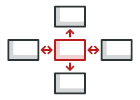
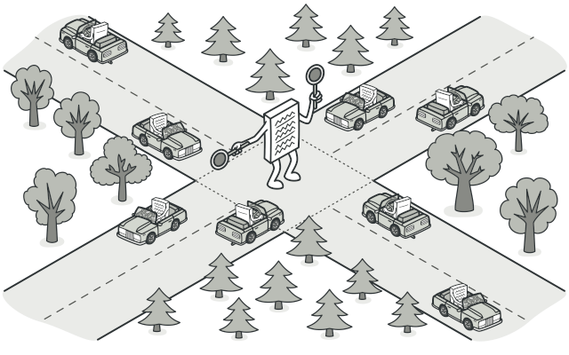
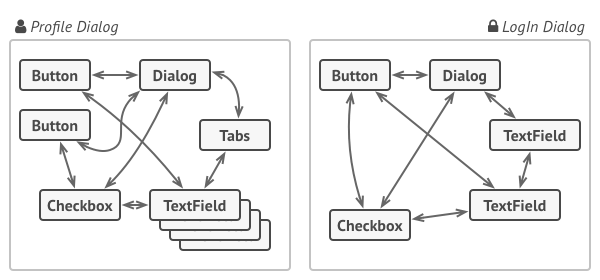
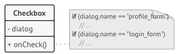
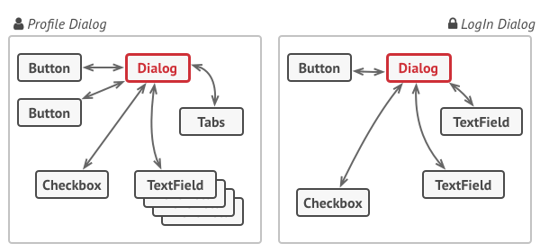
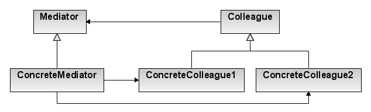

# Mediator
Define an object that encapsulates how a set of objects interact. Mediator promotes loose coupling by keeping objects from referring to each other explicitly, and it lets you vary their interaction independently.

## 🎯 เป้าหมายของ pattern นี้
ลดการขึ้นต่อกันของ object ที่ทำงานด้วยกัน โดยให้ทำงานผ่าน mediator แทนที่จะคุยกันตรงๆ

## ✌ หลักการแบบสั้นๆ
1. สร้างตัวกลางในการทำงานขึ้นมา
1. การทำงานให้ส่งต่อไปยังตัวกลางซะ แล้วให้ตัวกลางไปจัดการต่อว่าใครจะเป็นคนเอางานไปทำ
1. สร้างตัวกลางเป็น interface จะได้เปลี่ยนตัวกลางได้เรื่อยๆ

## 😢 ปัญหา


วันนี้เรามาฝึกงานที่เรือนจำบางแสน (ฝึกตำแหน่งอะไรฟระ) แล้วผู้คุมที่นั่นบอกว่าอยากได้โปรแกรมตัวนึง เพื่อเอาไว้บันทึกประวัตินักโทษในนั้น ซึ่งตัวโปรแกรมมันต้องสร้างและแก้ไขข้อมูลนักโทษได้

จากที่ว่ามาเราเลยเขียนโปรแกรมออกมาเป็น `Dialog` ซึ่งมี 2 หน้าคือ login และ profile โดยแต่ละหน้าจะมีปุ่มต่างๆ, ช่องกรอกข้อมูล, checkbox และอื่นๆอยู่เต็มไปหมด ตามที่แอพชาวบ้านชอบทำกัน

ซึ่งตัว control ในหน้าแต่ละกันมันจะต้องทำงานร่วมกับ control ตัวอื่นๆ เช่นหน้า profile จะมีช่องให้ติ๊กว่าเคยข่มขืนโดยไม่เจตนาหรือไม่ ซึ่งถ้าเราติ๊กไป มันจะต้องโชว์ช่องกรอกข้อมูล เพื่อให้ระบุว่าเผลทำไปกี่ครั้งด้วย หรือปุ่มบันทึกข้อมูล เมื่อกดแล้วมันจะต้องตรวจว่าข้อมูลทั้งหมดถูกต้องแล้วหรือยัง ก่อนที่จะเอาข้อมูลไปบันทึกจริง ตามภาพ



และบางทีตัว control ที่เราสร้าง อาจจะต้องเอาไปใช้ในหน้าอื่นๆด้วย ซึ่งถ้าเราเขียนโค้ดการทำงานไว้ภายใน control เลย มันจะยิ่งทำให้เราไม่สามารถนำ control นั้นๆไปใช้งานที่อื่นได้ หรือถ้าได้ เมื่อมีการแก้ control ตัวนั้นๆ ก็อาจส่งผลกระทบกับ control หรือหน้าอื่นๆไปด้วย



แม้ว่าตัวโปรแกรมเราจะสามารถทำงานได้อยู่ แต่ในใจเราก็รู้ดีว่าจะมีปัญหาในอนาคต เพราะทุกๆครั้งที่มีการเพิ่ม control หรือหน้าใหม่ๆเข้าไป นั่นหมายถึงความวุ่นวายจะตามมาทันที เพราะ control แต่ละตัวมันดันไปขึ้นกับ control ตัวอื่นๆอีกมากมายนั่นเอง ทำให้ตัวโปรแกรมเราขาดความยืดหยุ่นและยากต่อการดูแลรักษา

แล้วเราจะทำอย่างไรกันดีละ? (จริงๆปล่อยไปเลยก็ได้นิ ได้เงินแล้วก็เผ่นดิ)

## 😄 วิธีแก้ไข
หลังจากเดินเตร่แถวๆห้องขังได้สักครู่ ก็ได้พบกับ**มังกี้ D กาฟ** ซึ่งขณะนั้นท่านมาประจำการอยู่ที่เรื่อนจำแห่งนี้อยู่พอดี

**มังกี้ D กาฟ** เดินเข้ามาตบไหล่เราเบาๆ พร้อมกับกระซิบบอกเบาๆว่า (ยาราไนก๊ะ!!)

สมัยก่อนตอนที่ในเรือนจำแห่งนี้ยังไม่มีการจัดระเบียบอะไรเลย ทุกอย่างก็วุ่นวายกันไปหมด จะติดต่อเรื่องนี้ต้องไปคุยกับ เจ้าหน้าที่ A แล้วเจ้าหน้าที่ A ก็จะคุยกับเจ้าหน้าที่ B ให้ ถ้าติดต่อเรื่องนั้นก็ไปคุยกับ A เหมือนกัน แต่ A จะไปคุยกับ C และ D ให้ หรือเรื่องนู้นต้องไปคุยกับ B แล้ว B จะคุยกับ A และ C ให้ เห็นปะ แค่อธิบายให้ฟังยัง งงๆ กันเลย เอาเป็นว่าวุ่นวายชิบ

แต่ตอนนี้ดีขึ้นแล้ว เพราะเรามีคนกลางเอาไว้คอยประสานงานให้ อยากติดต่อเรื่องอะไรก็ไปคุยกับคนกลาง แล้วเขาจะจัดการประสานงานเรื่องอื่นๆต่อให้เอง

ปิ๊งงงง!! ทันทีที่ได้ยินเรื่องดังกล่าว เราก็เกิดไอเดียขึ้นในหัวว่า แทนที่เราจะให้ control จัดการงานของมันว่า เมื่อกดแล้วต้องไปทำอะไรบ้างกับ control ตัวอื่นๆ เราก็แค่มีตัวกลางที่ทำหน้าที่รับผิดชอบแทนดิ เมื่อเป็นแบบนี้ก็จะทำให้ control แต่ละตัวสามารถแยกออกจากกันได้แบ้ว

จากไอเดียที่ว่ามา เจ้าตัวกลางนี้ก็ขอเรียกชื่อเก๋ๆว่า `Mediator` ละกัน ส่วนเจ้า control หรือตัวทำงานจะขอเรียกมันว่า `Colleague` นะจ๊ะ

ซึ่งจากโค้ดที่เป็นอยู่ หน้าแต่ละหน้าจะมีตัวกลางของมันเอง เพราะหน้าต่างๆมันเป็น `Dialog` ซึ่งเจ้า Dialog จะต้องรู้จัก control ทุกตัวที่อยู่กับมัน ดังนั้น `Control ไหนอยากจะทำงาน ก็แค่ส่งคำขอไปที่ Dialog แล้ว Dialog ก็จะส่งงานต่อไปให้กับ control ที่เกี่ยวข้อง ให้มันไปทำงานต่อเอง` ตามภาพด้านล่าง



ผลที่เกิดขึ้นจากการทำแบบนี้คือ `เมื่อก่อนตอนที่เรากดปุ่มบันทึก เจ้าปุ่มเซฟมันจะต้องดึงข้อมูลจาก control อื่นๆมา เพื่อตรวจว่าข้อมูลถูกต้องครบหมดหรือยังก่อน ถึงจะบันทึกได้` แต่ตอนนี้ `เมื่อเรากดปุ่มบันทึก ปุ่มบันทึกก็แค่ส่งไปบอกกับ Dialog ว่ามีการกดบันทึกเกิดขึ้นเท่านั้นก็จะจบงานของปุ่มบันทึก`

จากที่ว่ามาจะเห็นว่าแบบใหม่นี้ ปุ่มบันทึก จะไม่ได้ต้องไปผูกกับฝูง control อื่นๆอีกแล้ว แค่มันผูกกับ Mediator เพียงตัวเดียวเท่านั้น

ยิ่งถ้าเราเปลี่ยน Mediator เป็น interface กลางละ!! นั่นหมายความว่า เราสามารถมีตัวจัดการหลายๆแบบได้ ส่วน client ที่เรียกใช้อยากจะทำงานกับตัวจัดการไหน ก็สามารถเปลี่ยนได้เรื่อยๆเช่นกัน `ทำให้โค้ดไม่เกิดการขึ้นต่อกันอีกแล้ว` บร๊ะ!!

## 📌 โครงสร้างของ pattern นี้


> **อธิบาย**  
**Colleague** - คือ interface ของ business logic class ซึ่งเมื่อมันจะทำงาน มันจะแจ้งไปยัง mediator เพื่อให้ไปหาคนมาทำงานให้มัน ซึ่งมันจะอ้างไปยัง interface ของ mediator ทำให้มันสามารถเปลี่ยน mediator เป็นแบบอื่นๆได้  
**Concrete Colleague** - ตัวที่ทำงานจริงๆ ซึ่งแต่ละตัวนั้น ไม่จำเป็นต้องรู้จักกันเลย แต่ถ้ามีงานที่เกี่ยวข้องกับมันถูกแจ้งมายัง Mediator แล้วละก็ เจ้า Mediator จะแจ้งมาให้ Colleague ที่เกี่ยวข้องมารับงานไปทำอีกที  
**Mediator** - เป็น interface ที่มี method มาตรฐานในการทำงานต่างๆ เพื่อเตรียมให้กับ **Colleague** มาเรียกใช้งาน ซึ่งตอนที่ **Colleague** แจ้งมาว่ามีงานให้ทำ มันอาจจะส่ง context เข้ามาด้วยก็ได้  
**Concrete Mediators** - ตัวกลางในการทำงานแต่ละรูปแบบ ซึ่งตัวมันจะรู้จักกับ Colleague อื่นๆ เมื่อเวลามันได้รับว่ามีงานเข้ามา มันก็จะเอางานที่ได้รับส่งต่อไปยัง Colleague ที่เกี่ยวข้อง  ให้มารับงานนั้นไปทำต่ออีกที และบางที **concrete mediator** อาจจะต้องจัดการ lifecycle ของ Colleague พวกนั้นอีกด้วย  

ในโครงสร้างนี้จะทำให้เรามอง Colleague เหมือนกับ black box คนที่ส่งงานไม่ต้องรู้ว่าใครจะรับเอางานไปทำต่อ และคนที่ทำงานก็ไม่ต้องรู้เช่นกันว่าใครส่งงานมันมาให้

## 🛠 ตัวอย่างการนำไปใช้งาน
สมมุติว่าเราถูกว่าจ้างให้เขียนโปรแกรมส่งข้อความ ให้กับอุปกรณ์สื่อสาร 3 ชนิด คือ คอมพิวเตอร์, มือถือ และ แท็บเล็ต ถ้าอุปกรณ์ชนิดไหนก็ตามส่งข้อความออกไป ข้อความนั้นจะต้องถูกส่งออกไปให้กับอุปกรณ์ที่เหลือ (ไม่ส่งเข้าตัวเอง)

จากตัวอย่าง เราลองมาใช้ Mediator Pattern มาช่วยแก้ปัญหาตัวนี้กันดีกว่า ดังนั้นอย่ารอช้า ไปดูโค้ดตัวอย่างกันเบย

## 👍 ข้อดี
* ลดการขึ้นต่อกัน (coupling) ระหว่าง Colleague แต่ละตัว
* ทำให้โค้ดสามารถนำกลับมาใช้ใหม่ได้เรื่อยๆ
* ถูกหลัก `Single Responsibility Principle`
* ถูกหลัก `Open/Closed Principle`

## 👎 ข้อเสีย
* ทำไปซักพัก Mediator จะกลายเป็น God object
> **God object** - คือของที่มันทำงานกับทุกสิ่งทุกอย่าง รู้ทุกเรื่อง เจือกได้ทุกอย่าง คิดง่ายๆคือคนที่เขียนโปรแกรมใหม่ๆยังแยก Module ไม่เป็น จะยัดทุกอย่างไว้ภายใน class เดียว และให้มันทำงานได้ครอบจักรวาล สิ่งนั้นแหละคือ God object

## ‍‍📝 Code ตัวอย่าง
```
using System;
using System.Collections.Generic;

// Mediator Interface
interface IMediator
{
    void Send(string msg, ColleagueBase sender);
}

// Concrete Mediators
class AppMediator : IMediator
{
    public IList<ColleagueBase> Colleagues { get; private set; }

    public AppMediator()
        => Colleagues = new List<ColleagueBase>();

    public void Send(string msg, ColleagueBase sender)
    {
        foreach(var receiver in Colleagues)
        {
            if(receiver != sender)
            {
                receiver.ReceiveMsg(msg);
            }
        }
    }
}

// Colleague Interface
abstract class ColleagueBase
{
    public IMediator Mediator { get; private set; }

    public ColleagueBase(IMediator mediator)
        => Mediator = mediator;

    public void Send(string msg)
        => Mediator.Send(msg, this);

    public abstract void ReceiveMsg(string msg);
}

// Concrete colleagues
class PcColleague : ColleagueBase
{
    public PcColleague(IMediator mediator) 
        : base(mediator) { }

    public override void ReceiveMsg(string msg)
        => Console.WriteLine($"คอมพิวเตอร์ - ได้รับข้อความว่า: {msg}");
}
class MobilePhoneColleague : ColleagueBase
{
    public MobilePhoneColleague(IMediator mediator) 
        : base(mediator) { }

    public override void ReceiveMsg(string msg)
        => Console.WriteLine($"มือถือ - ได้รับข้อความว่า: {msg}");
}
class TabletColleague : ColleagueBase
{
    public TabletColleague(IMediator mediator) 
        : base(mediator) { }

    public override void ReceiveMsg(string msg)
        => Console.WriteLine($"แท็บเล็ต - ได้รับข้อความว่า: {msg}");
}

// Client
class Program
{
    static void Main(string[] args)
    {
        var mediator = new AppMediator();
        var pc = new PcColleague(mediator);
        var mobilePhone = new MobilePhoneColleague(mediator);
        var tablet = new TabletColleague(mediator);

        mediator.Colleagues.Add(pc);
        mediator.Colleagues.Add(mobilePhone);
        mediator.Colleagues.Add(tablet);

        Console.WriteLine("คอมพิวเตอร์ทำการส่งข้อความออกไป");
        pc.Send("Hello world!");

        Console.WriteLine($"{Environment.NewLine}มือถือทำการส่งข้อความออกไป");
        mobilePhone.Send("Houston we got a problem!!");

        Console.WriteLine($"{Environment.NewLine}แท็บเล็ตทำการส่งข้อความออกไป");
        tablet.Send("Who the cat is Houston?");
    }
}
```

**Output**
```
คอมพิวเตอร์ทำการส่งข้อความออกไป
มือถือ - ได้รับข้อความว่า: Hello world!
แท็บเล็ต - ได้รับข้อความว่า: Hello world!

มือถือทำการส่งข้อความออกไป
คอมพิวเตอร์ - ได้รับข้อความว่า: Houston we got a problem!!
แท็บเล็ต - ได้รับข้อความว่า: Houston we got a problem!!

แท็บเล็ตทำการส่งข้อความออกไป
คอมพิวเตอร์ - ได้รับข้อความว่า: Who the cat is Houston?
มือถือ - ได้รับข้อความว่า: Who the cat is Houston?
```

# Credit
https://refactoring.guru  
You can buy his book by click the image below.  
[](https://refactoring.guru/design-patterns/book#buy-now)  