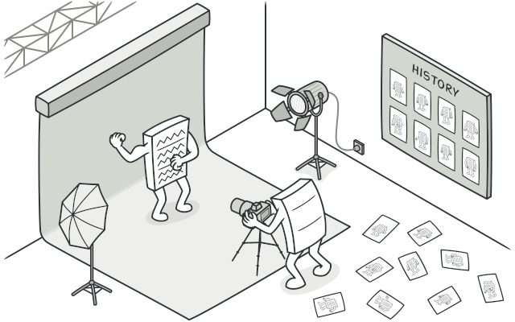
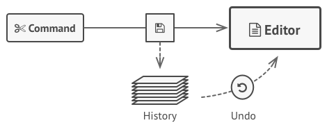
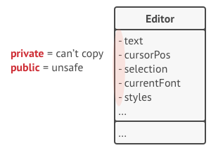
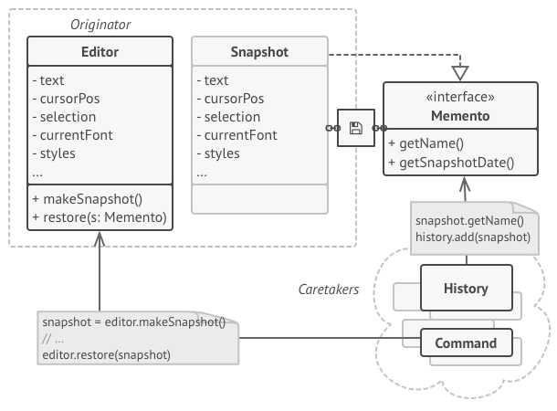
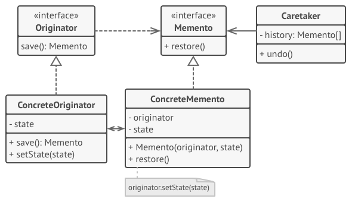

# Memento
Without violating encapsulation, capture and externalize an object's internal state so that the object can be restored to this state later.

## 🎯 เป้าหมายของ pattern นี้
ช่วยให้จำสถานะของ object และสามารถย้อนกลับไปก่อนที่จะแก้ไขมันได้

## ✌ หลักการแบบสั้นๆ
1. ให้ class ที่เราอยากให้มันย้อนกลับได้สร้าง memento object เอาไว้เก็บสถานะต่างๆของตัวมันเองไว้
1. สร้าง class ที่เอาไว้เก็บ memento object เพื่อเอาไปทำเป็น history แต่เข้าถึง memento ผ่าน interface
1. เมื่อต้องการย้อนสถานะกลับ ให้ส่ง memento object กลับไปให้ class ที่มีความสามารถย้อนกลับ

## 😢 ปัญหา
วันนี้อารมณ์ดีเลยมานั่งสูดกาวแถวๆริมทะเล ด้วยความหอมเย้ายวนของกาวยี่ห้อใหม่ทำให้ปัญหาเมื่อในอดีตผุดขึ้นมาในหัว นั่นคือตอนที่เขียนโปรแกรม text editor สมัยหนุ่มๆ ส่วนปัญหาของมันก็คือ เมื่อผู้ใช้เปลี่ยนสี, เปลี่ยนขนาดข้อความ, เพิ่มรูป หรือทำอะไรก็แล้วแต่ในโปรแกรมลงไป ผู้ใช้สามารถกด **ย้อนกลับ** ได้ แล้วสิ่งที่ทำลงไปก็จะกลับไปเป็นสถานะก่อนที่จะแก้ไขไงละ

ส่วนวิธีแก้ไขปัญหาในตอนนั้นของเราก็คือ เมื่อผู้ใช้ทำอะไรก็แล้วแต่ เราจะทำการบันทึก object ทุกตัวลงใน hardisk ก่อนทุกครั้ง แล้วเมื่อไหร่ที่ผู้ใช้กดย้อนกลับ (CTRL + Z) เราก็จะโหลด object ที่บันทึกไว้ทั้งหมดกลับมา ดังนั้นโปรแกรมเราก็ย้อนกลับไปสถานะก่อนหน้าได้แล้วเย่ ตามรูปเบย



แต่ด้วยฤทธิ์ของกาวทำให้เราเอะใจขึ้นมาได้ว่า รูปแบบที่ทำไปมันยังมีปัญหาอื่นๆซ่อนไว้อีกเช่น
1. มันใช้แค่ได้กับ object ที่เรียบง่ายเท่านั้นนิ เพราะ object ที่มีข้อมูลเป็น private เราจะทำอะไรกับมันไม่ได้เลย
1. ถ้า object ที่เราจะบันทึกมันต้องทำงานกับ object อื่นๆอีกละ ยิ่งถ้ามันพ่วงต่อกันหลายๆตัวอีกละ เราจะเขียนเก็บข้อมูลพวกนั้นยังไง
1. ถ้า object ที่เราบันทึกไว้มีการเปลี่ยนโครงสร้างละ นั่นหมายถึงของที่เคยบันทึกไว้ทั้งหมดก็จะใช้ไม่ได้เลยอะดิ



จากปัญหาที่ว่ามาเราจะแก้มันยังไงดี? หรือต้องหากาวสูตรอื่นมาดมเพิ่มเผื่อจะแก้ไขได้?

## 😄 วิธีแก้ไข
ขณะที่โลกกำลังหมุนด้วยฤทธิ์กาว ทำให้เห็นเณรน้อยเจ้าปัญญาเกลอเก่าสมัยนั่งดูดเนื้อด้วยกัน แล้วเณรน้อยก็พูดกับเราว่า

ถ้าโยมไม่สามารถแก้ปัญหาจากภายนอกได้เพราะเข้าไปไม่ถึงข้อมูลที่เป็น private ทำไมโยมไม่ลองแก้ปัญหาจากภายในดูบ้างละ เพราะ class ตัวมันเองเท่านั้นแหละที่จะมีสิทธิ์เข้าถึงข้อมูล private ไงโยม?

ปิ๊งงงงง!! เหมือนตรัสรู้ได้ในบัดดลเพราะนึกถึง `Memento Pattern` ขึ้นมาได้ ซึ่งมีหลักการว่า class ใดก็ตามที่เราอยากจะให้มันเก็บสถานะตัวมันเองไว้ได้ ให้ class คัดลอก state ของตัวมันเองไว้ใน object พิเศษที่เราเรียกมันว่า `Memento` ซะ และจงห้ามให้ใครเข้าถึง memento ได้ตรงๆนอกจาก class ที่สร้างมันเท่านั้น ส่วน class อื่นๆถ้าจะเข้าถึง memento ให้เข้าถึงผ่าน interface ที่ให้ดูได้เฉพาะ metadata ของมันเท่านั้น เช่น วันที่สร้าง, ชื่อคำสั่ง บลาๆ ตามรูปเบย



**อธิบาย - ให้ตัวเองฟังนิดหน่อยเดี๋ยวกาวเข้าเส้นแล้วจะลืม**  
1. **Editor** class คือตัวที่เราอยากให้มันเก็บสถานะต่างๆไว้ได้ มันเลยสามารถสร้าง memento object ไว้ได้ (class พวกนั้นเราเรียกมันว่า `Originator`)
1. คนที่จะมาคอยบันทึกสถานะของ object เราเรียกมันว่า `Caretaker` ซึ่งเมื่อไหร่มันอยากจะเก็บสถานะล่าสุดไว้มันก็แค่มาขอ memento object จาก **Originator** class แต่มันจะได้กลับไปในรูปแบบ interface เท่านั้น
1. ส่วนเมื่อไหร่เราอยากให้ `Originator` class กลับไปเป็นสถานะเดิม เราก็แค่ส่ง memento object กลับไป ซึ่ง **Originator** นั้นสามารถเข้าถึง memento object และข้อมูล private ของตัวเองได้สมบูรณ์ ดังนั้นมันเลยสามารถเปลี่ยนสถานะให้เป็นตาม memento object ได้

หลังจากที่เห็นเกลอเก่าส่งยิ้มให้เพราะเราแก้ปัญหาได้แล้ว สติก็ค่อยๆวูปไป

## 📌 โครงสร้างของ pattern นี้


> **อธิบาย**
**Originator Interface** - คือ interface กลางสำหรับ class ที่เราอยากจะให้มันย้อนกลับสถานะต่างๆได้   
**Originator** - คือ class ที่เราอยากจะให้มันย้อนกลับสถานะต่างๆได้ ซึ่งเจ้า class นี้จะมีความสามารถ 2 อย่างคือ 1.สร้าง memento object `(Save)` และ 2.ย้อนข้อมูลตัวเองกลับไปตาม memento object ที่ได้รับ `(Restore)`  
**Memento Interface** - เป็น interface เพื่อให้คนอื่นที่จะทำงานกับ memento มาเรียกใช้ เช่นดูวันเวลาล่าสุดว่าบันทึกเมื่อไหร่  
**Concrete memento** - เป็น class ที่เก็บสถานะต่างๆของ **Originator** class ไว้  
**Caretaker** - เป็นคนที่เก็บสถานะต่างๆของที่ **Originator** เป็นคนสร้างไว้ให้ และถ้าต้องการย้อน **Originator** กลับไปที่สถานะไหน ก็แค่ส่ง memento object ไปให้เท่านั้น

## 🛠 ตัวอย่างการนำไปใช้งาน
ในตัวอย่างนี้เราจะลองเขียนโปรแกรม text editor แบบง่ายๆ ที่สามารถย้อนกลับไปสถานะก่อนหน้าได้ ปะไปดูโค้ดตัวอย่างกัน

## 👍 ข้อดี
* สามารถเก็บสถานะของ object และย้อนสถานะไปมาได้โดยไม่ทำลายความเป็น encapsulation
* แยกหน้าที่ของตัวเก็บข้อมูลต่างๆจาก Originator ได้ เพราะมี caretaker เป็นคนดูแล

## 👎 ข้อเสีย
* เปลือง Ram เพราะมันจะเก็บข้อมูลไปเรื่อยๆ
* Caretaker จะต้องรู้จังหวะว่าเมื่อไหร่จะลบ memento object ทิ้ง
* ภาษาบางภาษาเราไม่สามารถป้องกันการเข้าถึง memento object ได้เช่นภาษา PHP, Phyton, Javascript

## ‍‍📝 Code ตัวอย่าง
```
using System;
using System.Linq;
using System.Collections.Generic;

// Originator Interface
interface IOriginator
{
    IMemento Save();
}

// Memento Interface
interface IMemento
{
    DateTime CreatedDate { get; }

    void Restore();
}

// Concreate Originator
class TextEditor : IOriginator
{
    public string DisplayText { get; private set; }

    public IMemento Save()
        => new TextEditorMemento(this){ CurrentDisplayText = DisplayText, LastPatchedDate = DateTime.Now };

    public void SetState(IMemento state)
    {
        var version = state as TextEditorMemento;
        DisplayText = version.CurrentDisplayText;
    }

    public void InputText(string text)
        => DisplayText = $"{DisplayText}{text}";
}

// Concreate Memento
class TextEditorMemento : IMemento
{
    private TextEditor originator;

    public string CurrentDisplayText { get; set; }

    public DateTime CreatedDate => LastPatchedDate;

    public DateTime LastPatchedDate { get; set; }

    public TextEditorMemento(TextEditor originator)
        => this.originator = originator;

    public void Restore()
        => originator.SetState(this);
}

// Caretaker
class Caretaker
{
    public IList<IMemento> Histories { get; set; }

    public Caretaker()
        => Histories = new List<IMemento>();

    public void Undo()
    {
        var lastHistory = Histories.LastOrDefault();
        if(lastHistory == null)
        {
            return;
        }
        
        lastHistory.Restore();
        Histories.Remove(lastHistory);
    }
}

// Client
class Program
{
    static void Main()
    {
        var caretaker = new Caretaker();
        var originator = new TextEditor();
        Console.WriteLine("พิมพ์ข้อความ Hello ลงไป");
        originator.InputText("Hello");
        Console.WriteLine($"ข้อความใน TextEditor คือ: {originator.DisplayText}");

        Console.WriteLine();
        Console.WriteLine("บันทึกสถานะปัจจุบัน");
        caretaker.Histories.Add(originator.Save());

        Console.WriteLine();
        Console.WriteLine("พิมพ์ข้อความ World ลงไป");
        originator.InputText("World");
        Console.WriteLine($"ข้อความใน TextEditor คือ: {originator.DisplayText}");

        Console.WriteLine();
        Console.WriteLine("สั่งให้ย้อนกลับไปสถานะก่อนหน้า");
        caretaker.Undo();
        Console.WriteLine($"ข้อความใน TextEditor คือ: {originator.DisplayText}");
    }
}
```

**Output**
```
พิมพ์ข้อความ Hello ลงไป
ข้อความใน TextEditor คือ: Hello

บันทึกสถานะปัจจุบัน

พิมพ์ข้อความ World ลงไป
ข้อความใน TextEditor คือ: HelloWorld

สั่งให้ย้อนกลับไปสถานะก่อนหน้า
ข้อความใน TextEditor คือ: Hello
```

# Credit
https://refactoring.guru  
You can buy his book by click the image below.  
[](https://refactoring.guru/design-patterns/book#buy-now)  