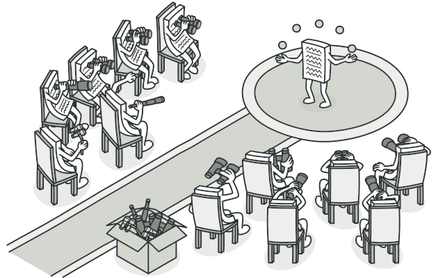
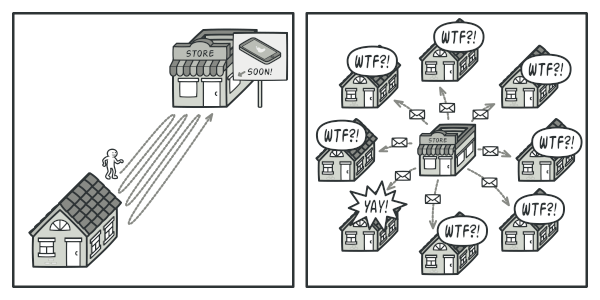
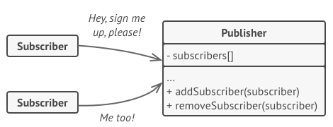
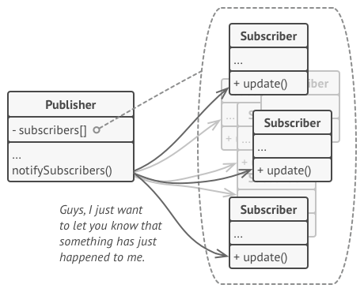
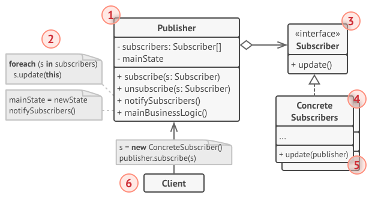

# Observer
Define a one-to-many dependency between objects so that when one object changes state, all its dependents are notified and updated automatically.

## 🎯 เป้าหมายของ pattern นี้
สร้างกลไกในการแจ้งเตือนให้กับ object ต่างๆที่สนใจ

## ✌ หลักการแบบสั้นๆ
1. สร้างตัวกลางในการลงทะเบียนให้กับคนที่ต้องการ ติดตามข่าว/ยกเลิกติดตามข่าว ขึ้นมา
1. สร้าง interface กลางสำหรับคนติดตามข่าว เพื่อให้ตัวกลางทำงานร่วมได้
1. คนที่ต้องการติดตามข่าวจะต้อง implement interface นั้น
1. เมื่อมีข่าวใหม่ๆเกิดขึ้น ตัวกลางก็จะส่งข่าวไปให้กลับคนที่ลงทะเบียนไว้

## 😢 ปัญหา
สมมุติว่าเราเขียนแอพขายของบนมือถือตัวนึงอยู่ ซึ่งโค้ดของเรามี class อยู่ 2 ตัวคือ `Customer` และ `Store`

เมื่อเรามีสินค้าใหม่ๆเข้ามา เราก็จะอัพเดทสินค้าลงใน database ส่วนถ้าลูกค้าอยากรู้ว่ามีสินค้าอะไรใหม่เข้ามาบ้าง ก็จะต้องไปถามจาก Store อีกที (เช่นอุปกรณ์บริหารนิ้วมือท่านชาย ที่ขายเกลื่อนบนลาซาด้า)

แต่ทุกครั้งที่ Customer เข้ามาดึงข้อมูลจาก Store ก็ไม่ได้หมายความว่ามันจะมีสินค้าใหม่เข้ามาทุกครั้ง ทำให้ในหลายๆครั้งที่ไปดึงข้อมูลมันจะทำงานฟรี ทั้ง Customer และ Store เลย

> **เกร็ดความรู้ - ไม่อ่านก็ได้**  
ทุกๆครั้งที่ client ขอให้เซิฟเวอร์ทำงาน นั่นหมายถึงเซิฟเวอร์จะต้องเสียความสามารถในการรับ request จาก client ไป (เป็นเหตุผลว่าทำไมบางเว็บเราไปรุมกด refresh รัวๆแล้วมันถึงล่ม, แต่เบื้องหลังจริงๆเซิฟเวอร์ไม่ได้กากแบบนั้นหรอก ที่มันล่มเพราะมันมีตัวแม่ทัพใช้ IoT ยิงมาถล่มจากหลังฉากต่างหาก) ซึ่งข้อเสียของมันคือ ทำให้เซิฟเวอร์และ client เสียแรงทำงานฟรี

และในทางกลับกัน ถ้าทุกครั้งที่มีสินค้าใหม่เข้ามา ระบบก็จะแจ้งไปหา Customer ทุกคนแทนละ ?? (นี่มันระบบ Spam ชัดๆ) คงมีลูกค้าบางคนแฮปปี้ แต่เสียงตอบรับส่วนใหญ่น่าจะกร่นด่าเป็นแน่แท้ ตามรูปเลย



ดูเหมือนว่าเราจะเจอปัญที่เป็นงูกินหางแล้วละ ว่าจะให้ลูกค้าเสียเวลามาเช็คของเองเรื่อยๆ ทั้งๆที่ส่วนใหญ่ไม่มีอะไรอัพเดท หรือเราจะส่งข้อความไปแจ้งลูกค้าทุกคน ทั้งๆที่มีแค่ลูกค้าส่วนน้อยเท่านั้นที่สนใจ

## 😄 วิธีแก้ไข
วิธีการแก้นั้นแสนจะง่าย ก่อนอื่นเรามากำหนดคำที่ใช้เรียกสิ่งต่างๆกันก่อนเลยดีกว่า

1. อะไรก็แล้วแต่ที่มีคนสนใจอยากรู้สถานะของมัน เราจะเรียกมันว่า `Subject` (ในตัวอย่างนี้คือ สถานะว่ามีสินค้าใหม่หรือเปล่า)
1. เมื่อไหร่ก็ตามที่ Subject มีการเปลี่ยนแปลง ดังนั้นทำให้เราต้องทำการส่งข้อความแจ้งเตือนออกไป เราจะเรียกเจ้าตัวที่คอยส่งการแจ้งเตือนออกไปว่า `Publisher` (ในตัวอย่างนี้คือ Store)
1. ใครก็ตามที่สนใจอยากรู้ว่า Subject มีการเปลี่ยนแปลงไหม เราจะเรียกเจ้าพวกนี้ว่า `Subscriber` (ในตัวอย่างนี้คือ Customer)

กลับมาที่หลักการของ Observer Pattern ของเราต่อบ้าง ซึ่งเจ้า pattern นี้เสนอว่า ตัว `Publisher` จะต้องมีช่องทางให้คนที่สนใจ`(Subscriber)` สามารถขอเข้ามาติดตาม(subscribe) หรือ ยกเลิกการติดตาม(unsubscribe) ได้

จากหลักการที่ว่ามา เลยทำให้เจ้า Publisher มี method 2 ตัว คือ `Subscribe` และ `Unsubscribe` เพื่อคอยเก็บว่า ใครบ้างที่สนใจจะรับข่าวสาร และ ใครบ้างที่ยกเลิกการขอรับข่าวสารตามรูปเลย



คราวนี้เมื่อตัว `Subject` มีการอัพเดทเกิดขึ้น เจ้า Publisher ก็จะส่งการแจ้งเตือนให้กับเหล่า Subscriber ที่ได้ขอเข้ามาติดตามข่าวสารนั่นเอง ตามรูปเลย



สุดท้ายเจ้า Publisher ที่คอยจำว่ามีใครบ้างที่สนใจจะรับข่าวสาร มันจะไม่จำ Subscriber เป็น concrete class (เพราะเราไม่อยากทำให้เกิด coupling ขึ้น) ดังนั้น พวก Subscriber จะต้อง implement interface เดียวกัน ทำให้ Publisher ทำงานกับ Subscriber ผ่านทาง interface เท่านั้น

สรุปคือ เราสามารถสร้างช่องทางการแจ้งเตือน ให้กับ object ที่สนใจในจะรับฟังจริงๆเท่านั้น และไม่ทำให้ client ต้องมาทำงานฟรีๆเพราะไม่มีข้อมูลใหม่อัพเดทอีกด้วย :D

## 📌 โครงสร้างของ pattern นี้


> **อธิบาย**  
**1.Publisher** - คอยแจ้งเตือนให้กับเหล่า subscriber เมื่อ subject มีการอัพเดท และรู้จักกับเหล่า subscriber ผ่านทาง interface เท่านั้น  
2.เมื่อ subject มีการอัพเดท มันจะไปดูว่ามี subscriber ไหนบ้าง ที่ขอรับการแจ้งเตือน แล้วทำการแจ้งเตือนไปให้กับ subscriber เหล่านั้น  
**3.Subscriber** - เป็น interface กลางให้กับ concrete subscriber ซึ่งตัวมันจะมี method สำหรับรับการแจ้งเตือน เพื่อให้ Publisher เรียกใช้ ซึ่ง Publisher จะรู้จักแค่ตัวนี้เท่านั้น  
**4.Concrete Subscribers** - ใครก็ตามที่สนใจอยากจะรับการแจ้งเตือน จะต้อง implement Subscriber Interface แล้วคอยดำเนินการอื่นๆต่อเมื่อได้รับการแจ้งเตือนนั้นมาแล้ว  
5.ในบางที subscriber อาจจะต้องการ context ด้วย เพื่อให้มันทำงานได้ถูกต้อง ดังนั้นในบางที Publisher ก็อาจจะส่งข้อมูลเข้ามาเป็น parameter ด้วยก็ได้  
**6.Client** - เป็นคนส่ง subscriber ให้กับ Publisher เพื่อระบุว่า object ไหน สนใจ/ไม่สนใจ ที่จะรับข่าวสารแล้ว

## 🛠 ตัวอย่างการนำไปใช้งาน
ในรอบนี้เราจะมาลองเขียนโปรแกรมส่งข้อความไปให้กับนักเรียนและอาจารย์ภายในโรงเรียนกันบ้าง โดยใช้ Observer Pattern เข้ามาช่วย ปะไปดูโค้ดตัวอย่างกันเลย

## 👍 ข้อดี
* ส่งการแจ้งเตือนให้กับคนที่สนใจจะรับข่าวสารนั้นจริงๆ

## 👎 ข้อเสีย
* ในแต่ละภาษาส่วนใหญ่จะรองรับเรื่องพวกนี้อยู่แล้ว ไปศึกษาภาษาที่ตัวเองใช้จะดีกว่า
* ถ้าจะส่งให้เป็นลำดับ จะต้องไปเขียนเพิ่ม

## ‍‍📝 Code ตัวอย่าง
```
using System;
using System.Collections.Generic;

// Subscriber Interface
interface ISubscriber
{
    void Update(string msg);
}

// Concrete Subscribers
class Student : ISubscriber
{
    public void Update(string msg)
        => Console.WriteLine($"นักเรียนได้รับข้อความใหม่ว่า, {msg}");
}
class Teacher : ISubscriber
{
    public void Update(string msg)
        => Console.WriteLine($"อาจารย์ได้รับข้อความใหม่ว่า, {msg}");
}

// Publisher
class SchoolMessager
{
    private IList<ISubscriber> subscribers;

    public SchoolMessager()
        => subscribers = new List<ISubscriber>();

    public void Subscribe(ISubscriber newSubscriber)
        => subscribers.Add(newSubscriber);
    
    public void Unsubscribe(ISubscriber newSubscriber)
        => subscribers.Remove(newSubscriber);

    public void SendMessage(string msg)
    {
        foreach(var it in subscribers)
        {
            it.Update(msg);
        }
    }
}

// Client
class Program
{
    static void Main(string[] args)
    {
        var student = new Student();
        var teacher = new Teacher();

        var publisher = new SchoolMessager();
        publisher.Subscribe(student);
        publisher.Subscribe(teacher);

        Console.WriteLine("โรงเรียนประกาศข้อความออกไป");
        publisher.SendMessage("ขณะนี้ฝุ่น 2.9 ระบาดในโรงเรียนแล้วนะจุ๊");

        Console.WriteLine("นักเรียนไม่ต้องการรับข่าวสารอีกต่อไป");
        publisher.Unsubscribe(student);

        Console.WriteLine("โรงเรียนประกาศข้อความออกไป");
        publisher.SendMessage("ขอให้คุณครูทุกคนจับเด็กเอาไว้ก่อน อย่าพึ่งปล่อยให้มันหนีไป");
    }
}
```
> **Note**  
สำหรับภาษา C# มีนั้น ทีมพัฒนาได้มีคำสั่งในการทำงานกับของพวกนี้อยู่แล้ว นั่นคือ [event](https://docs.microsoft.com/en-us/dotnet/standard/events) นั่นเอง โยมไม่ต้องไปเขียนใหม่ให้เมื่อยมือหรอก และยังมีพวก [IObserver, IObservable](https://docs.microsoft.com/en-us/dotnet/standard/events/observer-design-pattern) ไม่ก็ [Rx](http://reactivex.io) อีก กดที่ชื่อพวกนั้นเพื่อไปหาศึกษาดูเอาเองนะจ๊ะ

**Output**
```
โรงเรียนประกาศข้อความออกไป
นักเรียนได้รับข้อความใหม่ว่า, ขณะนี้ฝุ่น 2.9 ระบาดในโรงเรียนแล้วนะจุ๊
อาจารย์ได้รับข้อความใหม่ว่า, ขณะนี้ฝุ่น 2.9 ระบาดในโรงเรียนแล้วนะจุ๊
นักเรียนไม่ต้องการรับข่าวสารอีกต่อไป
โรงเรียนประกาศข้อความออกไป
อาจารย์ได้รับข้อความใหม่ว่า, ขอให้คุณครูทุกคนจับเด็กเอาไว้ก่อน อย่าพึ่งปล่อยให้มันหนีไป
```

# Credit
https://refactoring.guru  
You can buy his book by click the image below.  
[](https://refactoring.guru/design-patterns/book#buy-now)  