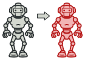
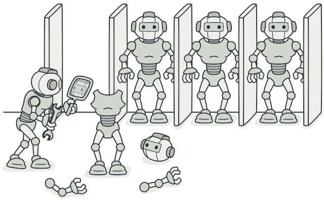

# Prototype
Specify the kinds of objects to create using a prototypical instance, and create new objects by copying this prototype.

## ✌ เป้าหมายของ pattern นี้
ก๊อปปี้ object ตัวหนึ่ง ออกมาเป็นอีกตัวหนึ่ง โดยไม่ทำให้โค้ดของเราต้องไปยุ่งกับ class ต่างๆที่เกี่ยวข้องกับ object นั้น

## 🎯 หลักการแบบสั้นๆ
1. in progress .... เดี๋ยวกลับมาเขียนต่อตอนเย็นๆ

## 😢 ปัญหา


โยมเคยปะที่เรามี object ซักตัวนึ่งอยู่ในมือ แล้วโยมก็อยากจะก๊อปปี้มันมาอีกซักตัวนึง?

เคยหรือไม่เคยอาตามาไม่รู้ละ แต่ถ้าโยมต้องทำ โยมจะทำยังไงละ?

อาตามาขอเดาว่า โยมก็ไปสร้าง object ใหม่จาก class ที่โยมอยากจะก๊อปปี้ใช่ปะ ถัดมาโยมก็จะไปกำหนดค่า field ต่างๆของ object ใหม่ของโยม โดยใช้ค่าจาก object ที่โยมอยากจะก๊อปปี้มาชิมิ?

หยุดก่อนอานนท์ ถ้าเจ้าคิดว่าทำแบบนั้นได้เสมอไปเจ้าอาจจะคิดผิดนะ ลองคิดให้ดี เจ้าไม่สามารถทำแบบนั้นกับทุก class ได้นะ เพราะ field บางตัวของมันอาจถูกซ่อนอยู่ (private) เพียงเท่านี้เจ้าก็เข้าไปกำหนดค่ามันไม่ได้แล้วไง


จากรูปเจ้าก็จะเพียงแค่ก๊อปปี้ได้แค่เปลือกนอกมันเท่านั้น แต่ไส้ในของมันเจ้ามิอาจทำได้ไงละ (ช่วงนี้เมียเปิดหนังจีนอยู่ข้างๆ)

แถมมันยังมีปัญหาอื่นอีกนะ เช่นถ้าบางที object ที่เราอยากจะก๊อปปี้มันดันเป็น `interface` ที่โยมไม่รู้ว่าเจ้าตัว class จริงๆของมัน `(concrete class)` คืออะไร ซึ่งถ้าเป็นแบบนี้โยมจะไปสร้าง object ใหม่ของโยมจาก class ไหนละจ๊ะ

## 😄 วิธีแก้ไข
เจ้า pattern นี้ก็เลยเสนอแนวการแก้ไขไว้คือ ให้เจ้า object ที่โยมอยากจะก๊อปปี้นั่นแหละ เป็นคนสร้างตัวโคลน object ของมันออกมาซะเลย เพราะตัวมันเองนั่นแหละถึงจะสามารถเข้าถึง private field ต่างๆของมันได้ไง!!

ดังนั้นเราก็จะมี interface กลางไว้ 1 ตัว ซึ่งภายใน interface ตัวนี้ก็จะแค่ `clone method` ก็พอ ส่วน class ไหนที่โยมอยากจะให้มันถูกก๊อปปี้ object ออกมาง่ายๆ ก็ไป implement interface ตัวที่ว่ามาซะ

in progress .... เดี๋ยวกลับมาเขียนต่อตอนเย็นๆ

## 📌 โครงสร้างของ pattern นี้
xxx

## 🛠 ตัวอย่างการนำไปใช้งาน
xxx

## 👍 ข้อดี
* xxx

## 👎 ข้อเสีย
* xxx

## ‍‍📝 Code ตัวอย่าง
```
xxx
```

**Output**
```
xxx
```

# Credit
https://refactoring.guru  
You can buy his book by click the image below.  
[](https://refactoring.guru/design-patterns/book#buy-now)  