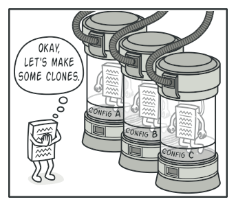
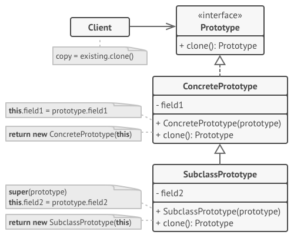
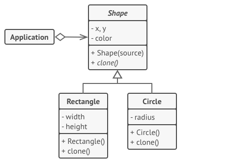

# Prototype
Specify the kinds of objects to create using a prototypical instance, and create new objects by copying this prototype.

## 🎯 เป้าหมายของ pattern นี้
ก๊อปปี้ object ตัวหนึ่ง ออกไปเป็นอีกตัวหนึ่ง โดยไม่ทำให้โค้ดของเราต้องไปยุ่งกับ class ต่างๆที่เกี่ยวข้องกับ object นั้นๆ

## ✌ หลักการแบบสั้นๆ
1. สร้าง interface ที่ใช้สำหรับก๊อปปี้/โคลน ออกมา 1 ตัว
2. Class ไหนที่ต้องการให้มีความสามารถในการสร้างก๊อปปี้ object ก็ไปทำการ implement interface ที่ว่านั้นซะ
3. การตั้งค่าเพิ่มเติมต่างๆสามารถไปใส่ไว้ใน subclass ได้

## 😢 ปัญหา


โยมเคยปะที่เรามี object ซักตัวนึ่งอยู่ในมือ แล้วโยมก็อยากจะก๊อปปี้มันมาอีกซักตัวนึง? (อาตตามาพูดถึง object ที่เป็น reference type นะ)

เคยหรือไม่เคยอาตามาไม่รู้ละ แต่ถ้าโยมต้องทำ โยมจะทำยังไงละ?

อาตามาขอเดาว่า โยมก็ไปสร้าง object ใหม่จาก class ที่โยมอยากจะก๊อปปี้ใช่ปะ ถัดมาโยมก็จะไปกำหนดค่า field ต่างๆของ object ใหม่ของโยม โดยใช้ค่าจาก object ที่โยมอยากจะก๊อปปี้มาชิมิ?

หยุดก่อนอานนท์ ถ้าเจ้าคิดว่าทำแบบนั้นได้เสมอไปเจ้าอาจจะคิดผิดนะ ลองคิดให้ดี เจ้าไม่สามารถทำแบบนั้นกับทุก class ได้นะ เพราะ field บางตัวของมันอาจถูกซ่อนอยู่ (private) เพียงเท่านี้เจ้าก็เข้าไปกำหนดค่ามันไม่ได้แล้วไงยังไงละ ชะล่ะล๊า~~*


จากรูปเจ้าก็จะก๊อปปี้ได้เพียงแค่เปลือกนอกของมันเท่านั้น แต่ไส้ในของมันเจ้ามิอาจทำได้ไงละ (ช่วงนี้เมียเปิดหนังจีนอยู่ข้างๆ)

แถมมันยังมีปัญหาอื่นอีกนะ เช่นถ้าบางที object ที่เราอยากจะก๊อปปี้มันดันเป็น `interface` ที่โยมก็อาจจะไม่รู้ว่า เจ้าตัว class จริงๆของมัน `(concrete class)` คืออะไร ซึ่งถ้าเป็นแบบนี้โยมจะไปสร้าง object ใหม่ของโยมจาก class ไหนละจ๊ะ

## 😄 วิธีแก้ไข
เจ้า pattern นี้ก็เลยเสนอแนวการแก้ไขไว้คือ ให้เจ้า object ที่โยมอยากจะก๊อปปี้นั่นแหละ เป็นคนสร้างตัวโคลน object ของมันออกมาซะเลย เพราะตัวมันเองนั่นแหละถึงจะสามารถเข้าถึง private field ต่างๆของมันได้ไง!!

ดังนั้นเราก็จะมี interface กลางไว้ 1 ตัว ซึ่งภายใน interface ตัวนี้ก็จะแค่ `clone method` ก็พอ ส่วน class ไหนที่โยมอยากจะให้มันถูกก๊อปปี้ object ออกมาง่ายๆ ก็ไป implement interface ตัวที่ว่ามาซะ

ส่วนวิธีการ implement ก็แสนเรียบง่าย ก็ทำเหมือนที่โยมเคยทำมานั่นแหละ สร้าง object จาก class ตัวมันเอง แล้วกำหนดค่า field แต่ละตัวเหมือนเดิม แต่มันจะดีกว่าเดิมตรงที่ ตอนนี้เราเข้าถึง private field มันแล้วไงละโยม และ ตอนนี้เราก็อยู่ในตัว class มันเอง ดังนั้นต่อให้มันส่งกลับไปเป็น interface ก็ไม่มีผลกระทบอะไรแล้วละ

คราวนี้ object ไหนก็ตาม ที่โยมทำให้มันรองรับการก๊อปปี้/โคลน แล้ว เราจะเรียก object พวกนี้ว่า `prototype`



> **Tip**  
ในขั้นตอน clone โยมสามารถผลักภาระการตั้งค่าต่างๆไปอยู่ใน subclass ของมันก็ได้นะ

ดังนั้นเวลาที่เราอยากจะทำการก๊อปปี้/โคลน object เราก็แค่เรียก clone method เท่านั้นเอง

## 📌 โครงสร้างของ pattern นี้


> **อธิบาย**  
**Prototype** - เป็น interface กลางเพื่อให้ class ที่เราอยากให้มันมีความสามารถในการก๊อปปี้/โคลน มา implement มันต่อ  
**Concrete Prototype** - เป็น class ที่เราอยากให้มันมีความสามารถในการก๊อปปี้/โคลน (เราสามารถผลักภาระเรื่องการตั้งค่าไปให้กับ subclass มันได้)  
**Client** - เมื่ออยากได้ก๊อปปี้ของ object ไหน เราก็แค่เรียก clone method


## 🛠 ตัวอย่างการนำไปใช้งาน
ในตัวอย่างนี้เราจะไปก๊อปปี้ object ของ class รูปทรงต่างๆ (สี่เหลี่ยม, วงกลม) โดยที่มี base เดียวกัน ตามรูปเลย


> **อธิบาย**  
`Shape` มี method ชื่อ `Clone` ซึ่งเอาไว้สำหรับทำก๊อปปี้ object และภายใน constructor ก็รับตัวมันเองเพื่อเอาไว้กำหนดค่าเมื่อมีการเรียกใช้ method clone  
`Rectangle` และ `Circle` เป็น subclass ของ `Shape` ดังนั้นเวลาที่มันจะก๊อปปี้ มันก็แค่สร้าง object ตัวมันเองแล้วส่งกลับให้ client ส่วน field ต่างๆที่มันไม่มีใน base class มันก็แค่ไปกำหนดไว้ใน constructor ของมันเองก่อน

## 👍 ข้อดี
* สามารถก๊อปปี้/โคลน object ได้เลยโดยที่โค้ดของเราไม่ไปผูกติดกัน (coupling)
* สามารถก๊อปปี้/โคลน object ที่มีความซับซ้อนได้ง่ายขึ้น
* ลดการซ้ำซ้อนของโค้ดตอนทำการก๊อปปี้

## 👎 ข้อเสีย
* ถ้า object มีการอ้างกันแบบงูกินหาง (circular references) จะทำได้ยาก และอาจเกิดปัญหาตามมาภายหลัง
> **Circular references**: เช่น object A อ้างหา object B แล้ว object B ก็อ้างกลับไปหา object A  
var a = new ObjectA();  
var b = new ObjectB();  
a.Ref = b;  
b.Ref = a;

## ‍‍📝 Code ตัวอย่าง
```
using System;

// Clone interface
public interface ICloneable
{
    Shape Clone();
}

// Cloneable classes
public abstract class Shape : ICloneable
{
    public int X { get; set; }
    public int Y { get; set; }

    public Shape() { }

    public Shape(Shape shape)
    {
        X = shape.X;
        Y = shape.Y;
    }

    public abstract Shape Clone();
}
public class Rectangle : Shape
{
    public int Width { get; set; }
    public int Height { get; set; }

    public Rectangle()
    {
    }

    public Rectangle(Rectangle shape) : base(shape)
    {
        Width = shape.Width;
        Height = shape.Height;
    }

    public override Shape Clone()
        => new Rectangle(this);
}
public class Circle : Shape
{
    public int Radius { get; set; }

    public Circle()
    {
    }

    public Circle(Circle shape) : base(shape)
    {
        Radius = shape.Radius;
    }

    public override Shape Clone()
        => new Circle(this);
}

// Client
class Program
{
    static void Main(string[] args)
    {
        var rec1 = new Rectangle
        {
            X = 1,
            Y = 2,
            Height = 10,
            Width = 20,
        };
        var rec2 = rec1.Clone() as Rectangle;
        Console.WriteLine($"Are they equal: {rec1 == rec2}"); // false
        Console.WriteLine($"Origin - X:{rec1.X}, Y:{rec1.Y}, W:{rec1.Width}, H:{rec1.Height}");
        Console.WriteLine($"Cloned - X:{rec2.X}, Y:{rec2.Y}, W:{rec2.Width}, H:{rec2.Height}");
    }
}
```
> **Note**  
สำหรับภาษา C# มีนั้น ทีมพัฒนาได้เตรียม interface สำหรับทำ Clone ไว้ให้แล้วนะโยมนะ ซึ่ง interface ตัวนั้นชื่อว่า `ICloneable` ซึ่งอยู่ภายใต้ namespace `System` นะ โยมไม่ต้องไปเขียนใหม่ให้เมื่อยมือหรอก

**Output**
```
Are they equal: False
Origin - X:1, Y:2, W:20, H:10
Cloned - X:1, Y:2, W:20, H:10
```

# Credit
https://refactoring.guru  
You can buy his book by click the image below.  
[](https://refactoring.guru/design-patterns/book#buy-now)  