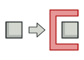
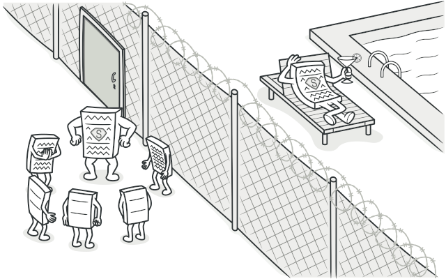
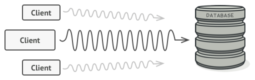
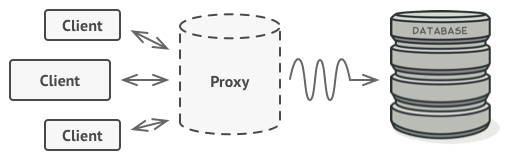
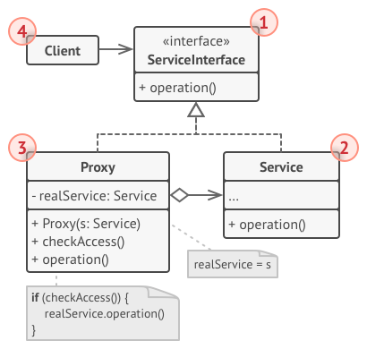

# Proxy
Provide a surrogate or placeholder for another object to control access to it.

## 🎯 เป้าหมายของ pattern นี้
สร้างตัวแทนของ object ที่เราจะเรียกใช้งานมัน ด้วย object อีกตัว เพื่อควบคุมการเข้าใช้งานของ object ตัวจริง

## ✌ หลักการแบบสั้นๆ
1. สร้าง interface สำหรับ service
1. สร้าง concrete service
1. สร้าง proxy ที่ implement interface นั้น ส่วนการทำงานจะส่งต่อให้กับ concrete service ทำงานต่อ
1. เมื่อ client ต้องการใช้ service ให้ส่ง proxy object ไปให้ใช้งานแทน

## 😢 ปัญหา


ตอนนี้เราเข้ามาอยู่ในวัดเพื่อปรึกษากับหล่วงพ่อ เพราะ library ของเรามีจุดที่ใช้งาน database อยู่เยอะมาก และแต่ละจุดที่เข้าไปต่อ database บางทีมันก็ไม่จำเป็นต้องไปต่อ database จริงๆ แค่เอาข้อมูลที่จำลองไว้มาใช้งานแทนก็ได้ และในหลายๆจุดก็ต้องการให้มันงานอะไรบางอย่าง ก่อน/หลัง query อีกด้วย



หลวงพ่อได้ฟังดังนั้นจึงทรงตรัสว่า โยมรู้หรือไม่ว่าการต่อ database โดยไม่จำเป็นมันเปลืองทรัพยากร ควรทำเป็น Lazy Initialization ไว้ด้วยนะจ๊ะ
> **Lazy Initialization** คือการสร้าง object เมื่อมันจำเป็นที่จะต้องใช้ ไม่สร้างมั่วซั่วทิ้งไว้เรี่ยราด ส่วนใหญ่จะใช้กับ อะไรก็ตามที่มันเปลืองทรัพยากร (หลวงพ่อท่านฝากบอกมา)

และท่านยังชี้แนะปัญหาที่จะตามมาในอนาคตอีกด้วยว่า ถ้าโยมเขียนข้อมูลจำลองไว้ใช้เอง หรือ มีโค้ทให้มันทำงานอะไรบางอย่าง ก่อน/หลัง query เอาไว้ใช้เองนั้น มันอาจจะใช้งานได้กับโปรแกรมของโยมเท่านั้น 

โยมลองคิดดูนะถ้ามี dev คนอื่นเอา library ของโยมไปใช้ละ โยมจะไปควบคุมเขายังไง เช่นถ้าจะเรียกใช้งานตาราง A จะต้องไปทำงานเรื่องนี้ก่อน แต่ถ้าใช้งานตาราง A ในกรณีนี้ไม่ต้องไปทำงานเรื่องนั้นก็ได้ หรือเมื่อไหร่จะส่งข้อมูลจำลองให้เขา เมื่อไหร่จะส่งข้อมูลตัวจริงให้เขากันละ

หลังจากหลวงพ่อตรัสจบ เณรน้อยอิคิวก็พูดขึ้นมาว่า แล้วโยมพี่จะทำยังไงดีฮะ?

## 😄 วิธีแก้ไข
หลวงพ่อมองหน้าเราอยู่ซักพัก เมื่อเห็นว่าเราทำหน้าเหมือน "ถ้ากรู๊วรู้ แล้วกรู๊วจะมานี่ทำมายฟระ" ท่านเลยชิ่งตรัสออกมาว่า โยมก็ใช้ `Proxy pattern` ดิ!! (ผมว่าวัดนี้ไม่ได้สอนแค่ปฏิบัติธรรมแล้วละ)

ก่อนที่เราจะได้เอ่ยปากถามต่อ ท่านก็โซโล่ต่อไปว่า จำตอนที่โยมเรียนมาได้ไหม ว่าจะจัดการยังไงถ้าเซิฟเวอร์รับโหลดเยอะๆ? ... `Multitier architecture` ไงโยม

(โพ่ง ... เสียง ชูเน็นซังทำบาตรหล่น ไม่ใช่เสียงอุทานแต่อย่างใด ดังขึ้น)

หลังจากหล่วงพ่อตั้งสติได้ ก็พล่ามต่อไปว่า

แทนที่จะให้เซิฟเวอร์รับโหลดคุยกับ client ได้ตรงๆจนมันล่ม เป็นเหตุให้ไม่สามารถถอนเงินได้แบบทุกวันนี้ โยมก็แค่ตั้งเซิฟเวอร์อีกตัวเข้ามาคั่นกลางระหว่าง client กับเซิฟเวอร์ตัวจริงของโยมไง แล้วค่อยให้เซิฟเวอร์นั้นคุยกับเซิฟเวอร์ตัวจริงอีกทีนึง ซึ่งวิธีนี้มันจะช่วยลดภาระของเซิฟเวอร์ตัวจริง เพราะเจ้าเซิฟเวอร์ที่มาคั่นกลางนี้ มันจะบอกปัด request ที่ไม่ถูกต้องออก หรือสั่งให้มันแก้ request ก่อนส่งมา หรือ แก้ response ก่อนส่งกลับด้วยก็ยังได้ จำได้หรือยังโยม

หลังจากนิ่งเงียบอยู่นาน ก็มีเสียงปิ๊ง!! ดังนั้น อิคิวซังเลยเดินไปเปิดไมโครเวฟเอามาม่ามากิน ก่อนจะพูดขึ้นทั้งที่มาม่าเต็มปากว่า

จากที่หลวงพ่อใบ้มา ผมคิดว่าโยมพี่น่าจะสร้าง class ที่มี interface เหมือนกับ class ที่ใช้ต่อ database ตัวจริงไว้นะ ส่วนถ้าใครจะต่อ database ก็ให้ทำผ่าน class ใหม่นี้ แทนที่จะทำงานกับตัวที่ต่อ database ตัวจริงยังไงละ เมื่อเป็นแบบนี้ถ้าโยมพี่อยากจะให้มันแก้ไข query ก่อน หรือแก้ไขข้อมูลก่อนส่งกลับไปให้ client ก็สามารถทำได้แล้วไง

พูดจบอิคิวก็วาดรูปลงใน iPad ให้ดู



จากรูปนะ class ใหม่นั่นก็คือ `Proxy` ซึ่งมันจะปลอมตัวให้คนอื่นเข้าใจว่า มันนั่นแหละที่เป็นตัวต่อ database ดังนั้น client ที่ต้องการต่อ database ก็จะทำงานกับ proxy ไป แล้วเจ้า proxy ก็จะไปทำงานกับ class ที่ต่อ database ตัวจริงอีกที

ปุจฉา: "แล้วข้อดีในการที่มีตัวมาคั่นกลางคืออะไร" เราชิ่งถามก่อนที่จะจบลงโดยที่เราไม่มีบทบาทอะไร

วิสัชนา: ข้อดีคือ เมื่อเจ้า proxy มันได้รับคำสั่งจาก client แล้ว มันจะไปทำอะไรอย่างอื่นก่อนแล้วค่อยไปทำงานกับ database ต่ออีกทีก็ได้ หรือได้รับข้อมูลจาก database แล้วอาจจะปรับแก้ข้อมูล หรือไปทำงานอย่างอื่นก่อนค่อยส่งข้อมูลคืนให้ client ก็ได้ หรือแม้แต่การทำ Lazy Initialization ก็ยังได้ด้วยยังไงละฮะ

และแล้วมาม่าก็อืด

## 📌 โครงสร้างของ pattern นี้


> **อธิบาย**  
1.**Service Interface** - Interface สำหรับให้ client เรียกใช้บริการของเรา และเพื่อให้ Proxy เข้ามาสวมรอยเจ้าเซอร์วิสที่แท้จริงของเราได้  
2.**Service** - เซอร์วิสที่แท้จริงของเรา (ต้อง implement **Service Interface**)  
3.**Proxy** - ตัวที่จะมาสวมรอยเป็นเซอร์วิสนั้นๆ สามารถ execute ก่อน/หลัง ทำงานกับเซอร์วิสได้ (ต้อง implement **Service Interface**)  
4.**Client** - คนที่มาใช้งานเซอร์วิส จะรู้แค่ว่ามันทำงานกับ **Service Interface** ซึ่งจริงๆถูก **Proxy** สวมรอยมาทำงานแทน

## 🛠 ตัวอย่างการนำไปใช้งาน
สมมุติว่าเราจะทำ Service ที่ใช้ในการดึงรูปจาก hardisk ซึ่ง การเข้าไปดึงข้อมูลจาก hardisk มันจะเปลืองทรัพยากร เราเลยจะใช้ Lazy Initialization เข้ามาช่วย ไปดูตัวอย่าง code กันเลย

## 👍 ข้อดี
* สามารถจัดการกับ service object ได้ โดยที่ client ไม่รู้ตัว
* จัดการกับ life cycle ของ service ตัวจริงได้ เมื่อ client ไม่ต้องการใช้แล้ว
* Proxy พร้อมทำงานได้เลย แม้ว่าตัว service จะยังไม่พร้อมทำงาน
* เป็น Open/Closed Principle

## 👎 ข้อเสีย
* อาจจะช้าเพราะมันคุยกัน 2 ต่อ
* เพิ่มความซับซ้อนให้กับโค้ด เพราะต้องไปสร้าง class และ interface มากมาย

## ‍‍📝 Code ตัวอย่าง
```
using System;

// Service Interface
interface IImageService
{
    void ShowImage();
}
// Service
class ImageService : IImageService
{
    private string fileName;

    public ImageService(string filePath)
        => loadImageFromDisk(filePath);

    public void ShowImage()
        => Console.WriteLine(fileName);

    private void loadImageFromDisk(string filePath)
        => this.fileName = "Batman";
}
// Proxy
class ImageProxy : IImageService
{
    private ImageService svc;
    private string filePath;

    public ImageProxy(string filePath)
        => this.filePath = filePath;

    public void ShowImage()
    {
        // สั่งให้ทำงานบางอย่างก่อน (pre execution)
        log($"มีการอ่านไฟล์รูปเมื่อเวลา: {DateTime.Now}");

        // Lazy Initialization
        if(svc == null) 
        {
            svc = new ImageService(filePath);
        }
        svc.ShowImage();

        // สั่งให้ทำงานบางอย่างต่อ (post execution)
        Console.WriteLine("เพิ่มตัวเลขในฐานข้อมูล ว่ารูปนี้โดนเปิดดูเพิ่มขึ้นอีกครั้งแล้ว");
    }

    private void log(string msg)
        => Console.WriteLine(msg);
}

class Program
{
    static void Main(string[] args)
    {
        IImageService svc = new ImageProxy("c:/porn/japan.png");
        svc.ShowImage();
    }
}
```

**Output**
```
มีการอ่านไฟล์รูปเมื่อเวลา: 2/1/19 7:32:10 PM
Batman
เพิ่มตัวเลขในฐานข้อมูล ว่ารูปนี้โดนเปิดดูเพิ่มขึ้นอีกครั้งแล้ว
```

# Credit
https://refactoring.guru  
You can buy his book by click the image below.  
[](https://refactoring.guru/design-patterns/book#buy-now)  