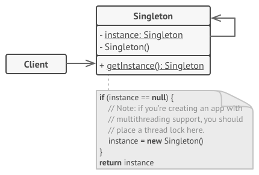

# Singleton
The singleton pattern ensures that only one object of a particular class is ever created. All further references to objects of the singleton class refer to the same underlying instance.

## 🎯 เป้าหมายของ pattern นี้
สร้างคลาสพิเศษที่สามารถนำไปสร้างเป็น object ได้เพียงแค่ตัวเดียวเท่านั้น แล้วเปิดช่องทางให้โค้ดอื่นๆสามารถเข้าถึง object นั้นได้

## ✌ หลักการแบบสั้นๆ
1. แก้ไข constructor ของ class ที่ต้องการจะทำให้ไม่มีคนอื่นเข้าถึงได้ (ทำให้ new object ไม่ได้)
1. สร้าง global access ที่เข้าถึง object นั้นเพื่อให้คนอื่นเรียกใช้
1. สร้าง object ของคลาสนั้นแล้วเก็บไว้ (เมื่อถูกเรียกใช้)

## 😢 ปัญหา
ตัว Single Pattern นี้มันแก้ปัญหา 2 เรื่องคือ

**1.ถ้าเราอยากจะสร้างคลาสที่สามารถนำไปสร้าง object ได้เพียงตัวเดียวได้ยังไง?**

เพราะปรกติทันทีที่เราใช้คำสั่ง `new` โปรแกรมก็จะสร้าง object ของคลาสนั้นๆมาให้เราทันที ดังนั้นถ้าเราใช้คำสั่ง new 10 ครั้ง นั่นหมายความว่าเราก็จะได้ object ใหม่ออกมา 10 ตัวนั่นเอง

ก่อนที่จะไปต่อ บางคนก็อาจสงสัยว่า แล้วเราจะไปสนใจมันทำไม มันอยากสร้าง object ใหม่ก็ปล่อยให้มันสร้างไปซิ ใช่มะ?

แต่ถ้าเราคิดดูดีๆ ของบางอย่างเวลาที่เราเขียนโปรแกรม ถ้ามันต้องทำงานใหม่เสมอ มันอาจจะก่อปัญหาขึ้นมาก็ได้ 

ยกตัวอย่างเช่น โค้ดที่ใช้ในการต่อฐานข้อมูล หรือ โค้ดที่ทำงานอ่านเขียนไฟล์ เพราะโค้ดพวกนี้ถ้าเราสังเกตุดีๆ ตอนสร้าง object ของคลาสพวกนี้ มันค่อนค่างจะช้าในครั้งแรก (อาจจะ 1-10 วินาที) แต่พอมันทำงานครั้งแรกเสร็จ ครั้งถัดๆไปมันจะเร็วละ (สาเหตุมันมาจากการสร้าง connection ในครั้งแรก เลยมันเลยช้าในตอนแรกที่เรียกใช้)

ดังนั้นถ้าเราเขียนโค้ดแล้วเราสร้าง object ใหม่ทุกครั้ง มันก็จะเหมือนทุกครั้งเราต้องไปสร้าง connection ใหม่ขึ้นมาเสมอ ลองคิดดู อ่านข้อมูล 1 ครั้ง รอ1-10 วินาที เขียนข้อมูล ก็รออีก 1-10 วินาที แล้วถ้าทำงานกับไฟล์หลายๆไฟล์ หรือ database หลายๆตัวละ ความน่าใช้โปรแกรมเราจะถูกใจลูกค้าขนาดไหน XD

ดังนั้นในการเขียนโปรแกรมบางกรณี เมื่อเราสร้าง object A ไว้แล้ว พอเราไปสร้าง object A อีกครั้ง บางทีโปรแกรมอาจจะไม่ได้สร้าง object A ให้เราใหม่ก็ได้ แต่มันจะส่ง object A ตัวที่สร้างไว้ก่อนหน้ากลับมาก๋เป็นได้ ตามรูปเลย


เอาละโม้อะมันง่าย แล้วเราจะทำแบบนั้นได้ยังไงละ?

**2.เราจะเปิด global access point ให้คนอื่นๆยังไง?**

จากปัญหาตัวแรกที่เราต้องทำให้มันสร้าง object ได้เพียงแค่ 1 ตัวเท่านั้น แล้วเรายังต้องเตรียมช่องทางให้ใครก็ตามที่ต้องการใช้มัน ต้องสามารถเข้าถึง object ตัวนี้ได้อีกด้วย

แต่การที่ใครก็สามารถเข้าถึง object ตัวนั้นได้ นั่นหมายถึงใครก็สามารถเข้ามาแก้ไข object นั้นได้ด้วยอะดิ!! แล้วโปรแกรมเราจะพังไหมเนี่ย???

## 😄 วิธีแก้ไข
**1.การสร้างคลาสให้สามารถมี object ได้เพียงตัวเดียว**  

การสร้าง object จะต้องใช้คำสั่ง `new` เสมอ และคำสั่ง new นี้จะต้องไปทำงานกับ `constructor` ของคลาสนั้นๆเสมอ

ซึ่งปรกติ constructor ของคลาสทั่วไปจะเป็น public เลยทำให้ใครก็ตามสามารถเข้าไปสร้าง object ใหม่ได้เรื่อยๆ

จากเหตุผลที่ว่ามา ถ้าเราไม่อยากให้ใครมาสร้าง object จากคลาสของเราได้ เราก็แค่เปลี่ยนจาก `public` ไปเป็น `private` ซะซิ (ลองไปเขียนเล่นดูเราจะสร้าง object จากคลาสนั้นไม่ได้เลย)

แล้วจะสร้าง object ยังไงละ ถ้าคนอื่นไม่สามารถสร้างได้แล้ว??

ใจเย็นๆโยม ถ้าโยมเพ่งจิตพิจารณาดีๆดู โยมก็จะพบว่า `private` นั้น จะยอมให้คลาสตัวมันเองเท่านั้นที่เรียกใช้งานได้ใช่ไหม ดังนั้นทางสว่างในการสร้าง object ของโยมก็คือ **ต้องให้คลาสของโยมเองนั่นแหละเป็นคนสร้าง object ออกมา**

**2.เราจะเปิด global access point ให้คนอื่นๆยังไง?**

คำสั่ง `static` ไงโยม จำได้ไหม (ทำไมเขียนบทนี้แล้วรู้สึกตัวเองเมากาว)

สิ่งที่โยมต้องทำก็คือสร้าง object ขึ้นมาภายในคลาสนั้น แล้วเก็บมันไว้ใน `static field` แล้วใครก็ตามที่ต้องการใช้งาน object ตัวนั้นก็จะได้ cache object ตัวนั้นกลับไปไงโยม (โยมห้ามเมากาวไปสร้าง object ให้เขาใหม่นะ ไม่งั้นทั้งหมดที่โยมทำมาจะไร้ความหมาย)

## 📌 โครงสร้างของ pattern นี้


> **อธิบาย**  
**Singleton** - คลาสนี้จะมี static method ที่ชื่อ getInstance เพื่อให้เข้าถึง object ของเราได้ และการสร้าง object จะต้องถูกซ่อนไม่ให้คนอื่นเข้ามาแก้ไขได้

## 🛠 ตัวอย่างการนำไปใช้งาน
สมมุติว่าโปรแกรมของเราต้องทำงานกับฐานข้อมูล ซึ่งการต่อฐานข้อมูลจะช้าเฉพาะครั้งแรกเท่านั้น ดังนั้นโค้ดต่างๆของเราเมื่อต้องการติดต่อฐานข้อมูล แทนที่เราจะไปสร้าง object ที่ใช้ต่อฐานข้อมูลใหม่ทุกครั้ง เราก็แค่สร้างคลาสที่ใช้ติดต่อฐานข้อมูลเป็น Singleton ไว้ แล้วใครอยากจะติดต่อฐานข้อมูลก็แค่เรียกผ่าน global access point ก็จะสามารถติดต่อฐานข้อมูลได้แล้ว

> **Note**  
ในโค้ดที่เขียนจริง โยมอย่าไปทำแบบนั้นนะ เพราะส่วนใหญ่เวลาเราใช้ framwork ที่ใช้ติดต่อฐานข้อมูล ผู้พัฒนา framework เขาจะจัดการเรื่อง connection pool ให้เราอยู่แล้ว เดี๋ยวจะหาว่าอาตามาไม่เตือน

## 👍 ข้อดี
* มั่นใจได้ว่าคลาสนั้นๆสามารถมี object ได้เพียงแค่ตัวเดียวเท่านั้น
* มี global access point ถึง object ตัวนั้น
* object ตัวนั้นจะถูกสร้างเมื่อจำเป็นเท่านั้น

## 👎 ข้อเสีย
* ละเมิดกฏ Single Responsibility Principle เพราะมันแก้ปัญหา 2 เรื่อง
* เป็น design ที่ไม่ดี เพราะ components อื่นๆสามารถกระโดดมาทำงานกับมันได้ตรงๆ
* มีปัญหากับการทำงานแบบ multithread
* มีปัญหากับการเขียน unit test

## ‍‍📝 Code ตัวอย่าง
```
using System;

// Singleton
public class Database
{
    private static Database instance;
    public static Database Instance 
    {
        get
        {
            if(instance == null)
            {
                instance = new Database();
            }
            return instance;
        }
    }

    private Database()
    {
    }

    public void Query(string cmd)
    {
        Console.WriteLine($"Query: {cmd}");
    }
}

// Client
class Program
{
    static void Main(string[] args)
    {
        // var db = new Database(); <-- error
        Database.Instance.Query("select * from myTable");
    }
}
```

**Output**
```
Query: select * from myTable
```

# Credit
https://refactoring.guru  
You can buy his book by click the image below.  
[](https://refactoring.guru/design-patterns/book#buy-now)  