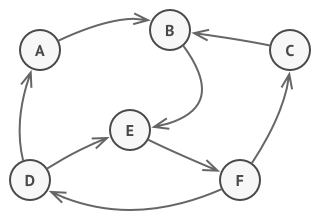
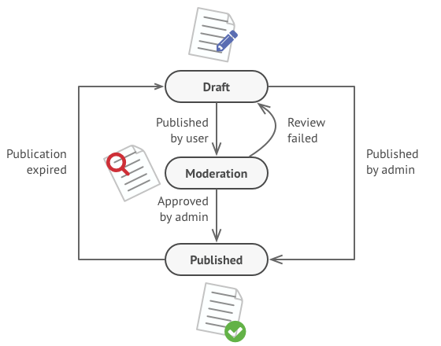
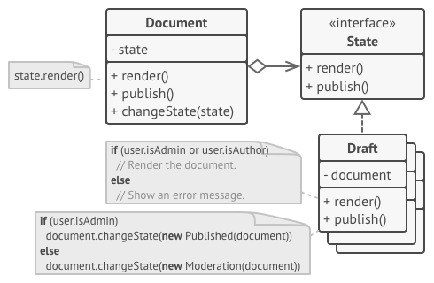
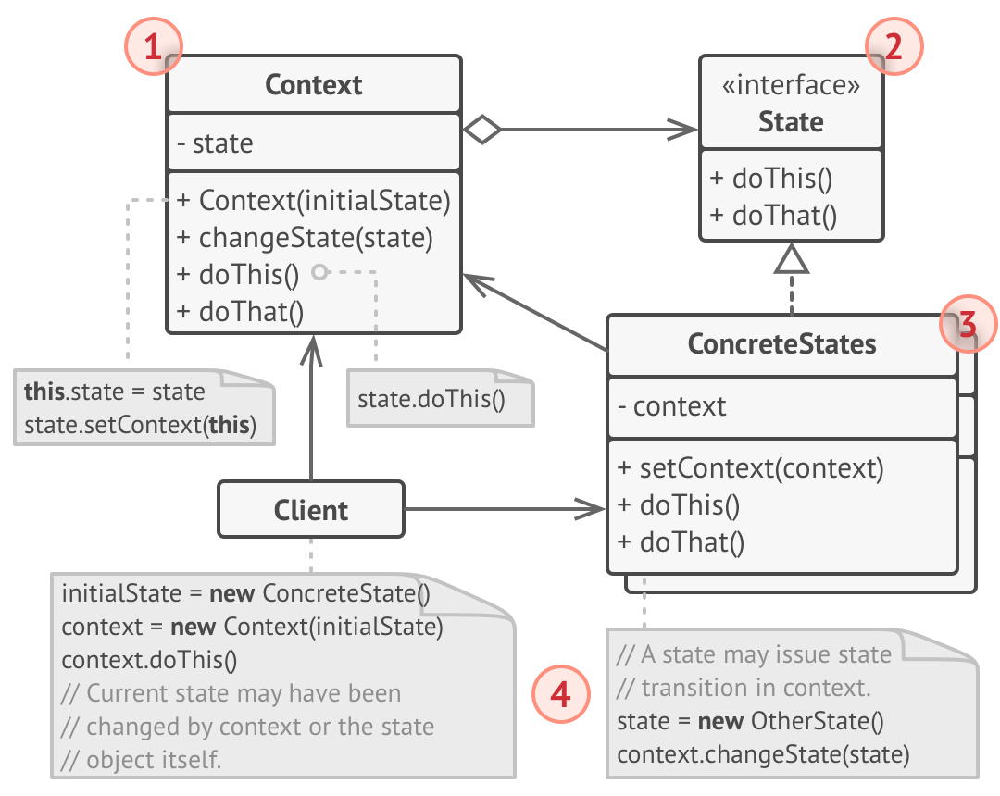

# State
Allow an object to alter its behavior when its internal state changes. The object will appear to change its class.

## 🎯 เป้าหมายของ pattern นี้
สามารถเปลี่ยนรูปแบบการทำงานของ object ตามสถานะของมันได้

## ✌ หลักการแบบสั้นๆ
1. แยก state ต่างๆออกมาเป็น class ต่างหาก และรวมถึง logic ของมันด้วย
1. ให้ context ทำงานกับ interface แทนที่จะทำงานกับ concreate state

## 😢 ปัญหา
ในเรื่องนี้จะคล้ายๆกับ [Finite-State Machine](https://en.wikipedia.org/wiki/Finite-state_machine) (แต่ไม่รู้เรื่องก็ไม่เป็นไร คิดซะว่าเรากำลังจะไปดูหนัง **The imitation game** ละกัน ซึ่งเจ้าเรื่องนี้เป็นจุดกำหนดคอมพิวเตอร์และ State machine นั่นเอง)

แนวคิดของ Finite-State Machine มีอยู่ว่า ในโปรแกรมอะไรก็แล้วแต่มันจะมีสถานะต่างๆ เช่น โปรแกรมปิด, โปรแกรมเปิด, โปรแกรมกำลังทำงาน, โปรแกรมถูกหยุด โดยของพวกนี้เราเรียกมันว่า **สถานะ** หรือ `(State)` ซึ่งมันมีกฏอยู่ว่า
1. ตัวโปรแกรมสามารถเปลี่ยน State ได้ถ้าตรงกับเงื่อนไขที่กำหนด
1. ในแต่ละช่วงเวลามันจะต้องเป็นแค่ State ใด state หนึ่งเท่านั้น ไม่สามารถเป็น 2 state ได้พร้อมกัน
1. State ในโปรแกรมจะมีจำนวนจำกัด อาจจะมีเป็นร้อยๆพันๆก็แล้วแต่ แต่สุดท้ายเราก็สามารถนับ Unique state ได้แน่นอนนั่นเอง

ตามรูปด้านล่าง



ซึ่งจากหลักการที่ว่ามา ก็เหมือนกับ object ในโค้ดของเรา เพราะตัวมันก็มี State ที่สามารถเปลี่ยนไปมาได้ เพื่อให้เห็นภาพขอสมมุติว่าเรามี class ที่ชื่อ `Document` ตัวนึง ซึ่งเจ้า object ของมันก็สามารถเปลี่ยนเป็น state ต่างๆได้ เช่น กำลังร่างเอกสาร `(Draft)` กำลังตรวจสอบ `(Moderation)` ถูกตีพิมพ์แล้ว `(Published)` ประมาณนี้

คราวนี้สมมุติต่อว่าเจ้า Document ของเรามันมี method 1 ตัวที่ชื่อว่า `Publish` มีหน้าที่ไว้เผยแพร่เอกสาร ซึ่งถ้าเรียกใช้งานเจ้า method นี้ มันจะทำงานยังไงขึ้นอยู่กับว่าตอนนี้เป็น State อะไร ตามนี้
* อยู่ใน state กำลังร่างเอกสาร `(Draft)` มันจะเปลี่ยน state เป็น กำลังตรวจสอบ `(Moderation)` แต่ถ้าคนที่กดเป็น Admin มันจะเปลี่ยน state เป็น ถูกตีพิมพ์แล้ว `(Published)`
* อยู่ใน state กำลังร่างเอกสาร `(Moderation)` ถ้าคนที่กดจะต้องเป็น Admin มันจะเปลี่ยน state เป็น ถูกตีพิมพ์แล้ว `(Published)` แต่ถ้าไม่ใช่ มันจะไม่ทำอะไรเลย
* อยู่ใน state ถูกตีพิมพ์แล้ว `(Published)` มันจะไม่ทำอะไรเลย

และถ้าเอกสารหมดอายุ มันก็จะกลับไปอยู่ใน state กำลังร่างเอกสาร `(Draft)` ตาม State diagram ด้านล่างเลย



จากที่ว่ามาน่าจะพอเห็นภาพละว่า เวลาที่เราเขียนโปรแกรมเพื่อเปลี่ยนสถานะ `(State)` นั้น โค้ดของเราจะประกอบไปด้วยพวก Condition statement (`if`, `switch`) พวกนี้ ซึ่งในโค้ดที่เราเขียนก็จะเป็นการเปลี่ยนค่า field ซะส่วนใหญ่ ตามโค้ดด้านล่างนี้

```
public void Publish()
{
    switch(state)
    {
        case "Draft":
        {
            if(IsAdmin)
            {
                state = "Publish";
            }
            else
            {
                state = "Moderation"
            }
            break;
        }
        case "Moderation":
        {
            if(IsAdmin)
            {
                state = "Publish";
            }
            break;
        }
        case "Published":
        default:
            break;
    }
}
```

จากโค้ดตัวอย่างเราจะเห็นปัญหาตัวหนึ่งนั่นคือ ทุกครั้งที่เราเพิ่มสถานะ `(State)` เข้ามา มันจะทำให้โค้ดในการตรวจสอบเงื่อนไขใหญ่ขึ้นไปเรื่อยๆ หรือมีการเปลี่ยนเงื่อนไขของ state ขึ้นมา เราก็ต้องมานั่งแก้โค้ดพวกนี้ทุกครั้งเช่นกัน และยิ่งแย่ไปกว่านั้น ถ้าโค้ดเรามีการตรวจสอบ state พวกนี้ในจุดอื่นๆ เราก็ต้องตามไปไล่แก้จุดพวกนั้นด้วยเช่นกัน

โดยปรกติถ้าเราเพิ่ม feature เข้าไปเรื่อยๆ โปรแกรมของเราก็จะมี state เข้ามาเพิ่มเรื่อยๆเช่นกัน แล้วเราจะแก้ปัญหาพวกนี้ยังไงกันดีน๊าาา (วันนี้ไม่มีกาวนะ เพราะผมรีบ)

## 😄 วิธีแก้ไข
**State pattern** แนะนำให้เราแยก state ทั้งหมดภายใน object ออกไปเป็น class ของมันเอง และย้ายเงื่อนไขต่างๆของมันไปอยู่ภายใน class ใหม่พวกนั้นด้วย

ถัดมาให้ object ตัวหลักของเรา reference ไปยัง state class พวกนั้น เพื่อจะได้ไม่มีเงื่อนไขไปอยู่ใน object หลักของเรา ตามรูป



คราวนี้เวลาที่เราอยากจะเปลี่ยน state ของเจ้า object หลักของเรา (object หลักเราเรียกมันว่า `Context`) เราก็แค่เรียกให้เจ้า state object ของเราไปทำงาน เพื่อตรวจสอบเงื่อนไขต่างๆของมัน ซึ่งถ้ามันถูกต้องตามเงื่อนไขเจ้า state object ก็จะทำการเปลี่ยน state object ตัวอื่นมาแทนที่มันให้กับ object หลักนั่นเอง

> **State pattern** จะคล้ายกับ [**Strategy pattern**](Strategy.md) แต่จะต่างกันที่เจ้า state pattern เวลาที่มันจะเปลี่ยน state มันจะรู้จักกับ state อื่นๆ แต่ในขณะที่เจ้า strategy จะไม่รู้จัก strategy อื่นนั่นเอง

## 📌 โครงสร้างของ pattern นี้


> **อธิบาย**  
**1.Context** - จะอ้างถึง concrete state object และจะเรียกใช้ concreate state objects ผ่าน interface  
**2.State interface** - interface กลางสำหรับสร้าง concreate state  
**3.Concrete States** - เป็นตัวที่ใช้ทำงานใน state ที่มันรับผิดชอบที่แท้จริง และในบางที state object อาจจะ reference กลับไปหา context object ด้วย  
**4.ทั้ง context และ concreate states** สามารถกำหนด state ให้กับ context ได้

## 🛠 ตัวอย่างการนำไปใช้งาน
ในรอบนี้ผมจะลองเขียนโปรแกรมตู้ซื้อสินค้าอัตโนมัติละกัน โดยตู้จะมีสถานะแค่ 2 สถานะคือ `ซื้อสินค้าได้` และ `ซื้อสินค้าไม่ได้`

ส่วนบนตู้มีแค่ ช่องให้หยอดเหรียญเข้าไป และ มีปุ่มให้กดซื้อสินค้า

โดยผมกำหนดว่าสินค้าในตู้ทุกอย่างชิ้นละ 7 บาทละกัน

ปะไปลองดูโค้ดกันเลยว่า เราจะจัดการกับ state 2 แบบนี้ยังไง โดยที่โปรแกรมจะรองรับ state ต่างๆเข้ามาเรื่อยๆได้ โดยที่เจ้า context เราจะไม่เปลี่ยนแปลงอะไรเลย

## 👍 ข้อดี
* รองรับ state ในอนาคตที่จะเพิ่ม/ลด ก็จะไม่มีผลกับโค้ดของ context
* ถูกหลัก `Single Responsibility Principle`
* ถูกหลัก `Open/Closed Principle`

## 👎 ข้อเสีย
* อย่าใช้ pattern นี้ถ้าโปรแกรมของเรามี state แค่นิดๆหน่อยๆเท่านั้น ไม่งั้นโค้ดจะซับซ้อนโดยไม่จำเป็น

## ‍‍📝 Code ตัวอย่าง
```
using System;

// State Interface
interface IAutoMachineState
{
    void InsertCoin(int amount);
    void Buy();
}

// Context
class AutoMachine
{
    public int CurrentCoins { get; set; }
    private IAutoMachineState currentState;

    public AutoMachine()
    { 
        currentState = new NothingAvailable(this);
         Console.WriteLine("กำหนดสถานะเริ่มต้นเป็น - ไม่สามารถซื้ออะไรได้เลย");
    }

    public void ChangeState(IAutoMachineState state)
        => currentState = state;
    
    public void InsertCoin(int amount)
    { 
        CurrentCoins += amount;
        currentState.InsertCoin(amount);
    }

    public void Buy()
        => currentState.Buy();
}

// Concrete state
class NothingAvailable : IAutoMachineState
{
    private AutoMachine context;

    public NothingAvailable(AutoMachine context)
        => this.context = context;

    public void InsertCoin(int amount)
    {
        const int MinimumCoinsForBuySomthing = 7;
        if(context.CurrentCoins >= MinimumCoinsForBuySomthing)
        {
            Console.WriteLine("เปลี่ยนสถานะเป็น - สามารถซื้ออะไรก็ได้");
            context.ChangeState(new SomethingAvailable(context));
        }
    }

    public void Buy()
    {
        Console.WriteLine("ไม่สามารถซื้ออะไรได้");
    }
}
class SomethingAvailable : IAutoMachineState
{
    private AutoMachine context;

    public SomethingAvailable(AutoMachine context)
        => this.context = context;

    public void InsertCoin(int amount) { }

    public void Buy()
    {
        const int MinimumCoinsForBuySomthing = 7;
        context.CurrentCoins -= MinimumCoinsForBuySomthing;
        Console.WriteLine("ซื้อสินค้าไปแล้ว");
        
        if(context.CurrentCoins < MinimumCoinsForBuySomthing)
        {
            context.ChangeState(new NothingAvailable(context));
            Console.WriteLine("เปลี่ยนสถานะเป็น - ไม่สามารถซื้ออะไรได้เลย");
        }
    }
}

// Client
class Program
{
    static void Main()
    {
        var machine = new AutoMachine();
        Console.WriteLine("ใส่เงิน 5 บาทเข้าไปในตู้");
        machine.InsertCoin(5);
        Console.WriteLine("กดซื้อของ");
        machine.Buy();
        Console.WriteLine("ใส่เงิน 3 บาทเข้าไปในตู้");
        machine.InsertCoin(3);
        Console.WriteLine("กดซื้อของ");
        machine.Buy();
    }
}
```

**Output**
```
กำหนดสถานะเริ่มต้นเป็น - ไม่สามารถซื้ออะไรได้เลย
ใส่เงิน 5 บาทเข้าไปในตู้
กดซื้อของ
ไม่สามารถซื้ออะไรได้
ใส่เงิน 3 บาทเข้าไปในตู้
เปลี่ยนสถานะเป็น - สามารถซื้ออะไรก็ได้
กดซื้อของ
ซื้อสินค้าไปแล้ว
เปลี่ยนสถานะเป็น - ไม่สามารถซื้ออะไรได้เลย
```

# Credit
https://refactoring.guru  
You can buy his book by click the image below.  
[](https://refactoring.guru/design-patterns/book#buy-now)  