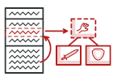
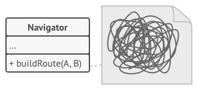
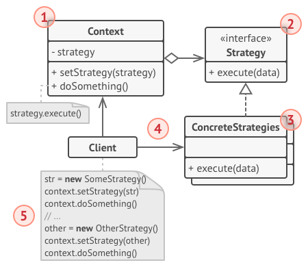

# Strategy
Define a family of algorithms, encapsulate each one, and make them interchangeable. Strategy lets the algorithm vary independently from clients that use it.

## 🎯 เป้าหมายของ pattern นี้
สร้างการทำงานหลายๆแบบ เพื่อให้ client เลือกไปใช้งานตามความเหมาะสม

## ✌ หลักการแบบสั้นๆ
1. แยกงานเฉพาะเรื่องที่แตกต่างกันออกเป็นหลายๆ class
1. สร้าง interface กลางของงานที่แยกออกมา
1. ตัวทำงานให้ reference interface นั้น
1. ให้ client เป็นคนกำหนดว่าจะสร้าง object เพื่อเอาไว้ทำงานจาก class ไหน


## 😢 ปัญหา
สมมุติว่าเรากำลังเขียนโปรแกรมแผนที่ตัวนึง เพื่อเอาไปแข่งกับ Google map และตอนนี้ตัวโปรแกรมมีแค่ `Navigator` class เท่านั้น

หัวใจสำคัญของโปรแกรมตัวนี้คือ มันสามารถคำนวณเส้นทางที่ใกล้ที่สุดให้เราได้ แล้วมันก็จะแสดงเป็นแผนที่สวยงามบนมือถือให้เราดู

ในเวอร์ชั่นแรกมันสามารถคำนวณการเดินทางด้วย `รถยนต์` ได้เท่านั้น แต่หลังจากเปิดตัวโปรแกรมนี้ไปซักพัก ผู้ใช้ก็เริ่มบ่นว่าอยากให้มันบอกการเดินทางด้วยวิธีอื่นๆด้วย

ดังนั้นในเวอร์ชั่นสอง เราเลยเพิ่มความสามารถให้มันคำนวณการเดินทางด้วย `ทางเท้า`, `ทางรถไฟ`,`รถไฟฟ้า` และ `รถประจำทางต่างๆ` เข้าไปด้วย เพื่อให้กับคนเดินถนนสามารถไปถึงจุดหมายได้เร็วที่สุด

โปรแกรมทำงานต่างๆได้ด้วยดี ผู้ใช้ Happy เงินเดือนเพิ่มขึ้น และตามมาด้วยความปวดหัวของโปรแกรมเมอร์ เพราะเจ้า `Navigator` class เริ่มบวมขึ้นเรื่อยๆ

และแล้วจุดแตกหักก็มาถึง ในวันที่เราเพิ่มการเดินทางด้วย `รถจักรยาน` เข้าไป ตัวโปรแกรมเริ่มแสดงผลแปลกๆเช่น แนะนำให้รถขับไปบนทางรถไฟ แนะนำให้คนไปเดินบนไฮเวย์ หรือให้รถจักรยานปั่นลงน้ำ!! (เป็นก้าวพัฒนาที่ดีนะ เพราะ Apple เวอร์ชั่นแรกๆก็มี feature นี้ให้คนพูดถึงเหมือนกัน)



เหล่าผู้บริหารโวยวายกันออฟฟิสแตก ถามหาว่าเกิดอะไรขึ้น ในขณะที่ developer นั่งหา bugs กันหัวหมุน

ทุกครั้งที่เพิ่มวิธีการเดินทางแบบใหม่ลงไป พี่ `Navigator` class ก็จะตัวบวมขึ้น งานที่เคยใช้ได้กลับใช้ไม่ได้ ทำให้มักจะมีปัญหาตามมาเสมอๆ (คุ้นๆวุ้ย เหมือนตอนยังไม่รู้จัก TDD เลย)

ขณะที่เรากำลังหาว่าเกิดอะไรขึ้น ก็มีผู้บริหารคนหนึ่งขว้างนาฬิกาหนีนักข่าวที่จะเข้ามาทำข่าวของแอพของเรา ซึ่งเจ้านาฬิกาตัวซวยที่ยืมเพื่อนมาก็เข้ามาโดนหัวเราเข้าอย่างจัง จนหมดสติไป

## 😄 วิธีแก้ไข
ขณะที่สติเลือนลาง ก็มีภาพผุดขึ้นมาในหัว เป็นภาพเราขณะที่เดินทางไปเขาเหลียงซาน ก็ได้พบกับหลวงพ่อแห่งวัดอังโคะคุจิ ซึ่งท่านมีข้อแนะนำไว้ว่า ถ้าโยมมี class อะไรซักอย่าง ที่มันทำงานเฉพาะเรื่องของมัน แต่มีรูปแบบการทำงานที่แตกต่างกันหลายๆแบบ โยมจงแยกการทำงานพวกนั้นออกเป็น class หลายๆตัวแทนซะ ซึ่งเจ้า class ที่แยกออกมาเหล่านี้หลวงพ่อเรียกมันว่า `Strategy`

ส่วน class ตัวแรกนั้นหลวงพ่อขอเรียกมันว่า `Context` ซึ่งมันจะต้องมี field ที่ชี้กลับไปหา strategy ที่มันจะใช้ซักตัว เมื่อเข้า context จะต้องทำงาน มันก็แค่สั่งให้ strategy ไปทำงานแทนซะ

เจ้า context ไม่ได้มีหน้าที่บอกว่าจะใช้ strategy ตัวไหน แต่ client ต่างหากที่จะเลือก strategy ให้กับ context เอง ซึ่งจริงๆแล้ว context มันไม่รู้เลยด้วยซ้ำว่ามี strategy อะไรบ้าง มันทำงานกับ strategy ได้เพราะมันทำงานผ่าน interface นั่นเอง ด้วยเหตุนี้เองเลยทำให้เราสามารถเพิ่ม strategy ใหม่ๆเข้าไปได้เรื่อยๆ หรือแก้ไข strategy โดยที่ไม่มีผลกระทบกับ context หรือ strategy ตัวอื่นเลย

ปิ้ง!! หลังจากได้สติกลับมาและหายเมากาวแล้ว จึงรีบเอานาฬิกาซุกเข้ากระเป๋าซะ แล้วรีบตีเนียนโดยการหยิบกระดาษมาเขียนของที่เห็นเมื่อสักครู่ออกมา ตามภาพด้านล่าง


เดิมตัว `Navigation` ก็คือตัวที่ทำงานทุกอย่าง มันเลยบวมออกเรื่อยๆ ดังนั้นเราเลยทำการแยกงานของมันออกมาเป็น `Strategry` หลายๆตัว ทางรถ(RoadStrategy), ทางเท้า(WalkingStrategy), การขนส่งสาธารณะ(PublicTransportStrategy)

ดังนั้นตัว Navigation ของเราก็คือ `Context` ตามที่หลวงพ่อว่าไว้ ดังนั้นมันเลยต้อง reference ไปหา strategy ผ่าน interface ที่ชื่อว่า `RouteStrategy`

ส่วนเมื่อต้องการจะเดินทางด้วยรถยนต์ เราก็แค่ส่ง RoadStrategy object ไปให้กับ Navigation class ทำงานด้วย และเมื่อไหร่จะเดินทางด้วยเท้า เราก็ส่ง WalkingStrategy object ไปให้เท่านั้น

จากที่เมากาวมา จะเห็นว่า ตัว Navigation ตัวเดิม สามารถเปลี่ยนการทำงานไปได้เรื่อยๆ เพียงแค่เราเปลี่ยน strategy เท่านั้นเอง

## 📌 โครงสร้างของ pattern นี้


> **อธิบาย**  
**1.Context** - เป็นตัวที่อ้างถึง strategy ผ่าน interface เพื่อทำงานด้วยเมื่อ client เรียก  
**2.Strategy interface** - เป็นแบบอย่างให้กับ strategy ต่างๆ และมันจะมี method เพื่อให้ context สามารถเรียกใช้งานได้  
**3.Concrete Strategies** - ตัวที่ทำงานจริงๆ ซึ่งส่วนใหญ่เราจะมี strategy หลายตัว เพื่อให้สามารถทำงานได้หลายๆแบบที่ต่างกัน เมื่อ client เรียก context ทำงาน ตัว context จะสั่งให้ strategy ทำงานให้  
**4.Client** - เป็นคนส่ง strategy ที่จะใช้ให้กับ context

## 🛠 ตัวอย่างการนำไปใช้งาน
ในเกมหลายๆเกมจะมีระบบธาตุ ซึ่งผู้เล่นสามารถเอาธาตุไปใส่อาวุธได้ ทำให้เวลาเวลาโจมตีออกไปจะทำให้เกิดผลที่ไม่เหมือนกัน
* ธาตุไฟ จะโจมตีสูงขึ้นเมื่อเจอกับธาตุดิน แต่จะโจมเบาลงเมื่อโจมตีใส่ธาตุน้ำ
* ธาตุน้ำ จะโจมตีสูงขึ้นเมื่อเจอกับธาตุไฟ แต่จะโจมตีเบาลงเมื่อโจมตีใส่ธาตุดิน
* ธาตุดิน จะโจมตีสูงขึ้นเมื่อเจอกับธาตน้ำ แต่จะโจมตีเบาลงเมื่อโจมตีใส่ธาตุไฟ
และผู้เล่นจะเปลี่ยนธาตุให้กับอาวุธของตัวเองเมื่อไหร่ก็ได้ อะไรประมาณนี้ ดังนั้นเราจะลองใช้ strategy pattern เข้ามาช่วย เพื่อให้อาวุธของผู้เล่นมีการทำงานหลายๆรูปแบบ ไปดูที่โค้ดตัวอย่างกันเลย

## 👍 ข้อดี
* สามารถเปลี่ยนการทำงานได้ตลอดเวลา ขณะ runtime
* แยกการทำงานออกเป็นเรื่องๆ ขาดจากกันได้
* ถูกหลัก `Open/Closed Principle`

## 👎 ข้อเสีย
* ถ้าการทำงานมีไม่เยอะและไม่ได้เปลี่ยนบ่อย อย่าใช้ strategy pattern มันทำให้โปรแกรมเราซับซ้อนขึ้นโดยไม่จำเป็น
* Client จะต้องรู้ว่า strategy ที่จะใช้แต่ละตัวคืออะไร และต่างกันยังไง
* ภาษา/framework สมัยใหม่ส่วนใหญ่จะรอบรับของพวกนี้อยู่แล้ว ไปศึกษาแล้วใช้ของพวกนั้นดีกว่าถ้าจะต้องใช้

## ‍‍📝 Code ตัวอย่าง
```
using System;

// Strategy Interface
interface IElement
{
    string Name { get; }
    void Attack(string element);
}

// Strategies
class EarthElement : IElement
{
    public string Name => "Earth";
    public void Attack(string element)
    {
        if(element == "Water") Console.WriteLine("attack+10");
        else if(element == "Fire") Console.WriteLine("attack-5");
        else Console.WriteLine("attack+0");
    }
}
class FireElement : IElement
{
    public string Name => "Fire";
    public void Attack(string element)
    {
        if(element == "Earth") Console.WriteLine("attack+10");
        else if(element == "Water") Console.WriteLine("attack-5");
        else Console.WriteLine("attack+0");
    }
}
class WaterElement : IElement
{
    public string Name => "Water";
    public void Attack(string element)
    {
        if(element == "Fire") Console.WriteLine("attack+10");
        else if(element == "Earth") Console.WriteLine("attack-5");
        else Console.WriteLine("attack+0");
    }
}

// Context
class Weapon
{
    public IElement Element { get; set; }

    public void Attack(string element)
    {
        Console.WriteLine($"โจมตีด้วยธาตุ {Element.Name} ใส่ธาตุ {element}");
        Element.Attack(element);
    }
}

class Program
{
    static void Main(string[] args)
    {
        var weapon = new Weapon();
        weapon.Element = new FireElement();
        weapon.Attack("Earth");

        weapon.Element = new WaterElement();
        weapon.Attack("Earth");

        weapon.Element = new EarthElement();
        weapon.Attack("Water");
    }
}
```

**Output**
```
โจมตีด้วยธาตุ Fire ใส่ธาตุ Earth
attack+10
โจมตีด้วยธาตุ Water ใส่ธาตุ Earth
attack-5
โจมตีด้วยธาตุ Earth ใส่ธาตุ Water
attack+10
```

# Credit
https://refactoring.guru  
You can buy his book by click the image below.  
[](https://refactoring.guru/design-patterns/book#buy-now)  