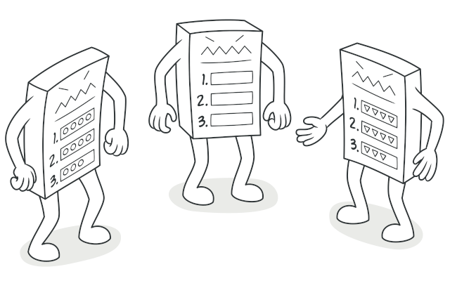
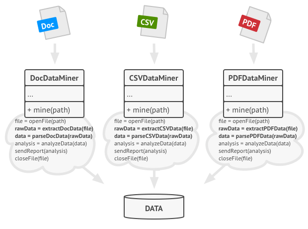
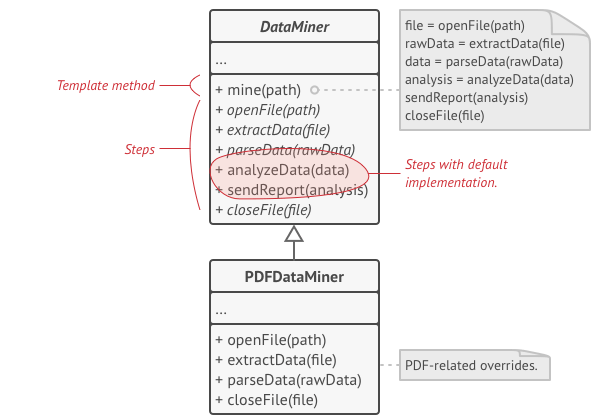
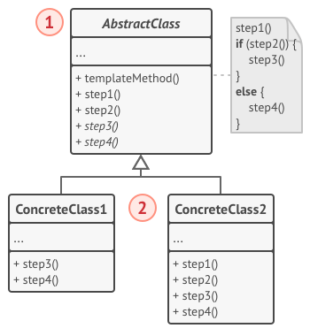

# Template Method

Define the skeleton of an algorithm in an operation, deferring some steps to subclasses. Template Method lets subclasses redefine certain steps of an algorithm without changing the algorithm's structure.

## 🎯 เป้าหมายของ pattern นี้
สร้าง algorithm ที่สามารถเปลี่ยนการทำงานบางขั้นตอนได้จาก subclass

## ✌ หลักการแบบสั้นๆ
1. แตก algorithm ออกเป็นขั้นๆ แล้วทำให้เป็น method (บางตัวอาจะเป็น abstract)
1. เขียนลำดับการเรียก method พวกนั้นไว้ภายใน template method
1. สร้าง subclass เพื่อมาจัดการขั้นตอนเฉพาะทางของเรื่องนั้นๆ

## 😢 ปัญหา
เนื่องจาก**โจโฉ**รุกรานอย่างหนัก ทำให้**โชกุนอาชิคางะ โยชิมิสึ**จ้างเรามาวิเคราะห์แผนการรบของฝ่าย**โจโฉ**ที่ส่งผ่านกันทางเอกสาร ซึ่งเอกสารพวกนั้นมีหลากหลายแบบ เช่น Pdf, Doc และ Csv

หลังจากดมกาวเสร็จเราก็ทำ class เวอร์ชั่นแรกเสร็จ เป็น class 3 ตัวที่เอาไว้อ่านไฟล์เอกสารทั้ง 3 ชนิดตามรูปด้านล่าง



หลังจากที่เริ่มสร่างเมา เราก็พบว่า class ทั้ง 3 ตัวโค้ดมันเกือบจะเหมือนกันเลยนิหว่า!! มัน**ต่างกันแค่ขั้นตอนในการจัดการไฟล์** ส่วนขั้นตอนวิเคราะห์ไฟล์ที่เหลือเหมือนกันหมดเลย

ซึ่งการมีโค้ดที่ซ้ำๆกันมันเป็น**อนันตริยกรรม** ดังนั้นเราจะจัดการอย่างไรกับโค้ดพวกนี้ดี?

## 😄 วิธีแก้ไข
**Template Method** เสนอวิธีการแก้กรรมนี้ว่า 

1. ให้แตกขั้นตอนการทำงานออกเป็นขั้นๆ แล้วเปลี่ยนขั้นตอนแต่ละตัวให้เป็น method ซะ โดย method พวกนี้บางตัวอาจจะ implement ไว้เลย หรือ เป็น `abstract` ไว้ก็ได้ 
1. ให้เขียนลำดับการเรียก method พวกนั้นไว้ภายใน **template method** 
1. สร้าง subclass สำหรับทำงานแต่ละงาน และ implement abstract method พวกนั้น หรือจะ override บางขั้นตอนเลยก็ได้ (ยกเว้น **template method** นะเฟร้ย)

หลังจากที่ทําบุญอุทิศส่วนกุศลตาม **Template method** ว่ามาแล้ว เราก็จะได้หน้าตาโค้ดเราออกมาเป็นแบบนี้



จากภาพ เราแตกขั้นตอนออกเป็น method ต่างๆ ซึ่งบางตัวก็ implement เรียบร้อยเลย แต่บางตัวก็ปล่อยเป็น abstract ไว้ ส่วนขั้นตอนการเรียก method ทั้งหมดอยู่ภายใน method ที่ชื่อว่า **mine(path)** และสุดท้ายเมื่อเราอยากให้มันทำงานกับไฟล์อะไร เราก็จะสร้าง subclass มาจัดการขั้นตอนที่ยังเป็น abstract อยู่

> **Note**  
ใน method บางตัวเราอาจจะปล่อยว่างไว้เลยก็ได้ มันจะได้เป็น optional เผื่อเราจะมาเพิ่มเติมอะไรลงไป เช่น pre-process/post-process ต่างๆ ซึ่งเราเรียก method แบบนี้ว่า  **Hook**

สรุป โชว์กุนก็สามารถรวมทั้ง 10 ก๊กเป็นหนึ่งเดียวกันได้ จนได้สมยาว่า **ผู้ชนะ 10 ทิศ** จนถึงทุกวันนี้นั่นเอง เพราะไม่ว่า**โจโฉ**จะเปลี่ยนรูปแบบเอกสารไปเป็นไหนก็ตาม เราก็สามารถอ่านแล้ววิเคราะห์เอกสารพวกนั้นได้ทั้งหมด จนทำให้**โจโฉ**ต้องสั่งทุบเครื่อง **Enigma** ทิ้งนั่นเอง

## 📌 โครงสร้างของ pattern นี้


> **อธิบาย**  
**1.Abstract Class** - สร้าง method ขั้นตอนการทำงานต่างๆ และรวมถึงลำดับการเรียกขั้นตอนพวกนั้นด้วย และบาง method อาจเป็น `abstract` ก็ได้  
**2.Concrete Classes** - Subclass ที่จะมาดูแลขั้นตอนเฉพาะงานของมัน

## 🛠 ตัวอย่างการนำไปใช้งาน
ไม่ต้องหาตัวอย่างอื่นหรอก ตัวโปรแกรมวิเคราะห์เอกสารของโชวกุนนี่ก็เหมาะแล้วละ ไปดูโค้ดเลยดีกว่า

## 👍 ข้อดี
* ลดโค้ดที่ซ้ำๆกันลงได้
* สามารถทำงานกับของหลายๆแบบ ที่มีโครงสร้างการทำงานเหมือนเดิม

## 👎 ข้อเสีย
* ดูแลรักษายากเมื่อขั้นตอนมันเยอะๆ หรือต้องเพิ่มขั้นตอนใหม่ๆเข้าไป
* ละเมิดกฏ `Liskov Substitution Principle` 

## ‍‍📝 Code ตัวอย่าง
```
using System;
using System.IO;

abstract class DataMiner
{
    protected string result;

    public void Mine(string path)
    {
        var file = OpenFile(path);
        var rawData = ExtractData(file);
        var data = ParseData(rawData);
        data = PreProcess(data);
        var analysis = AnalyzeData(data);
        analysis = PostProcess(analysis);
        SendReport(analysis);
        CloseFile(file);
    }

    public abstract Stream OpenFile(string path);
    public abstract string ExtractData(Stream file);
    public abstract string ParseData(string rawData);

    public virtual string AnalyzeData(string data)
        => $"วิเคราะห์ข้อมูลเสร็จสิ้น, {data}";

    public virtual void SendReport(string analysis)
        => Console.WriteLine($"ส่งอีเมล์เสร็จสิ้น, ข้อมูลคือ: {analysis}");

     public virtual void CloseFile(Stream file)
        => file.Dispose();

    public virtual string PreProcess(string data)
        => data;

    public virtual string PostProcess(string data)
        => data;
}

class PDFDataMiner : DataMiner
{
    public override Stream OpenFile(string path)
        => Stream.Null;

    public override string ExtractData(Stream file)
        => "PDF_FILE_FORMAT";

    public override string ParseData(string rawData)
        => rawData.Replace("_", " ");
}
class HtmlDataMiner : DataMiner
{
    public override Stream OpenFile(string path)
        => Stream.Null;

    public override string ExtractData(Stream file)
        => "<body>Hello world</body>";

    public override string ParseData(string rawData)
        => rawData.Replace("<body>", " ").Replace("</body>", " ");
    
    public override string PreProcess(string data)
        => $"PRE-Process {data}";

    public override string PostProcess(string data)
        => $"{data} POST-Process";
}

class Program
{
    static void Main()
    {
        var pdf = new PDFDataMiner();
        pdf.Mine("c:/porn/japan/tokyohot.pdf");

        var html = new HtmlDataMiner();
        html.Mine("c:/porn/japan/prestige.pdf");
    }
}
```

**Output**
```
ส่งอีเมล์เสร็จสิ้น, ข้อมูลคือ: วิเคราะห์ข้อมูลเสร็จสิ้น, PDF FILE FORMAT
ส่งอีเมล์เสร็จสิ้น, ข้อมูลคือ: วิเคราะห์ข้อมูลเสร็จสิ้น, PRE-Process Hello world POST-Process
```

# Credit
https://refactoring.guru  
You can buy his book by click the image below.  
[](https://refactoring.guru/design-patterns/book#buy-now)  
