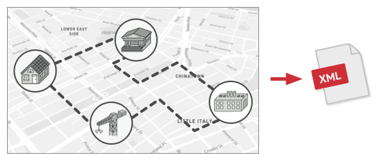
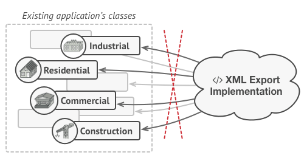

> กำลังเขียนอยู่ อย่าพึ่งซน รอตอนเย็นๆเดี๋ยวกลับมาทำต่อ


# Visitor
Represent an operation to be performed on the elements of an object structure. Visitor lets you define a new operation without changing the classes of the elements on which it operates.

## 🎯 เป้าหมายของ pattern นี้
เพิ่มความสามารถใหม่ๆให้กับ class โดยที่ไม่ต้องเข้าไปแก้ไขโค้ดเดิม

## ✌ หลักการแบบสั้นๆ
1. xxx

## 😢 ปัญหา
หลักจากที่ที่การรบเร้าของ **มาร์คสากกระเบือ** ไม่ไหว ในที่สุดเราก็ใจอ่อนยอมมาทำงานกับ Google Map ซึ่งอย่างที่ทราบดีว่าตัว Google map นั้นจะแสดงแผนที่สุดอลังการ มีทั้งบ้านเรือน โรงงานอุตสาหกรรม สิ่งก่อสร้างต่างๆอีกบานตะไท ซึ่งข้อมูลต่างๆที่ว่ามามันก็จะมี class ของมันเองแต่ละแบบที่ดูแลข้อมูลของมันอยู่

อยู่มาวันนึง เราก็ได้รับงานใหม่มานั่นก็คือการ export แผนที่ให้ออกมาเป็น XML ไฟล์นั่นเอง ตามรูปเบย



ฟังดูแล้วก็น่าจะไม่มีอะไรยากนิ เพราะข้อมูลสถานที่แต่ละจุด ก็มี class ที่ดูแลของมันเองอยู่แล้ว ดังนั้นเราก็แค่เพิ่ม export method ให้กับ class พวกนั้นก็เสร็จแล้วนิ!!

แต่แล้ว **ขงเบ้ง** ที่ดูแล system architect อยู่ ก็ไม่ยอมให้เราทำแบบนั้น โดยให้เหตุผลว่าโค้ดพวกนั้นมันเป็น production แล้ว ซึ่งเขาไม่อยากเสี่ยงเพราะกลัวว่าการแก้โค้ดของเราอาจจะมี bug ก็เป็นได้

> **Production**  
คืออะไรก็แล้วแต่ที่มันกำลังใช้ทำงานอยู่จริงๆ มีลูกค้าใช้งานอยู่จริง อะไรพวกนี้ ซึ่งของพวกนี้เราจะไม่ไปยุ่งกับมันเพราะมันเสี่ยงที่จะมีปัญหา ดังนั้นเราเลยจะทำ `Staging environment` และ `Development environment` เอาไว้เวลาที่เราจะทดสอบ feature ใหม่ๆก่อนที่จะเข้าสู่ `Production environment` นั่นเอง



นอกจากป๋าแกจะปฏิเสธไม่ยอมให้เราแก้ class พวกนั้นแล้ว ป๋าแกยังตบหน้าด้วยคำถามว่า

หน้าที่หลักของ class พวกนั้นคือทำงานกับข้อมูลแผนที่เท่านั้นนะเฟร้ย เอ็งคิดว่ามันเหมาะแล้วเหรอที่จะเพิ่ม export method ให้กับ class พวกนั้นนะ? (พาตาม่อน!! มันไม่ใช่แค่เรื่อง production แล้ว มันเกี่ยวกับเรื่อง design ด้วย)

ที่เจ๋งไปกว่านั้นคือ เราได้ยินข่าวมาว่าเฮีย **มาร์คสากกระเบือ** ยังอยากให้เรา export ออกเป็นหลายๆ format และยังมีอีกหลายๆเรื่องที่อยากจะให้เพิ่มความสามารถแปลกๆเข้าไปอีกด้วย ซึ่งถ้าเราทำตามแผนที่คิดไว้ในตอนแรก มันจะทำให้โค้ดเราต้องยัดของแปลกๆเข้าไปทุกๆครั้งเลยอะดิ แล้วเราจะแก้ปัญหาพวกนี้ยังไงดีกันนะ ??

## 😄 วิธีแก้ไข
xxx

## 📌 โครงสร้างของ pattern นี้
xxx

## 🛠 ตัวอย่างการนำไปใช้งาน
xxx

## 👍 ข้อดี
* xxx

## 👎 ข้อเสีย
* xxx

## ‍‍📝 Code ตัวอย่าง
```
xxx
```

**Output**
```
xxx
```

# Credit
https://refactoring.guru  
You can buy his book by click the image below.  
[](https://refactoring.guru/design-patterns/book#buy-now)  