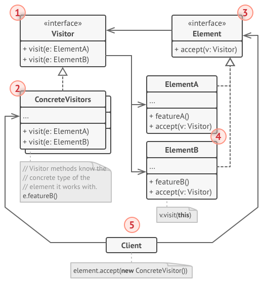

# Visitor
Represent an operation to be performed on the elements of an object structure. Visitor lets you define a new operation without changing the classes of the elements on which it operates.

## 🎯 เป้าหมายของ pattern นี้
เพิ่มความสามารถใหม่ๆให้กับ class โดยที่ไม่ต้องเข้าไปแก้ไขโค้ดเดิม

## ✌ หลักการแบบสั้นๆ
1. สร้าง Visitor interface สำหรับความสามารถใหม่
1. ให้ Class ที่จะเพิ่มความสามารถเป็นคนตัดสินใจว่าจะจัดการกับความสามารถใหม่นั้นยังไง
1. สร้าง Concrete visitor เพื่อเพิ่มความสามารถใหม่ให้ class เดิม

## 😢 ปัญหา
หลักจากที่ทนการรบเร้าของ **มาร์คสากกระเบือ** ไม่ไหว ในที่สุดเราก็ใจอ่อนยอมมาทำงานกับ **Google Map** ซึ่งอย่างที่ทราบดีว่าตัว Google map นั้นจะแสดงแผนที่สุดอลังการ มีทั้งบ้านเรือน โรงงานอุตสาหกรรม สิ่งก่อสร้างต่างๆอีกบานตะไท ซึ่งข้อมูลสถานที่ต่างๆที่ว่ามามันก็จะมี class ของมันเองแต่ละแบบที่ดูแลข้อมูลของมันอยู่ โดยของพวกนั้นทีมพัฒนาเรียกมันว่า **Node**

อยู่มาวันนึง เราก็ได้รับงานใหม่มานั่นก็คือการ export แผนที่ให้ออกมาเป็น **XML** ไฟล์นั่นเอง ตามรูปเบย


ฟังดูแล้วก็น่าจะไม่มีอะไรยากนิ เพราะข้อมูลสถานที่แต่ละจุด ก็มี class ของมันเองอยู่แล้ว ดังนั้นเราก็แค่เพิ่ม Export method ให้กับ class พวกนั้นก็เสร็จแล้วนิ!!

แต่แล้ว **ขงเบ้ง** ที่ดูแล system architect อยู่ ก็ไม่ยอมให้เราทำแบบนั้น โดยให้เหตุผลว่าโค้ดพวกนั้นมันเป็น production แล้ว และเขาไม่อยากเสี่ยงให้เราแก้โค้ดเพราะกลัวว่าโค้ดของเราอาจจะมี bug ก็ได้ (เราทำ TDD อยู่นะเฟร้ย)

> **Production**  
คืออะไรก็แล้วแต่ที่มันกำลังใช้ทำงานอยู่จริงๆ มีลูกค้าใช้งานอยู่จริง อะไรพวกนี้ ซึ่งของพวกนี้เราจะไม่ไปยุ่งกับมันเพราะมันเสี่ยงที่จะมีปัญหา ดังนั้นเราเลยจะทำ `Staging environment` และ `Development environment` เอาไว้เวลาที่เราจะทดสอบ feature ใหม่ๆก่อนที่จะเข้าสู่ `Production environment` นั่นเอง

> **TDD - Test Driven Development**  
เป็นแนวคิดในการพัฒนาซอฟต์แวร์โดยให้เขียน test ก่อนเสมอ [ไปศึกษาต่อที่ VDO ของผมเอาละกัน กดที่นี่ได้เลย](https://www.youtube.com/watch?v=k8pnhUebGTg&list=PLUjAn8nwWniiL3ToFK8PfmAo8U6IoGAkg)


นอกจากป๋าแกจะปฏิเสธไม่ยอมให้เราแก้ class พวกนั้นแล้ว ป๋าแกยังตบหน้าด้วยคำถามว่า

หน้าที่หลักของ class พวกนั้นคือทำงานกับข้อมูลแผนที่เท่านั้นนะเฟร้ย เอ็งคิดว่ามันเหมาะแล้วเหรอที่จะเพิ่ม Export method ให้กับ class พวกนั้นนะ? (พาตาม่อน!! มันไม่ใช่แค่เรื่อง production แล้ว มันเกี่ยวกับเรื่อง design ด้วย)

ที่เจ๋งไปกว่านั้นคือ เราได้ยินข่าวมาว่าเฮีย **มาร์คสากกระเบือ** ยังอยากให้เรา export ออกเป็นหลายๆ format และยังมีเรื่องแปลกๆอีกหลายๆเรื่องที่อยากจะให้เราเพิ่มเข้าไปอีกด้วย ซึ่งถ้าเราทำตามที่คิดไว้ในตอนแรก มันจะทำให้ class พวกนั้นต้องยัดของแปลกๆเข้าไปทุกๆครั้งเลยอะดิ แล้วเราจะแก้ปัญหาพวกนี้ยังไงดีกันนะ ??

## 😄 วิธีแก้ไข
หลังจากที่เดินคิดหาคำตอบอยู่นั้นก็ได้พบกับหนุ่มใส่หมวกฟางยืนคุยกับกวางเรนเดียสวมหมวกอยู่ เลยได้ยินบทสนธนาว่า

**กวางเรนเดีย**: ถ้างานใหม่ๆมันเข้ามาเรื่อยๆแล้วละก็ จงใช้ `Visitor pattern` ดิวะเจ้า**ลูฟี่**!! (อ่อเจ้าหมวกฟางชื่อลูฟี่นี่เอง) เจ้า visitor pattern แนะนำเราว่า ถ้ามีงานใหม่เข้ามา จงแยกงานนั้นออกเป็น class ใหม่ แล้วเรียกเจ้า class นั้นว่า `Visitor` ไง  

**ลูฟี่**: อ๋อคุ้นๆละ ถ้าทำแบบนั้นมันจะทำให้เราไม่ต้องไปแก้ไข class เดิมเลยอะดิ แล้วเราก็เรียก class เดิมพวกนั้นว่า `Element` ใช่ปะ **ช็อปเปอร์** (สรุปเจ้ากวางนั้นชื่อช็อปเปอร์นี่เอง)  

**ช็อปเปอร์**: ใช่เลยเพื่อนยาก แล้วเจ้า visitor ของเราก็จะมี method ที่รับ class ที่เราจะเพิ่มความสามารถใหม่ๆให้มันเข้าไปด้วย แล้วเราก็จะเขียนโค้ดความสามารถใหม่ของมันภายใน method นี้เลย ทำให้โค้ดเดิมไม่ต้องถูกแก้ไข แต่ก็มีความสามารถใหม่ๆด้วยยังไงละ

(เราคิดในใจของเรา) อืมมมม ฟังแล้วเป็นไอเดียที่ดีนิน่า แต่ถ้ามันต้องเพิ่มความสามารถแบบเดียวกันให้กับ class หลายๆแบบละ? เพราะในปัญหาของเรามี class ตั้งหลายตัว เช่น มีทั้งบ้านเรือน โรงงานอุตสาหกรรม บลาๆ นิเลยหว่า

เอ็งก็สร้าง method ที่รับ class ทุกแบบนั่นดิวะ!!

(เสียง **ช็อปเปอร์** ตะโกนใส่ **ลูฟี่** ดังขึ้นมา ไม่เกี่ยวกับเราแต่อย่างใด)

ปิ๊ง!! เหมือนตรัสรู้ในท่าแอบฟังชาวบ้าน จึงเห็นนิมิตรลอยมากลางอากาศตามโค้ดด้านล่างเลย

```
class XMLExportVisitor
{
    method DoForCity(City c) { ... }
    method DoForIndustry(Industry f) { ... }
    method DoForSightSeeing(SightSeeing ss) { ... }
}
```

แล้วเราจะเรียกใช้ของพวกนี้ยังไงฟระ ถ้าต้องมานั่งไล่เช็คแบบโค้ด้านล่างนี้ก็ยากตายพอดีดิ

```
foreach (Node node in nodeCollection)
    if (node is City) exportVisitor.DoForCity((City) node)
    if (node is Industry) exportVisitor.DoForIndustry((Industry) node)
    // ...
}
```

หรือเราจะเขียนเป็น method overloading ดีหว่า แต่ถ้าขืนทำไปนั่นหมายความว่า ถ้ามีสิ่งก่อสร้างใหม่ๆเข้ามา เราก็ต้องไปไล่แก้โค้ดเราทุกครั้งด้วยอะดิ!!

พอได้สติว่าวิธีที่คิดว่ามีปัญหา เลยมองกลับไปที่เจ้า 2 ตัวนั่นต่อ

**ช็อปเปอร์**: ปัญหาที่แกคิดเมื่อกี้อะ Visitor pattern เขามีแนะนำไว้แล้วโว้ย มันเรียกว่า `Double Dispatch` ยังไงละ!! (NaNi?) หลักการมันคือ `แทนที่เราจะไปไล่ตรวจว่า object นั้นควรจะใช้ method ตัวไหนดี` เราจะทำกลับด้านกันคือ `object ตัวนั้นแหละบอกว่า visitor ไหนที่เหมาะสมกับมัน และยังไม่พอเจ้า object นั่นจะต้องบอกอีกด้วยว่า method ไหนที่มันจะต้องทำงานด้วย`

นิมิตรลอยมากลางอากาศอีกครั้ง

```
// Client code
foreach (Node node in graph)
    node.Accept(exportVisitor)

// City
class City
{
    void Accept(Visitor v)
        => v.DoForCity(this);
}

// Industry
class Industry
{
    void accept(Visitor v)
        => v.DoForIndustry(this);
}
```

สุดท้ายก็ต้องแก้ class อยู่ดีนิหว่า แต่อย่างน้อยมันก็แก้แค่นิดเดียว และมันยังรองรับให้เราเพิ่มความสามารถใหม่ๆโดยไม่ต้องไปแก้โค้ดอีกครั้งแล้วละ

อาวละ ลองออกแบบ Interface สำหรับพวก visitor ดู แล้วไปคุยกับป๋าขงเบ้งอีกทีละกัน ส่วนรอบหน้าจะลองมาฟังเรื่องหวยดูบ้างดีกว่า เผื่อเจ้าสองตัวนั่นจะใบ้อะไรแม่นๆให้ฟังบ้าง

สรุปคือ เราสามารถเพิ่มความสามารถใหม่ๆให้กับโค้ดเดิมเราได้ละ

## 📌 โครงสร้างของ pattern นี้


> **อธิบาย**  
**1.Visitor** - เป็น interface กลางสำหรับพวก visitor โดยมี method เพื่อรองรับ class ต่างๆที่เราต้องการเพิ่มความสามรถให้  
**2.Concrete Visitor** - ตัวที่ดูแลการทำงานใหม่ๆของ class ต่างๆที่เราต้องการเพิ่มความสามรถให้  
**3.Element** - เป็น interface กลางสำหรับ class ที่เราอยากให้มันเพิ่มความสามารถใหม่ๆได้ โดยตัวมันจะมี accept method สำหรับเลือก visitor ที่มันจะทำงานด้วย  
**4.Concrete Element** - เป็นตัวตัดสินใจว่าจะเลือกทำงานกับ visitor ตัวไหน โดยตัวมันจะต้องเลือก method ของ visitor ที่มันจะใช้ทำงานอีกด้วย  
**5.Client** - เป็นคนส่ง visitor ไปให้กับ element เลือกทำงานด้วย

## 🛠 ตัวอย่างการนำไปใช้งาน
ในตัวอย่างนี้เราจะมีรูปทรงหลายๆแบบ จุด, วงกลม, สี่เหลี่ยม แล้วเราอยากจะเพิ่มความสามารถให้มัน 2 อย่างคือ
1. ให้มัน export ออกเป็นไฟล์ XML ได้
1. ให้มัน export ออกเป็นไฟล์ Json ได้
โดยที่เราจะใช้ Visitor pattern เข้ามาช่วย ปะไปลองดูโค้ดตัวอย่างกัน

## 👍 ข้อดี
* เพิ่มความสามารถใหม่ๆให้กับ class ที่เคยมีไว้ได้ โดยไม่ต้องไปยุ่งกับโค้ดเดิม
* ถูกหลัก `Open/Closed Principle`
* ถูกหลัก `Single Responsibility Principle`

## 👎 ข้อเสีย
* ถ้า class ถูกแก้ไข,เพิ่ม,ลบ จะต้องมาแก้ไข visitor ด้วย
* ต้องคอยมาจัดการให้ visitor เข้าถึงของที่เป็น private/protected

## ‍‍📝 Code ตัวอย่าง
```
using System;
using System.Collections.Generic;

// Element Interface
interface IShape
{
    void Accept(IExporter exporter);
}

// Concrete Elements
class Dot : IShape
{
    public int X { get; set; }
    public int Y { get; set; }

    public void Accept(IExporter visitor)
        => visitor.Visit(this);
}
class Circle : IShape
{
    public int Radius { get; set; }

    public void Accept(IExporter visitor)
        => visitor.Visit(this);
}
class Rectangle : IShape
{
    public int Hight { get; set; }
    public int Width { get; set; }

    public void Accept(IExporter visitor)
        => visitor.Visit(this);
}

// Visitor Interface
interface IExporter
{
    void Visit(Dot shape);
    void Visit(Circle shape);
    void Visit(Rectangle shape);
}

// Concrete Visitors
class XMLExporter : IExporter
{
    public void Visit(Dot shape)
        => Console.WriteLine($"<shape><type>จุด</type><X>{shape.X}</X><Y>{shape.Y}</Y></shape>");

    public void Visit(Circle shape)
        => Console.WriteLine($"<shape><type>วงกลม</type><area>{Math.PI * shape.Radius * shape.Radius}</area></shape>");

    public void Visit(Rectangle shape)
        => Console.WriteLine($"<shape><type>สี่เหลี่ยม</type><area>{shape.Width * shape.Hight}</area></shape>");
}
class JsonExporter : IExporter
{
    public void Visit(Dot shape)
        => Console.WriteLine($"{{ \"type\": \"จุด\", \"X\": \"{shape.X}\", \"Y\": \"{shape.Y}\" }}");

    public void Visit(Circle shape)
        => Console.WriteLine($"{{ \"type\": \"วงกลม\", \"area\": \"{Math.PI * shape.Radius * shape.Radius}\" }}");

    public void Visit(Rectangle shape)
        => Console.WriteLine($"{{ \"type\": \"สี่เหลี่ยม\", \"area\": \"{shape.Width * shape.Hight}\" }}");
}


class Program
{
    static void Main()
    {
        var shapes = new List<IShape>
        {
            new Dot{ X = 5, Y = 10 },
            new Circle{ Radius = 5 },
            new Rectangle{ Width = 10, Hight = 20},
        };

        Console.WriteLine("Export to XML");
        var xmlExporter = new XMLExporter();
        foreach(var element in shapes)
        {
            element.Accept(xmlExporter);
        }

        Console.WriteLine();

        Console.WriteLine("Export to Json");
        var htmlExporter = new JsonExporter();
        foreach(var element in shapes)
        {
            element.Accept(htmlExporter);
        }
    }
}
```

**Output**
```
Export to XML
<shape><type>จุด</type><X>5</X><Y>10</Y></shape>
<shape><type>วงกลม</type><area>78.5398163397448</area></shape>
<shape><type>สี่เหลี่ยม</type><area>200</area></shape>

Export to Json
{ "type": "จุด", "X": "5", "Y": "10" }
{ "type": "วงกลม", "area": "78.5398163397448" }
{ "type": "สี่เหลี่ยม", "area": "200" }
```

# Credit
https://refactoring.guru  
You can buy his book by click the image below.  
[](https://refactoring.guru/design-patterns/book#buy-now)  